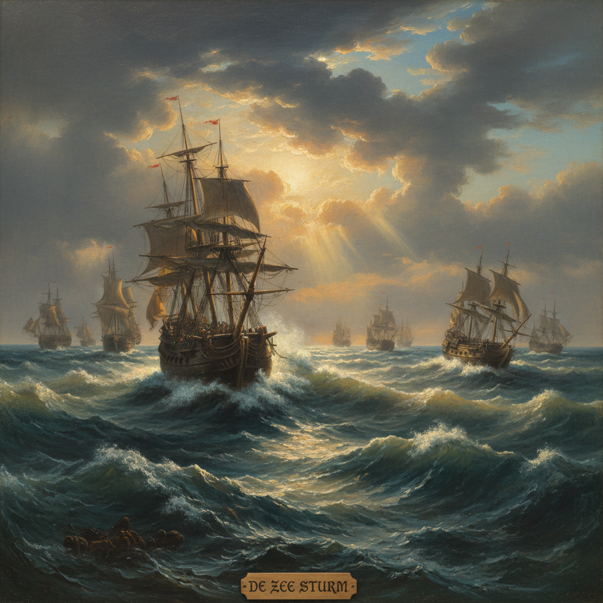

# Marine Painting 海景画

> **时期：** 16世纪–至今  
> **关键词：** 大海、船舶、风暴、港口、海军战役

## 概述

Marine Painting（海景画）是以海洋、船舶和海岸为主题的绘画类型。从17世纪荷兰黄金时代的海战画到透纳笔下狂暴的大海，海景画既是海洋帝国的视觉史诗，也是画家挑战自然力量——光、水、风——的终极试炼场。大海永远在变，每一笔都是对瞬间的捕捉。

## 风格特征

- **水面表现**：波浪、倒影、透明度的极致描绘
- **天空占比**：通常天空占画面三分之二以上
- **光线变化**：日出、风暴、月光的戏剧效果
- **船舶细节**：帆具、旗帜的精确记录
- **动态感**：风浪中的运动与力量

## 代表人物与作品

- 威廉·凡·德·维尔德 荷兰海战画
- J.M.W. 透纳《奴隶船》《暴风雪》
- 伊凡·艾瓦佐夫斯基《九级浪》
- 温斯洛·霍默 美国海岸风景

## 概念图

