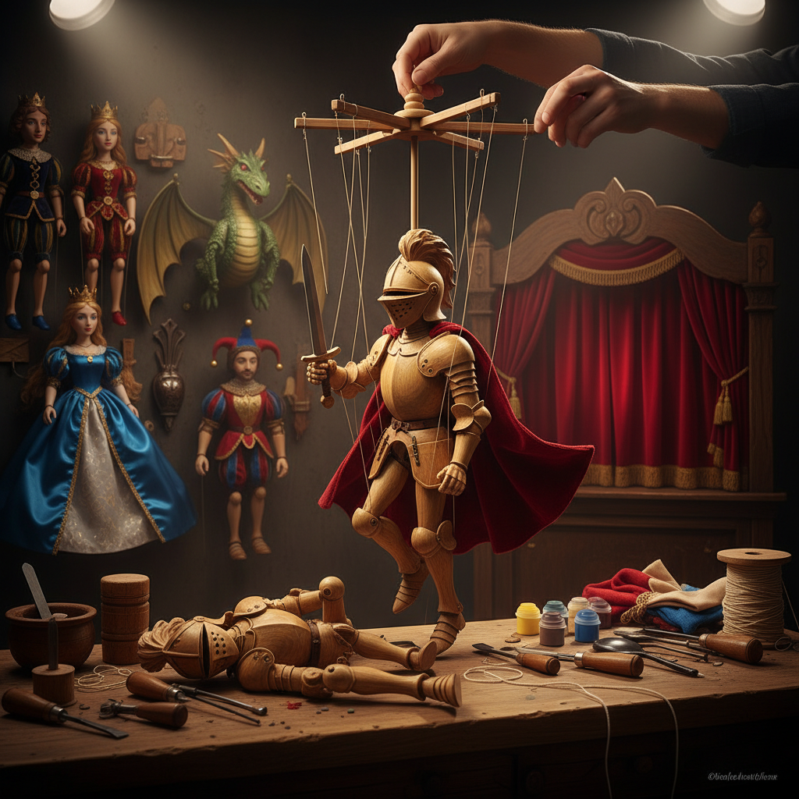

# Marionette Art 提线木偶艺术

> "A marionette is a paradox made visible — an object that appears to live, moved by strings that are meant to be invisible yet are always there, connecting the puppet to the hand above like fate connecting mortals to the gods. The puppeteer must think in reverse: to make the puppet look down, pull up; to make it stumble, release. Every natural gesture must be engineered from above through a web of threads." — Unknown

## 概述

提线木偶艺术（Marionette Art）是通过线绳从上方操控木偶进行表演和创作的艺术形式——木偶的四肢、头部和身体通过多根线绳连接到操控十字架上，由木偶师从上方操纵，使木偶产生逼真的动作和表情。提线木偶是最复杂也最具表现力的木偶形式之一。

提线木偶艺术的实践包括：1）传统提线木偶戏——经典的木偶剧表演；2）木偶制作——雕刻和装配提线木偶；3）木偶操控——操纵线绳的技艺；4）当代木偶剧场——现代实验性木偶表演；5）巨型提线木偶——大型户外木偶表演（如Royal de Luxe）；6）木偶电影——用提线木偶拍摄的影视作品；7）木偶艺术装置——将提线木偶作为艺术装置展示。

## 核心特征

| 特征 | 描述 |
|------|------|
| 线控 | 通过线绳从上方操控 |
| 精密 | 精密的关节和线绳系统 |
| 表演 | 综合的表演艺术 |
| 雕刻 | 精细的木偶雕刻 |
| 叙事 | 讲述故事的能力 |
| 幻觉 | 创造生命的幻觉 |

## 视觉特征

- **线绳**：可见或隐形的操控线
- **关节**：精密的关节连接
- **表情**：丰富的面部表情
- **服装**：精致的微型服装
- **动态**：逼真的动态姿态
- **十字架**：操控用的十字架

## 代表作品

| 作品 | 艺术家/团体 | 年代 | 意义 |
|------|-------------|------|------|
| *The Sultan's Elephant* | Royal de Luxe | 2005 | 巨型提线木偶 |
| *Thunderbirds* | Gerry Anderson | 1965 | 木偶电视剧 |
| *Salzburg Marionette Theatre* | 萨尔茨堡 | 1913至今 | 经典木偶剧院 |
| *Czech marionettes* | 捷克传统 | 18世纪至今 | 捷克木偶传统 |
| *Sicilian puppets* | 西西里传统 | 中世纪至今 | 西西里骑士木偶 |

## 历史时间线

| 时期 | 事件 |
|------|------|
| 古代 | 古埃及和古希腊的提线木偶 |
| 中世纪 | 欧洲宗教木偶剧 |
| 18-19世纪 | 捷克和意大利木偶传统的黄金时代 |
| 20世纪 | 木偶电影和电视 |
| 当代 | 巨型木偶和当代木偶剧场 |

## 中国语境

提线木偶艺术在中国有悠久的传统——中国的提线木偶戏（又称"悬丝傀儡"）是中国木偶戏的重要类型之一。福建泉州的提线木偶戏是中国最著名的提线木偶传统——泉州提线木偶戏被列入国家级非物质文化遗产名录。泉州提线木偶的特点是线数多（可达30多根线）、操控精细——能表现喝茶、写字等极其细腻的动作。中国的提线木偶制作工艺精湛——木偶头部的雕刻和彩绘是独立的艺术门类。中国当代的一些木偶艺术家在探索传统提线木偶与现代剧场的结合——创造新的表演形式。中国的木偶戏面临传承挑战——年轻一代的木偶师数量在减少，但政府和文化机构正在努力保护和推广这一传统。

## AI生成概念图

## 与其他风格的关系

- **Puppet Art** → 木偶艺术
- **Theater Art** → 戏剧艺术
- **Wood Carving** → 木雕艺术
- **Performance Art** → 表演艺术
- **Animation** → 动画艺术
- **Mechanical Art** → 机械艺术

---

*浮光艺志 | Chronicle of Artistry*
