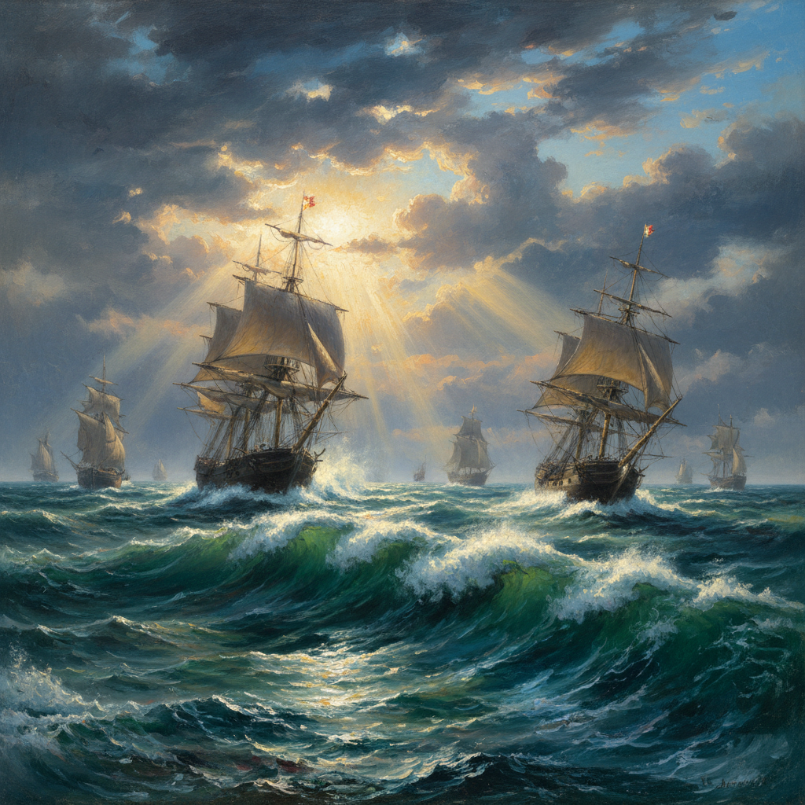

# Maritime Art 海洋画派

> "The sea is everything." — Jules Verne

## 概述

海洋画派（Maritime Art / Marine Art）是以海洋、船舶、海战、港口和海岸为主题的绘画传统，从17世纪荷兰黄金时代的海景画到19世纪英国的海军画，再到印象派的海岸风景，海洋画贯穿了整个西方艺术史。

作为岛国和海洋帝国的核心视觉叙事，海洋画不仅记录了航海史和海战史，更发展出了独特的光线、水面和天空表现技法。

## 核心特征

| 特征 | 描述 |
|------|------|
| 海洋主题 | 海战、商船、渔船、港口、海岸、风暴 |
| 天空与水 | 天空和海面通常占据画面80%以上 |
| 光线变化 | 海上独特的光线——反射、折射、雾气 |
| 船舶精确 | 对船只结构和索具的精确描绘 |
| 戏剧天气 | 暴风雨、巨浪、海难的戏剧性表现 |
| 历史记录 | 记录重要海战和航海事件 |

## 视觉特征

- **天空**：壮阔的云层，占据画面大部分
- **水面**：从平静如镜到惊涛骇浪的各种状态
- **光线**：海面反射的银色光芒，日出日落的金色
- **船舶**：精确到每根绳索的细节描绘
- **色调**：灰蓝、银绿、深靛、风暴中的墨绿
- **构图**：低地平线，强调天空和海面的广阔

## 代表人物

| 画家 | 代表作 | 特点 |
|------|--------|------|
| J.M.W. Turner | *The Fighting Temeraire* (1839) | 光与色的海洋诗人 |
| Ivan Aivazovsky | *The Ninth Wave* (1850) | 俄罗斯海景大师 |
| Willem van de Velde | 荷兰海战系列 | 荷兰海洋画奠基人 |
| Winslow Homer | *The Gulf Stream* (1899) | 美国海洋画 |
| Claude Joseph Vernet | 法国港口系列 | 法国海景画 |
| Caspar David Friedrich | *The Sea of Ice* (1824) | 浪漫主义海景 |

## 历史演变

1. **17世纪**：荷兰海洋画兴起，记录荷兰海上霸权
2. **18世纪**：英国海军画传统确立
3. **19世纪初**：透纳将海景画推向浪漫主义巅峰
4. **19世纪中**：艾瓦佐夫斯基成为俄罗斯海景大师
5. **印象派时期**：莫奈等人在海岸写生
6. **至今**：海洋画仍是活跃的绘画题材

## 与其他风格的关系

- **Dutch Golden Age** → 荷兰海洋画是黄金时代的重要分支
- **Romanticism** → 透纳和弗里德里希的崇高海景
- **Luminism** → 美国光辉主义的海岸风景
- **Impressionism** → 莫奈的海岸系列
- **Grimshaw** → 格里姆肖的港口月夜属于海洋画传统

## 概念图

---

*浮光艺志 | Chronicle of Artistry*
