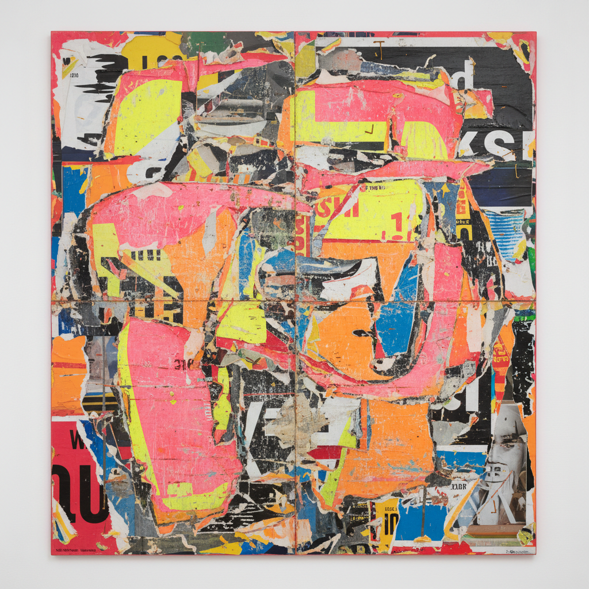

# Mark Bradford 马克·布拉德福德

> **流派**: 当代绘画 · 混合媒介 · 社会实践  
> **时期**: 1961–至今 美国  
> **关键词**: 城市考古、广告纸层、地图抽象、社区介入

## 概述

马克·布拉德福德从洛杉矶南部社区的街头收集材料——广告传单、美发店海报、商铺招牌、地图碎片——将它们层层粘贴在画布上，然后用砂纸、电锯和溶剂进行切割和剥离，露出下面的色彩层次。最终的画面既是抽象绘画，也是城市社区的物质考古。

## 视觉特征

- **纸层堆叠**: 数十层广告纸、地图、海报粘贴后打磨
- **剥离痕迹**: 表面被撕开露出下层的色彩和文字碎片
- **巨大尺幅**: 作品常超过3米，具有壁画般的气势
- **城市色彩**: 霓虹粉、黄色、蓝色——街头广告的颜色
- **地图结构**: 隐约可见的街道网格和地理轮廓

## 代表作品

- 威尼斯双年展美国馆 (2017)
- 《Pickett's Charge》(2017) — 赫希霍恩博物馆
- 《Scorched Earth》(2006)
- 《Mithra》(2008)

## 历史影响

布拉德福德将抽象绘画与社会实践结合，证明了形式实验和社区关怀可以共存。他的"城市考古"方法为理解美国种族地理和社区历史提供了独特的视觉途径。

## 相关风格

- [Abstract Expressionism 抽象表现主义](abstract-expressionism.md)
- [Collage Art 拼贴艺术](collage-art.md)
- [Social Practice Art 社会实践艺术](social-practice-art.md)
