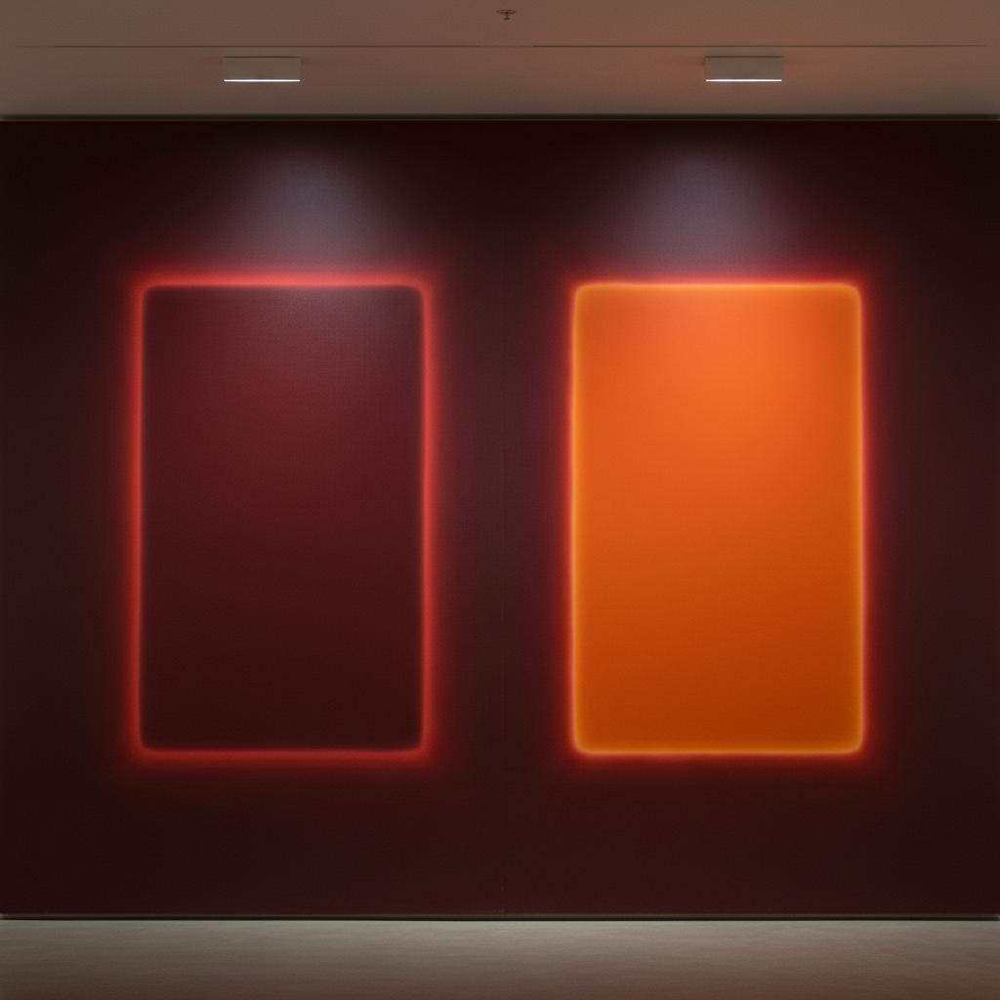

# Mark Rothko 马克·罗斯科

> **流派**: 抽象表现主义 · 色域绘画  
> **时期**: 1903–1970 俄国/美国  
> **关键词**: 色域矩形、精神性、沉浸体验、悲剧感

## 概述

马克·罗斯科以其标志性的大尺幅色域绘画闻名——两到三个柔边矩形色块悬浮在单色背景上。他追求的不是装饰效果，而是一种能让观者产生深刻情感共鸣的精神体验。他坚持认为自己画的不是颜色，而是"人类的基本情感——悲剧、狂喜、命运"。

## 视觉特征

- **悬浮矩形**: 柔和边缘的色块仿佛漂浮在画面中
- **大尺幅**: 巨大的画面包围观者，创造沉浸感
- **微妙色彩**: 看似简单的色块实则包含极其复杂的色层
- **发光感**: 颜色从内部发出光芒，如同彩色玻璃窗
- **晚期暗色**: 后期作品转向深沉的黑色、褐色和灰色

## 代表作品

- 《橙与黄》(1956)
- 《No. 61 (锈与蓝)》(1953)
- 罗斯科教堂壁画 (1964–67)
- 《黑色形式》系列 (1964)

## 历史影响

罗斯科将抽象绘画提升到精神冥想的高度，证明了纯粹的色彩可以传达最深刻的人类情感。他影响了极简主义、光与空间运动以及当代沉浸式艺术。

## 相关风格

- [Abstract Expressionism 抽象表现主义](abstract-expressionism.md)
- [Clyfford Still 克利福德·斯蒂尔](clyfford-still.md)
- [Color Field Painting 色域绘画](color-field-painting.md)
