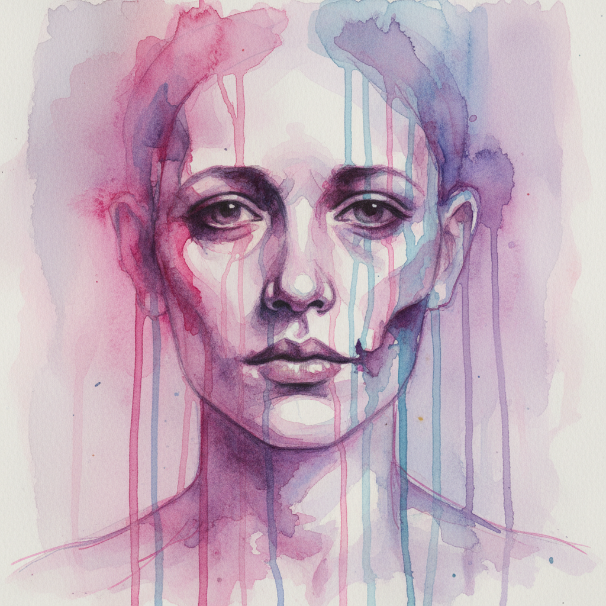

# Marlene Dumas 马琳·杜马斯

> **流派**: 当代绘画 · 具象表现主义  
> **时期**: 1953–至今 南非/荷兰  
> **关键词**: 水彩肖像、情色与死亡、照片转化、湿润笔触

## 概述

马琳·杜马斯是当代最重要的具象画家之一。她从报纸照片、色情杂志、犯罪现场照和个人快照出发，用稀薄流淌的油彩和水彩创作肖像——面孔在颜料的流动中变得模糊而鬼魅。她的作品直面情色、死亡、种族和暴力等禁忌主题，用极度脆弱的笔触表达极度强烈的情感。

## 视觉特征

- **稀薄颜料**: 油彩或水彩极度稀释，在画面上流淌
- **模糊面孔**: 五官在颜料流动中溶解
- **肉色调**: 大量粉红、紫红和苍白的肤色
- **照片来源**: 基于各种摄影图像但高度转化
- **小尺幅系列**: 常以大量小幅水彩组成系列

## 代表作品

- 《画家》(The Painter, 1994)
- 《死去的玛丽莲》(Dead Marilyn, 2008)
- 《模特》(Models) 系列
- 《伟大的男人》(Great Men) 系列

## 历史影响

杜马斯证明了绘画可以比摄影更加直接地触及人类的脆弱性。她的稀薄笔触让每一幅肖像都像是即将消失的幽灵，在美与恐惧之间创造了独特的张力。

## 相关风格

- [Luc Tuymans 吕克·图伊曼斯](luc-tuymans.md)
- [Neo Rauch 尼奥·劳赫](neo-rauch.md)
- [Contemporary Figurative Art 当代具象艺术](contemporary-figurative-art.md)
