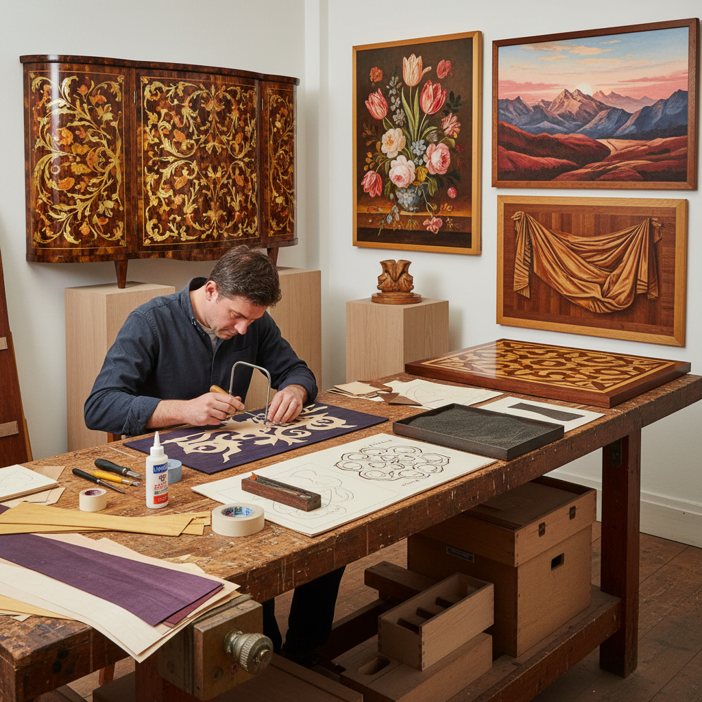

# Marquetry Art 薄片镶嵌

> "Marquetry is the art of painting with wood veneers — paper-thin slices of exotic timbers cut with surgical precision and assembled into pictures where every shade comes from nature's own palette, the grain of each piece flowing like brushstrokes, creating images that glow with an inner warmth no paint can match." — Unknown

## 概述

薄片镶嵌（Marquetry）是一种使用极薄的木材薄片（veneer，通常0.5-1mm厚）切割成精确的形状，然后拼合粘贴在家具或面板表面，创造装饰性图案和图像的木工艺术。与Intarsia使用较厚木块不同，Marquetry使用的薄片几乎是平面的，最终效果类似于绘画——但所有的"颜色"都来自不同木材的天然色彩。

Marquetry在17世纪的荷兰和法国达到鼎盛——路易十四时期的法国宫廷家具大师André-Charles Boulle发明了著名的"Boulle work"（龟甲与黄铜的镶嵌）。传统Marquetry使用"packet cutting"技法——将多层薄片叠在一起用线锯同时切割，使相邻的片完美吻合。当代Marquetry艺术家能够创造出照片级写实的图像，利用数百种木材的天然色彩和纹理。

## 核心特征

| 特征 | 描述 |
|------|------|
| 薄片 | 使用极薄木材薄片 |
| 平面 | 平面拼合效果 |
| 天然色 | 利用木材天然色彩 |
| 精密 | 极其精密的切割 |
| 装饰 | 装饰性艺术 |
| 家具 | 常用于家具装饰 |

## 视觉特征

- **平滑**：平滑的表面
- **木色**：丰富的天然木色
- **精密**：精密的拼合接缝
- **绘画感**：类似绘画的效果
- **光泽**：抛光后的光泽
- **纹理**：木纹的方向性

## 代表作品

| 作品 | 艺术家 | 年代 | 意义 |
|------|--------|------|------|
| *Boulle work furniture* | André-Charles Boulle | 17世纪 | 布尔镶嵌家具 |
| *Dutch floral marquetry* | 荷兰工匠 | 17世纪 | 荷兰花卉镶嵌 |
| *Roentgen furniture* | David Roentgen | 18世纪 | 伦特根家具 |
| *Contemporary pictorial marquetry* | Various | 当代 | 当代图画镶嵌 |
| *Sand-shaded marquetry* | Various | 传统-当代 | 砂烫阴影镶嵌 |

## 历史时间线

| 时期 | 事件 |
|------|------|
| 古代 | 薄片镶嵌的早期实践 |
| 16世纪 | 意大利和德国的发展 |
| 17世纪 | 法国Boulle镶嵌的鼎盛 |
| 18世纪 | 新古典主义风格的镶嵌 |
| 当代 | 艺术化的当代镶嵌 |

## 中国语境

薄片镶嵌在中国有相关的传统——中国传统家具中的"百宝嵌"和螺钿镶嵌与Marquetry有相似的美学追求。中国的红木家具传统中有精美的薄片装饰。当代中国的一些高端家具品牌引入了西方Marquetry技法。中国的木工教育中也开始教授Marquetry技术。中国的传统漆器中的"嵌"工艺（如嵌螺钿、嵌金银）与Marquetry有技法上的相似性。

## AI生成概念图

## 与其他风格的关系

- **Intarsia** → 木镶嵌
- **Parquetry** → 几何镶嵌
- **Boulle Work** → 布尔镶嵌
- **Woodworking** → 木工
- **Veneer Art** → 薄片艺术
- **Decorative Arts** → 装饰艺术

---

*浮光艺志 | Chronicle of Artistry*
