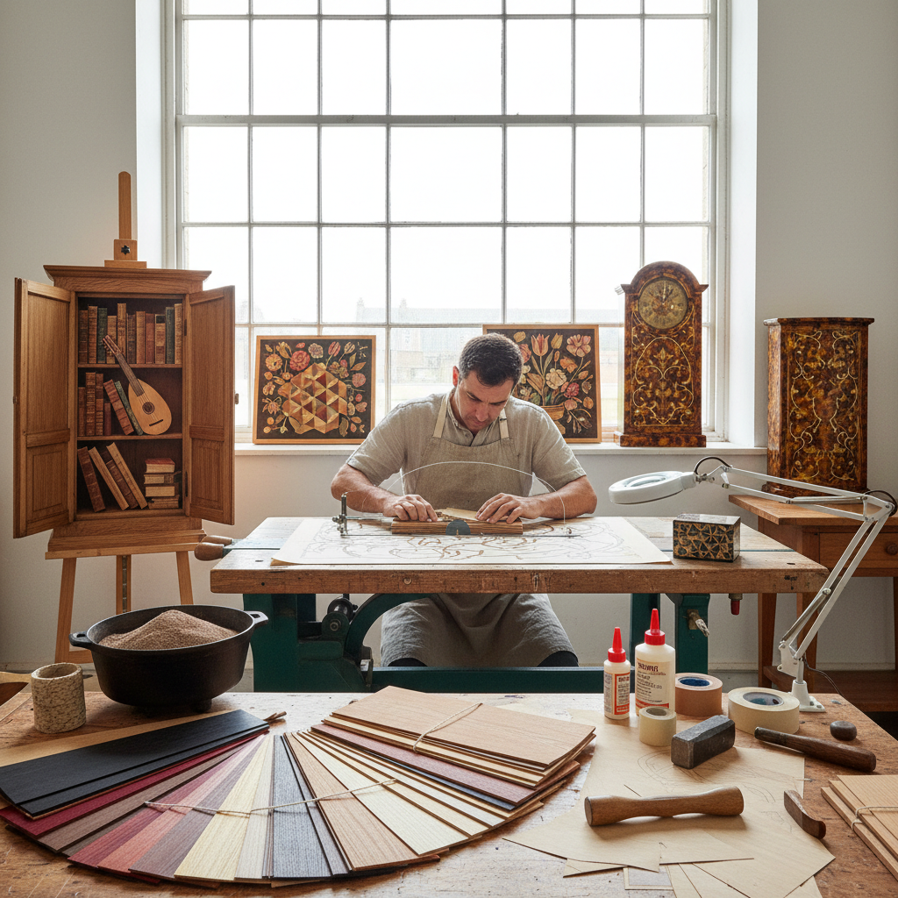

# Marquetry Inlay Art 镶嵌细工艺术

> "Marquetry is painting with wood — the marqueteur selects veneers for their color, grain, and figure the way a painter mixes pigments on a palette, cutting and assembling thousands of tiny pieces into pictures that glow with the natural warmth of timber. Unlike paint, these colors will never fade; they are the wood itself, and they deepen with age." — Unknown

## 概述

镶嵌细工艺术（Marquetry Inlay Art）是将不同颜色和纹理的薄木片（贴面）精确切割并拼合成装饰图案或画面的木工装饰艺术——以其"用木材作画"的独特表现力和极其精细的工艺著称。镶嵌细工是家具装饰中最精美的技法之一，在文艺复兴和巴洛克时期达到巅峰。

镶嵌细工艺术的实践包括：1）Marquetry——在表面贴合不同木材薄片形成图案；2）Intarsia——将不同木材嵌入凹槽形成图案；3）Parquetry——几何图案的木材拼花；4）Boulle work——龟甲和黄铜的镶嵌；5）Pietra dura——石材镶嵌（硬石镶嵌）；6）当代镶嵌——将传统技法与现代设计结合的创作。

## 核心特征

| 特征 | 描述 |
|------|------|
| 精细 | 极其精细的切割 |
| 色彩 | 天然木材的色彩 |
| 纹理 | 利用木纹的表现力 |
| 耐久 | 永不褪色的天然色 |
| 奢华 | 极其耗时的奢华工艺 |
| 叙事 | 可以表现复杂画面 |

## 视觉特征

- **拼合**：无缝拼合的木片
- **色彩**：天然木材的丰富色调
- **纹理**：木纹方向的巧妙利用
- **细节**：极其精细的图案细节
- **光泽**：抛光后的温润光泽
- **深度**：色调变化的空间深度

## 代表作品

| 作品 | 艺术家/文化 | 年代 | 意义 |
|------|-------------|------|------|
| *Studiolo of Federico* | 意大利 | 1476 | 文艺复兴镶嵌巅峰 |
| *André-Charles Boulle furniture* | Boulle | 17世纪 | 法国布尔镶嵌 |
| *David Roentgen cabinets* | Roentgen | 18世纪 | 德国镶嵌大师 |
| *Japanese yosegi-zaiku* | 日本传统 | 江户时代 | 日本寄木细工 |
| *Silas Kopf works* | Silas Kopf | 当代 | 当代镶嵌大师 |

## 历史时间线

| 时期 | 事件 |
|------|------|
| 古代 | 埃及和罗马的早期镶嵌 |
| 文艺复兴 | 意大利intarsia的黄金时代 |
| 17世纪 | 法国Boulle镶嵌的发展 |
| 18世纪 | 镶嵌细工的巅峰 |
| 当代 | 镶嵌艺术的现代传承 |

## 中国语境

镶嵌细工艺术在中国有独特的传统形式。中国传统家具中的"百宝嵌"是一种综合性的镶嵌技法——将玉石、象牙、珊瑚、螺钿等多种材料嵌入木材表面。中国的螺钿镶嵌（螺钿漆器）是中国特有的镶嵌艺术——将贝壳薄片嵌入漆面形成精美图案。中国明清家具中的"攒斗"技法与parquetry有相似之处——将小块木材拼合成几何图案用于家具装饰。中国的硬木家具传统中，不同木材的搭配使用也体现了镶嵌的美学——如紫檀与黄花梨的对比。中国当代的一些家具设计师将传统镶嵌技法与现代设计结合——创造具有东方美学的当代镶嵌作品。中国的非物质文化遗产中，多种镶嵌技艺被列入保护名录——如扬州漆器的螺钿镶嵌、福建的木雕镶嵌等。

## AI生成概念图

## 与其他风格的关系

- **Intarsia** → 嵌木艺术
- **Wood Carving** → 木雕艺术
- **Furniture Design** → 家具设计
- **Mosaic Art** → 马赛克艺术
- **Pietra Dura** → 硬石镶嵌
- **Decorative Art** → 装饰艺术

---

*浮光艺志 | Chronicle of Artistry*
