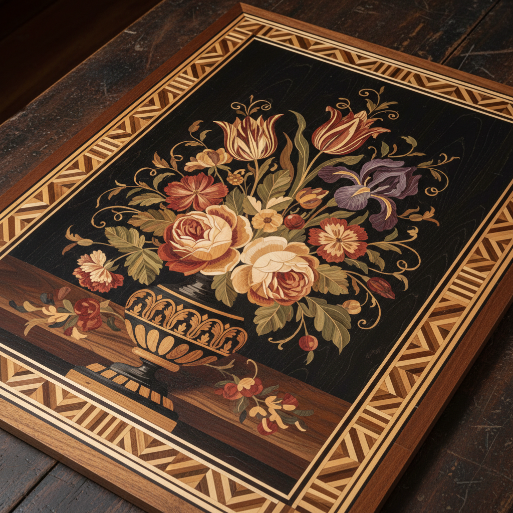

# Marquetry 木镶嵌 | Intarsio / Tarsia

> **"木头的调色板——工匠用百种木材的天然色差绘制出不用颜料的画。"**

## 概述

木镶嵌（Marquetry / Intarsio / Tarsia）是用不同颜色和纹理的木材薄片精确切割后拼贴成图案的装饰艺术。"Marquetry"源自法语"marqueter"（镶嵌），"Intarsio"是意大利语。这种工艺利用不同木材的天然色差（从乌木的黑色到黄杨的淡黄）创造图案，无需使用颜料。意大利文艺复兴时期的Intarsia（建筑透视画）和法国路易十四时期的André-Charles Boulle的铜龟甲镶嵌（Boulle Work）是这种艺术的两大巅峰。

## 主要传统

| 传统 | 时期 | 特征 |
|------|------|------|
| 意大利Intarsia | 15世纪 | 建筑透视错觉 |
| Boulle Work | 17世纪 | 铜+龟甲，法国宫廷 |
| 荷兰花卉 | 17-18世纪 | 写实花卉静物 |
| 英国Tunbridge | 19世纪 | 微型马赛克木镶嵌 |
| 日本寄木细工 | 江户时代 | 几何图案，箱根 |
| 摩洛哥Thuya | 传统 | 柏木瘤镶嵌 |

## 核心特征

- **天然色差**：利用木材本身的颜色
- **精确切割**：薄片精确拼合
- **无颜料**：纯粹的木材色彩
- **多种木材**：使用数十种不同木材
- **平面贴合**：薄片贴在家具表面
- **打磨抛光**：表面光滑如镜

## 常见木材

| 木材 | 颜色 |
|------|------|
| 乌木 Ebony | 黑色 |
| 黄杨 Boxwood | 淡黄 |
| 紫檀 Rosewood | 深红紫 |
| 胡桃 Walnut | 深棕 |
| 枫木 Maple | 浅白 |
| 桃花心木 Mahogany | 红棕 |

## 视觉特征

- 木材天然纹理的丰富变化
- 精密的拼接无缝隙
- 温暖的木质色调
- 写实或几何的精美图案
- 光滑抛光的表面
- 自然材料的温润质感

## 与其他风格的关系

| 风格 | 关系 |
|------|------|
| Pietra Dura | 共享精密镶嵌传统 |
| 日本寄木细工 | 木镶嵌的日本分支 |
| Art Deco | 几何木镶嵌的现代应用 |
| 当代家具设计 | Marquetry的现代复兴 |
| Parquetry | 几何木地板图案 |

## 概念图

---

*浮光艺志 | Chronicle of Artistry*
