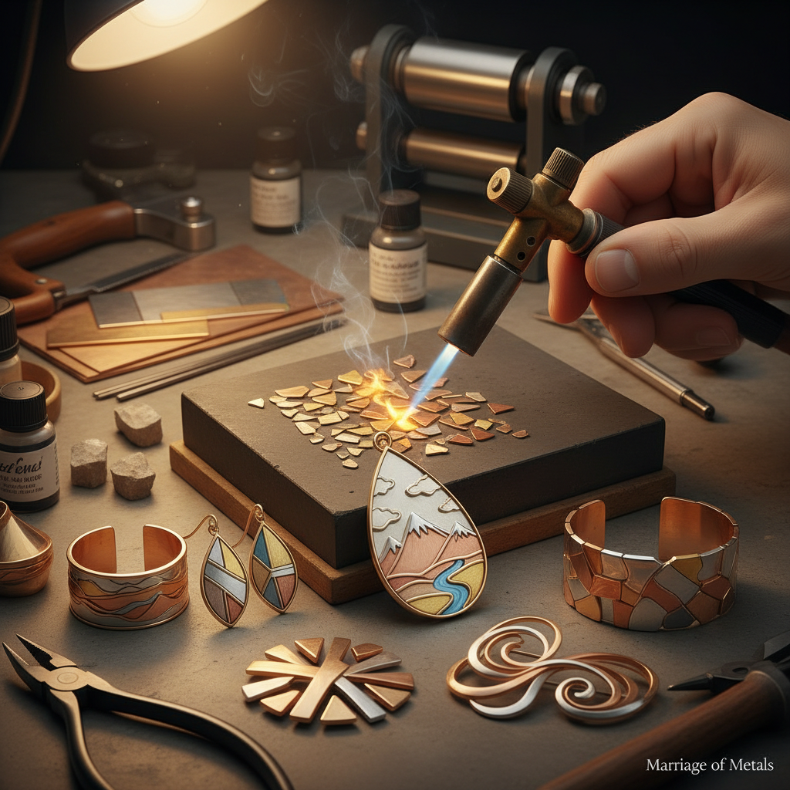

# Marriage of Metals 金属嫁接

> "Marriage of metals is the jeweler's alchemy — soldering different colored alloys edge to edge into a single sheet, then forging, rolling, and forming them as one, so that gold, silver, and copper flow together like rivers merging on a map." — Unknown

## 概述

金属嫁接（Marriage of Metals）是一种将不同颜色或种类的金属片焊接在一起形成单一金属板的技法——然后将这块复合金属板像普通金属一样进行锻造、轧制和成型。最终的作品呈现出不同金属颜色的图案——类似于拼图或马赛克，但完全平整、无缝。

金属嫁接与木目金（Mokume-gane）不同——木目金是将金属层叠后锻造产生木纹图案，而金属嫁接是将金属片边对边焊接。金属嫁接的魅力在于：艺术家可以精确控制不同金属的位置和形状，创造出有意识的图案设计。常用的金属组合包括：黄金与白金、银与铜、黄铜与银、不同K金之间的组合。

## 核心特征

| 特征 | 描述 |
|------|------|
| 拼接 | 不同金属的拼接 |
| 焊接 | 边对边焊接 |
| 多色 | 多种金属颜色 |
| 平整 | 完全平整无缝 |
| 设计 | 精确的图案设计 |
| 一体 | 形成一体化金属板 |

## 视觉特征

- **多色**：不同金属的颜色对比
- **图案**：精确的图案设计
- **平整**：完全平整的表面
- **无缝**：无缝的金属过渡
- **几何**：几何图案常见
- **有机**：也可创造有机图案

## 代表作品

| 作品 | 艺术家 | 年代 | 意义 |
|------|--------|------|------|
| *Marriage of metals rings* | Various | 当代 | 金属嫁接戒指 |
| *Multi-metal pendants* | Various | 当代 | 多金属吊坠 |
| *Marriage of metals bracelets* | Various | 当代 | 金属嫁接手镯 |
| *Landscape jewelry* | Various | 当代 | 风景主题首饰 |
| *Abstract metal art* | Various | 当代 | 抽象金属艺术 |

## 历史时间线

| 时期 | 事件 |
|------|------|
| 古代 | 不同金属组合的早期尝试 |
| 中世纪 | 金属镶嵌技法的发展 |
| 20世纪 | 工作室首饰运动中的系统化 |
| 1970s | 当代金属工艺中的流行 |
| 1990s | 技法的教学推广 |
| 当代 | 金属嫁接在当代首饰中的广泛应用 |

## 中国语境

金属嫁接在中国的当代首饰设计领域有一定的应用。中国传统的金属工艺中有类似的"错金银"技法——将金银丝嵌入其他金属表面。当代中国的首饰设计师使用金属嫁接创作多色金属首饰。中国的珠宝设计学校和金属工艺课程教授金属嫁接技法。金属嫁接的"多种金属和谐共存"理念在中国的设计文化中有共鸣。

## AI生成概念图

## 与其他风格的关系

- **Mokume-gane** → 木目金
- **Keum-boo** → 金箔贴合
- **Damascening** → 大马士革镶嵌
- **Inlay** → 镶嵌
- **Jewelry Making** → 首饰制作
- **Silversmithing** → 银器制作

---

*浮光艺志 | Chronicle of Artistry*
