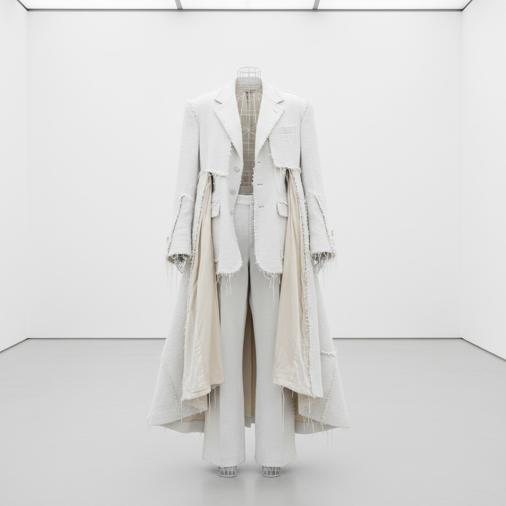

# Martin Margiela 马丁·马吉拉

> **时期：** 1957–至今  
> **关键词：** 解构时装、匿名设计、回收再造、白色标签

## 概述

Martin Margiela 是比利时时装设计师，以极端的解构主义和匿名性闻名。他从不公开露面、不接受采访、用白色标签代替品牌名——他的设计将旧衣服拆解重组、把衬里翻到外面、用胶带代替缝线，彻底颠覆了时尚的制作逻辑和展示方式。

## 风格特征

- **解构**：暴露缝线、衬里外翻、未完成的边缘
- **回收再造**：用旧衣服、跳蚤市场物品重新创作
- **白色**：工作室、标签、邀请函全部是白色
- **匿名**：设计师本人从不露面，拒绝个人崇拜
- **尺度游戏**：将小号衣服放大或大号缩小

## 代表作品

- *Tabi 分趾靴*（1988）
- *Artisanal 系列*（回收再造高定）
- *白色油漆系列*
- *Flat Garments*（将3D衣服压平为2D）

## 概念图

