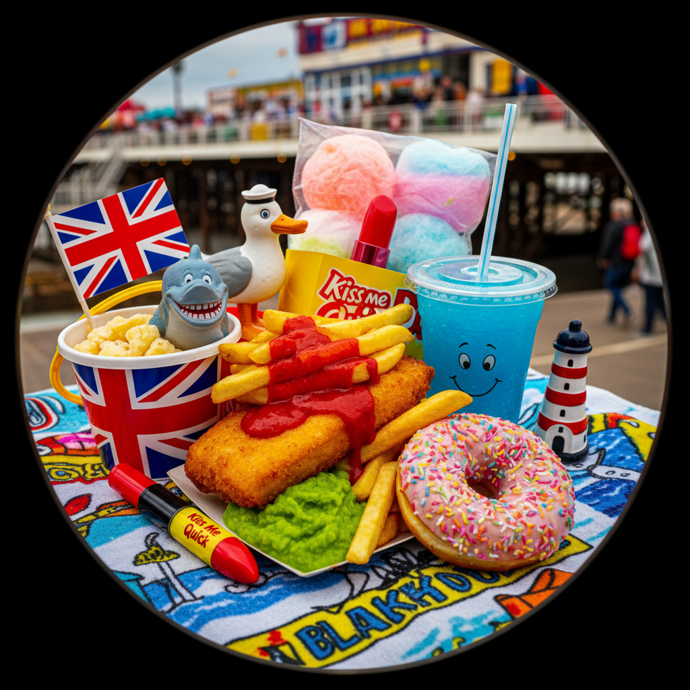

# Martin Parr 马丁·帕尔

> **时期：** 1952–至今  
> **关键词：** 新纪实摄影、消费主义讽刺、闪光灯美学、英国日常

## 概述

Martin Parr 是英国摄影师，以尖锐而幽默的视角记录消费社会的荒诞。他用环形闪光灯和高饱和度色彩拍摄海滩度假、快餐、纪念品商店和中产阶级的休闲生活——这些照片既是社会学文献，也是对大众文化的温柔嘲讽。

## 风格特征

- **环形闪光灯**：消除阴影的正面强光，创造出平面化的"超真实"效果
- **高饱和色彩**：鲜艳到刺眼的颜色强化消费品的视觉冲击
- **微距特写**：食物、手指、嘴唇的极近距离拍摄
- **消费主义主题**：购物、旅游、快餐等大众消费场景
- **英式幽默**：温和的讽刺而非恶意的批判

## 代表作品

- *The Last Resort*（1986）
- *Common Sense*（1999）
- *Luxury*（2009）
- *Life's a Beach*（2013）

## 概念图

