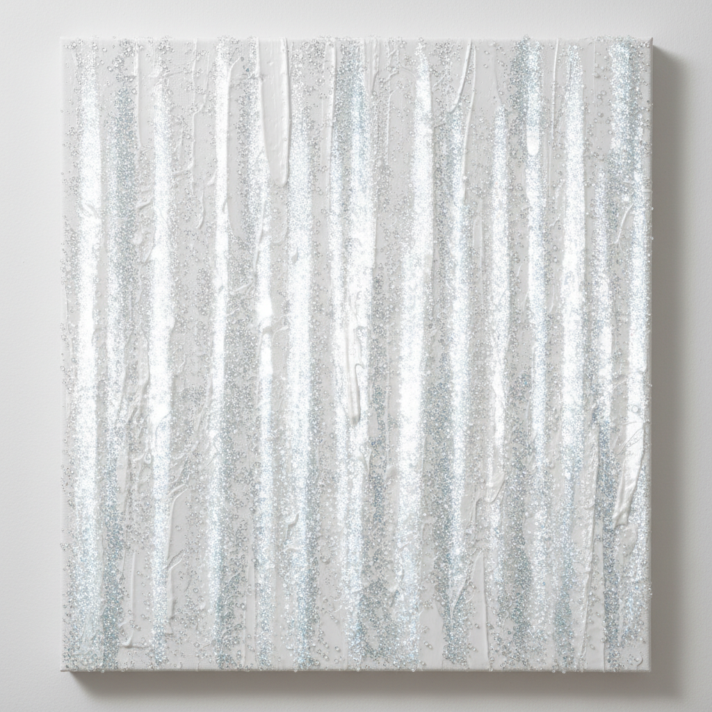

# Mary Corse 玛丽·科尔斯

> **时期：** 1945–至今  
> **关键词：** 白光绘画、玻璃微珠、光与空间运动、感知绘画

## 概述

Mary Corse 是美国画家，"光与空间"运动中唯一坚持绘画媒介的核心成员。她的标志性作品是在白色丙烯颜料中混入玻璃微珠（用于公路反光标线的材料），创造出随观者移动而变化的光学表面——从某些角度看是哑光白色，从另一些角度则闪烁着银色光芒。

## 风格特征

- **玻璃微珠**：颜料中混入的微珠使画面随观看角度变化而闪烁
- **白色为主**：以白色和浅灰色为主调，探索光的最纯粹状态
- **垂直条带**：画面常以垂直的宽条带结构组织
- **身体性观看**：作品要求观者移动身体来体验光的变化
- **绘画的物质性**：将绘画从再现解放为纯粹的光学物质体验

## 代表作品

- *White Light*系列（1960s–至今）
- *Untitled (White Multiple Inner Band)*（2003）
- *Untitled (Black Earth)*系列
- *Untitled (White Narrow Inner Band)*（2019）

## 历史意义

Corse 证明了绘画可以像James Turrell的光装置一样操控感知，而不需要放弃画布和颜料。她长期被忽视，直到2010年代才获得应有的重新评价，成为"光与空间"运动中最后被发现的大师。

## 概念图

