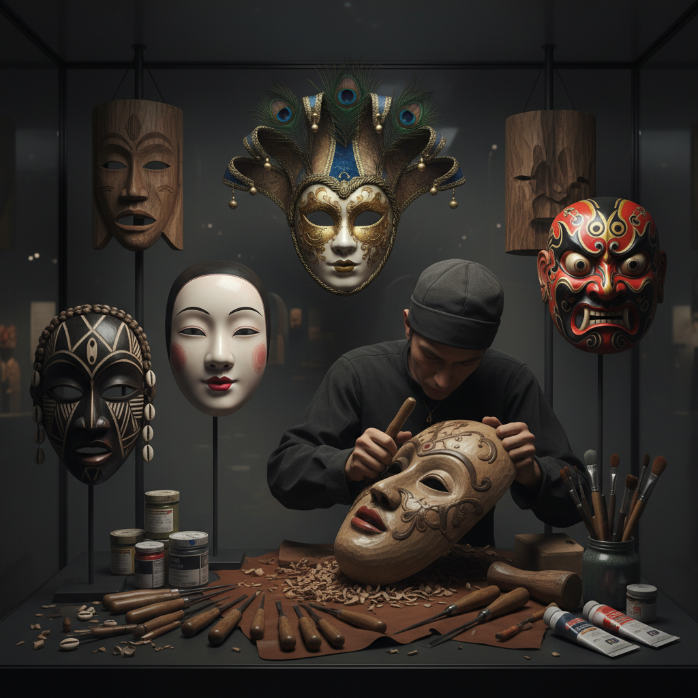

# Mask Making 面具制作

> "A mask is a face for the invisible — it gives form to spirits, gods, and the hidden selves we dare not show." — Unknown

## 概述

面具制作（Mask Making）是创造可佩戴或展示的面部覆盖物的工艺艺术。面具是人类最古老的艺术形式之一——从旧石器时代的仪式面具到当代的艺术面具，面具在人类文化中扮演着独特的角色：它既隐藏又揭示，既是伪装又是真实。面具的材料极其多样：木、皮革、纸浆、金属、陶瓷、织物等。每种文化都有自己独特的面具传统——从非洲的仪式面具到日本的能面，从威尼斯的嘉年华面具到中国的傩面具。

面具的哲学在于：变形——戴上面具的瞬间，佩戴者变成了另一个存在，面具是人与神、人与兽、自我与他者之间的门户。

## 核心特征

| 特征 | 描述 |
|------|------|
| 面部 | 覆盖或代表面部 |
| 变形 | 转化身份的功能 |
| 仪式 | 常用于仪式场合 |
| 多材 | 材料极其多样 |
| 文化 | 深厚的文化内涵 |
| 表演 | 与表演艺术结合 |

## 视觉特征

- **表情**：夸张或程式化的表情
- **色彩**：鲜艳的色彩装饰
- **雕刻**：精细的雕刻细节
- **对称**：面部的对称结构
- **象征**：象征性的图案
- **戏剧**：戏剧性的视觉效果

## 代表作品

| 作品 | 艺术家 | 年代 | 意义 |
|------|--------|------|------|
| *African ritual masks* | 匿名 | 传统 | 非洲仪式面具 |
| *Japanese Noh masks* | Various | 14世纪+ | 日本能面 |
| *Venetian carnival masks* | 匿名 | 13世纪+ | 威尼斯嘉年华 |
| *Chinese Nuo masks* | 匿名 | 传统 | 中国傩面具 |
| *Balinese Topeng masks* | Various | 传统 | 巴厘岛面具舞 |

## 历史时间线

| 时期 | 事件 |
|------|------|
| 旧石器时代 | 最早的仪式面具 |
| 古代 | 各文明的面具传统 |
| 中世纪 | 欧洲嘉年华面具 |
| 14世纪+ | 日本能面的发展 |
| 传统 | 全球各地的面具文化 |
| 当代 | 当代面具艺术 |

## 中国语境

中国有丰富的面具传统——傩面具是中国最重要的面具艺术，被列为国家级非物质文化遗产。傩面具用于傩戏（中国最古老的戏剧形式之一），代表各种神灵和角色。贵州、江西、安徽等地都有傩面具传统。此外，中国的藏戏面具、京剧脸谱（虽然是化妆而非面具）、社火面具等也是重要的面具文化。当代中国艺术家也在探索面具作为当代艺术表达的可能性。

## AI生成概念图

## 与其他风格的关系

- **Woodcarving** → 木雕（木面具）
- **Papier-mâché** → 纸浆塑形
- **Theater** → 戏剧艺术
- **Sculpture** → 雕塑
- **Folk Art** → 民间艺术
- **Ritual Art** → 仪式艺术

---

*浮光艺志 | Chronicle of Artistry*
