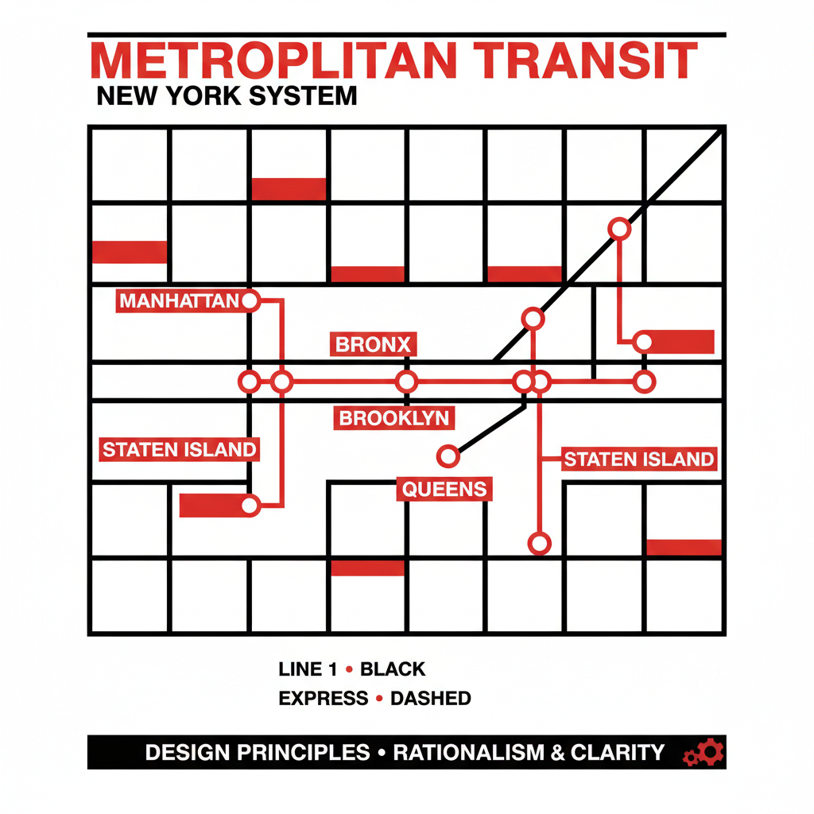

# Massimo Vignelli 马西莫·维涅利

> **时期：** 1931–2014  
> **关键词：** 网格系统、Helvetica、纽约地铁图、永恒设计

## 概述

Massimo Vignelli 是意大利裔美国设计师，以严格的网格系统和对Helvetica字体的执着闻名。他设计了纽约地铁导视系统、美国航空标志和无数企业形象——坚信好的设计应该是永恒的，只需要少数几种字体和严格的秩序就能解决一切视觉问题。

## 风格特征

- **网格至上**：所有元素都严格对齐到网格系统
- **字体极简**：一生只用5-6种字体（以Helvetica为核心）
- **黑白红**：极度克制的色彩使用
- **信息清晰**：设计的首要目的是清晰传达信息
- **永恒性**：拒绝时尚和潮流，追求不过时的设计

## 代表作品

- *纽约地铁导视系统*（1972）
- *American Airlines 标志*（1967）
- *Knoll 家具图录*
- *Bloomingdale's 购物袋*

## 概念图

