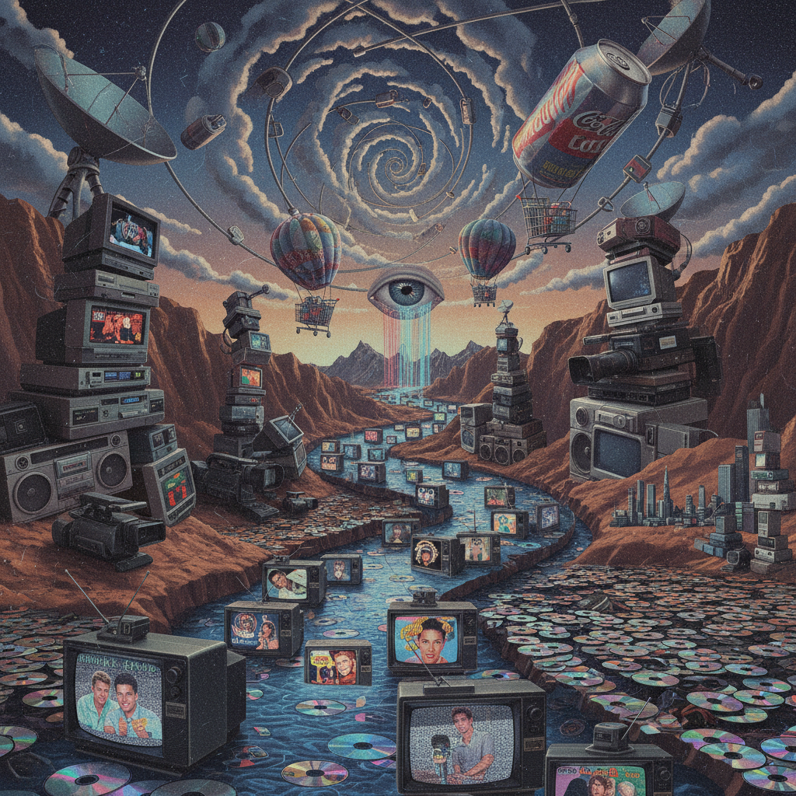

# Massurrealism 大众超现实主义

> **时期：** 1992–至今  
> **关键词：** 数字超现实、大众媒体拼贴、技术梦境、互联网意识流

## 概述

Massurrealism 由艺术家 James Seehafer 于1992年提出，是超现实主义在数字时代的延伸。它将大众媒体（mass media）与超现实主义（surrealism）结合——用Photoshop、数字拼贴和互联网图像流来创造梦境般的视觉体验。与传统超现实主义依赖潜意识不同，Massurrealism 的"潜意识"是大众媒体本身——电视、广告、网络图像构成了当代人的集体梦境。

## 风格特征

- **数字拼贴**：用数字工具无缝合成不相关的图像
- **媒体碎片**：电视屏幕、广告、新闻图像作为素材
- **超现实并置**：不可能的场景以照片级真实感呈现
- **技术美学**：像素、故障、数字纹理作为视觉元素
- **消费文化**：商品和品牌符号的梦境化处理

## 代表人物与作品

- James Seehafer 数字拼贴系列
- 当代数字超现实主义摄影
- 互联网 meme 文化中的超现实元素

## 概念图

