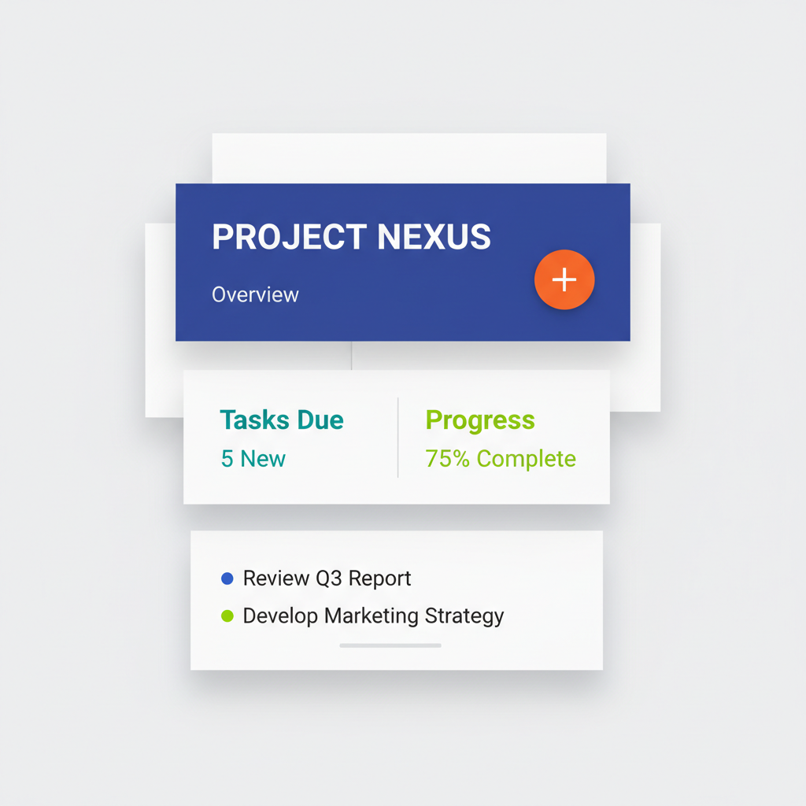

# Material Design 材料设计

> **时期：** 2014年–至今  
> **关键词：** 纸张隐喻、海拔层级、有意义的动效、网格系统、Google设计语言

## 概述

Material Design（材料设计）是Google于2014年发布的设计语言，以"数字纸张"为核心隐喻。它将界面元素想象为不同海拔高度的纸片，通过阴影表达层级关系，用有意义的动效传达交互逻辑。Material Design试图在扁平化的简洁与拟物化的可理解性之间找到平衡点。

## 风格特征

- **纸张隐喻**：界面元素如同不同高度的纸片
- **海拔阴影**：通过阴影深浅表达层级
- **有意义动效**：动画传达因果关系和空间逻辑
- **大胆色彩**：鲜明的主色调和强调色
- **网格排版**：8dp基准网格的严格对齐

## 代表应用

- Google全系产品（Gmail、Maps、Drive）
- Android操作系统
- Material Design Components库
- 大量第三方应用采用

## 概念图

