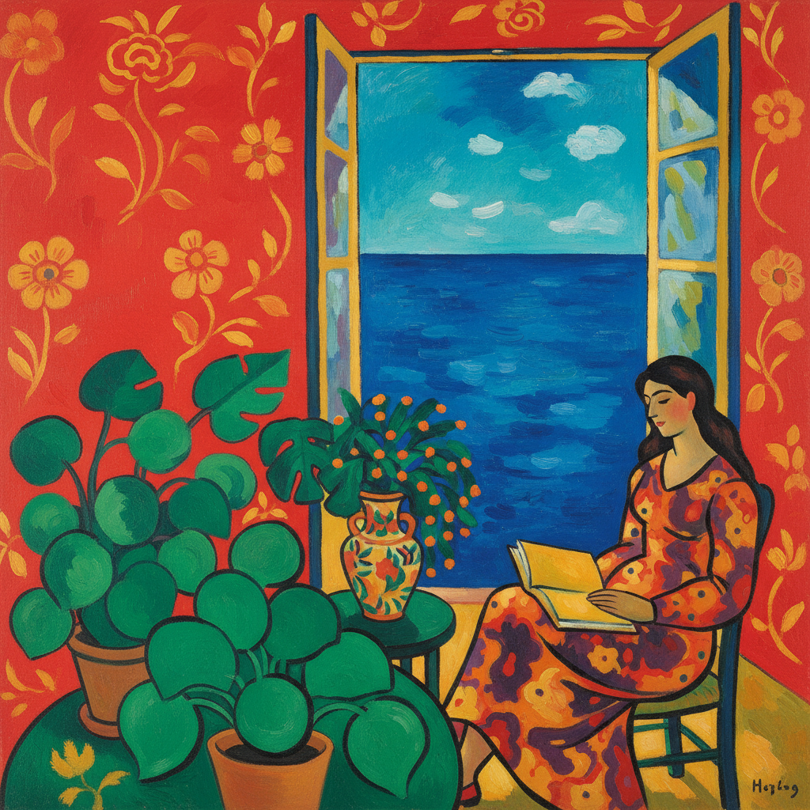

# Henri Matisse 马蒂斯

> "What I dream of is an art of balance, of purity and serenity, devoid of troubling or depressing subject matter... like a good armchair." — Henri Matisse

## 概述

亨利·马蒂斯（Henri Émile Benoît Matisse，1869–1954）是20世纪最重要的色彩大师，野兽派（Fauvism）的领袖，也是与毕加索并列的现代艺术两大巨人之一。他以大胆的纯色平涂、简化的形式和装饰性的构图创造了一种充满愉悦和生命力的艺术语言。

马蒂斯一生追求"表达的艺术"——用最简洁的手段传达最丰富的情感。从早期野兽派的色彩爆炸，到晚期剪纸的极致简化，他始终在寻找色彩、线条和形式的完美平衡。

## 核心特征

| 特征 | 描述 |
|------|------|
| 纯色平涂 | 大面积的纯色平涂，拒绝明暗建模 |
| 装饰性 | 图案、织物、壁纸的装饰性融合 |
| 简化形式 | 将复杂形体简化为本质线条 |
| 愉悦感 | 追求视觉愉悦和生命力 |
| 色彩解放 | 色彩不必忠实于自然——红色的房间、蓝色的裸体 |
| 晚期剪纸 | "用剪刀画画"——彩色纸张的剪贴 |

## 视觉特征

- **色彩**：大胆的纯色——红、蓝、绿、橙的平涂
- **线条**：流畅的、装饰性的阿拉伯式曲线
- **空间**：扁平化的空间，拒绝传统透视
- **图案**：织物、壁纸、地毯的装饰图案
- **人物**：简化的、优雅的人体轮廓
- **氛围**：愉悦、宁静、充满阳光

## 代表作品

| 作品 | 年代 | 意义 |
|------|------|------|
| *The Dance* | 1910 | 五个红色人体在绿色大地上舞蹈 |
| *Woman with a Hat* | 1905 | 野兽派的宣言——绿色的脸 |
| *The Red Studio* | 1911 | 红色吞没一切——空间的革命 |
| *Blue Nude II* | 1952 | 晚期剪纸的巅峰 |
| *The Snail* | 1953 | 纯色块的抽象——84岁的自由 |
| *Jazz* 系列 | 1947 | 剪纸艺术书——"用剪刀画画" |

## 真实作品（公共领域）

马蒂斯的部分早期作品已进入公共领域：

| 作品 | 来源 |
|------|------|
| *Woman with a Hat* | [SF MoMA](https://www.sfmoma.org/) |
| *The Dance* | [Hermitage](https://www.hermitagemuseum.org/) |

> ⚠️ 马蒂斯的多数作品仍受版权保护（至2024年后逐步进入公共领域）。本条目使用AI生成概念图展示风格特征。

## AI生成概念图

## 与其他风格的关系

- **Fauvism** → 野兽派的领袖和命名者
- **Post-Impressionism** → 从后印象派发展而来
- **Nabis** → 受纳比派装饰性影响
- **Islamic Art** → 受伊斯兰装饰艺术影响
- **Abstract Art** → 晚期剪纸接近纯抽象
- **Color Field** → 色域绘画的先驱

---

*浮光艺志 | Chronicle of Artistry*
