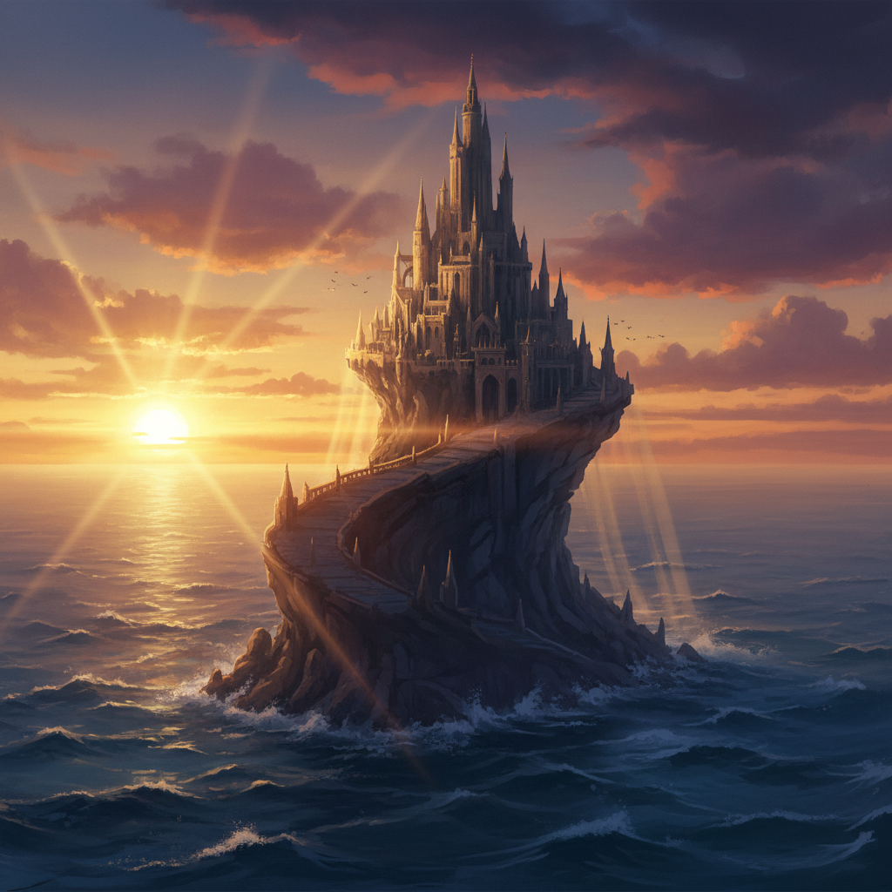

# Matte Painting 数字绘景



> **"让观众相信他们看到了一个不存在的世界——电影魔法最古老的秘密。"**

## 概述

| 维度 | 描述 |
|------|------|
| 时期 | 1907–至今 |
| 别名 | Matte Painting, Digital Matte Painting, 绘景, 接景 |
| 核心色彩 | 电影色调——青橙、冷暖对比、大气透视色 |
| 关键元素 | 照片级真实感、大气透视、电影构图、环境叙事 |
| 代表人物 | Dylan Cole, Yanick Dusseault, Peter Ellenshaw |
| 关联风格 | Concept Art, Photorealism, Landscape Painting, VFX |

---

## 历史脉络

| 年份 | 事件 |
|------|------|
| 1907 | Norman Dawn——最早的电影绘景技术 |
| 1930s | 好莱坞黄金时代——玻璃绘景 |
| 1977 | 《星球大战》——传统绘景的巅峰 |
| 1990s | 数字绘景取代传统——Photoshop革命 |
| 2000s | 3D+2D混合绘景——《指环王》 |
| 2010s | 全CG环境——绘景与3D的融合 |
| 2020s | AI辅助绘景+实时渲染+虚拟制片 |

### 核心哲学

Matte Painting的精神是**"让不可能的场景看起来像真的——这就是电影的魔法"**：
- 真实 = 目标（"观众不应该注意到绘景——他们应该相信那是真的"）
- 规模 = 力量（"一个人画出一座城市——这就是绘景的力量"）
- 大气 = 关键（"大气透视让平面变成空间"）
- 叙事 = 核心（"每个环境都在讲故事——即使没有角色"）
- "最好的绘景是你永远不会注意到的那些"

---

## 视觉语法

### 色彩系统

```
电影色调：
  青橙 — 好莱坞经典
  冷蓝 — 科幻、夜晚
  暖金 — 史诗、黄昏
  灰绿 — 末世、荒凉

大气透视：
  近景 — 高对比、高饱和
  中景 — 中等对比
  远景 — 低对比、偏蓝/灰
  天空 — 渐变、云层

规则：
  - 大气透视是核心
  - 光源统一
  - 照片级真实感
  - 电影构图（三分法、引导线）

质感：
  照片 — 基础素材
  绘画 — 补充细节
  3D — 结构基础
  合成 — 最终整合
```

### 标志性元素

| 类别 | 元素 |
|------|------|
| 场景 | 城市、废墟、外星球、历史场景、幻想世界 |
| 技法 | 照片合成+绘画+3D+大气效果 |
| 规模 | 宏大、史诗、超越现实 |
| 光影 | 电影级光影、体积光、大气散射 |
| 工具 | Photoshop, Nuke, Maya, Unreal Engine |
| 态度 | 真实感、规模感、叙事性、隐形 |

---

## 与千禧怀旧的关系

### 从"隐形艺术"到"可见艺术"
- 传统：绘景是"幕后"工作——观众不应该看到
- 现在：绘景作为独立艺术形式被欣赏
- ArtStation上的绘景作品 = 数字艺术的热门类别
- "Making of"视频让绘景从幕后走到台前

### 虚拟制片的革命
- LED Volume (如《曼达洛人》) = 实时绘景
- Unreal Engine = 绘景师的新工具
- "绘景不再是后期——是拍摄现场的一部分"

---

## 中国语境

- 中国电影VFX产业中的绘景需求
- 中国数字艺术家的绘景作品
- 中国古装/仙侠电影的绘景实践
- 中国游戏产业中的环境绘景

---

## 设计应用

| 场景 | 应用方式 |
|------|----------|
| 电影 | 环境扩展+虚拟场景+历史重建 |
| 游戏 | 背景+天空盒+过场+概念 |
| 广告 | 产品环境+品牌世界+视觉叙事 |
| 虚拟制片 | LED Volume+实时渲染+现场 |

---

## 相关风格

← [Concept Art 概念艺术](concept-art.md) | [Photorealism 照片写实主义](photorealism.md) →

↑ [返回千禧怀旧目录](README.md) | [返回总目录](../README.md)
