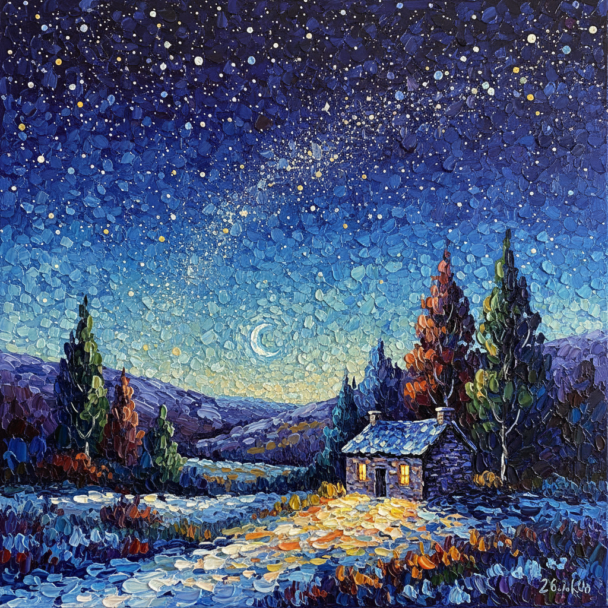

# Matthew Wong 王俊杰

> **时期：** 1984–2019  
> **关键词：** 孤独风景、星空夜色、厚涂色点、自学成才

## 概述

Matthew Wong 是加拿大华裔画家，以色彩浓烈、充满孤独感的风景画闻名。他几乎完全自学成才，在短暂的创作生涯中（约2014–2019）创造了大量融合梵高的笔触能量、波纳尔的色彩亲密感和中国山水画空间意识的作品。他于2019年去世，年仅35岁。

## 风格特征

- **厚涂色点**：以密集的短笔触和色点覆盖画面，如同彩色马赛克
- **夜景偏好**：大量描绘夜晚场景——星空、月光、窗户中透出的暖光
- **孤独氛围**：空旷的风景中偶尔出现单一人物或建筑，强调孤立感
- **色彩饱和**：即使是夜景也充满丰富的色彩——深蓝中的紫、绿和金
- **东西融合**：西方油画技法与中国山水画的留白和意境并存

## 代表作品

- *The Realm of Appearances*（2018）
- *Starry Night*（2019）
- *River at Dusk*（2018）
- *Blue*（2018）

## 历史意义

Wong 的作品证明了绘画仍然能够传达最深层的情感体验——孤独、渴望和美的共存。他的早逝和身后市场的爆发式增长引发了关于艺术家心理健康和市场伦理的重要讨论。

## 概念图

