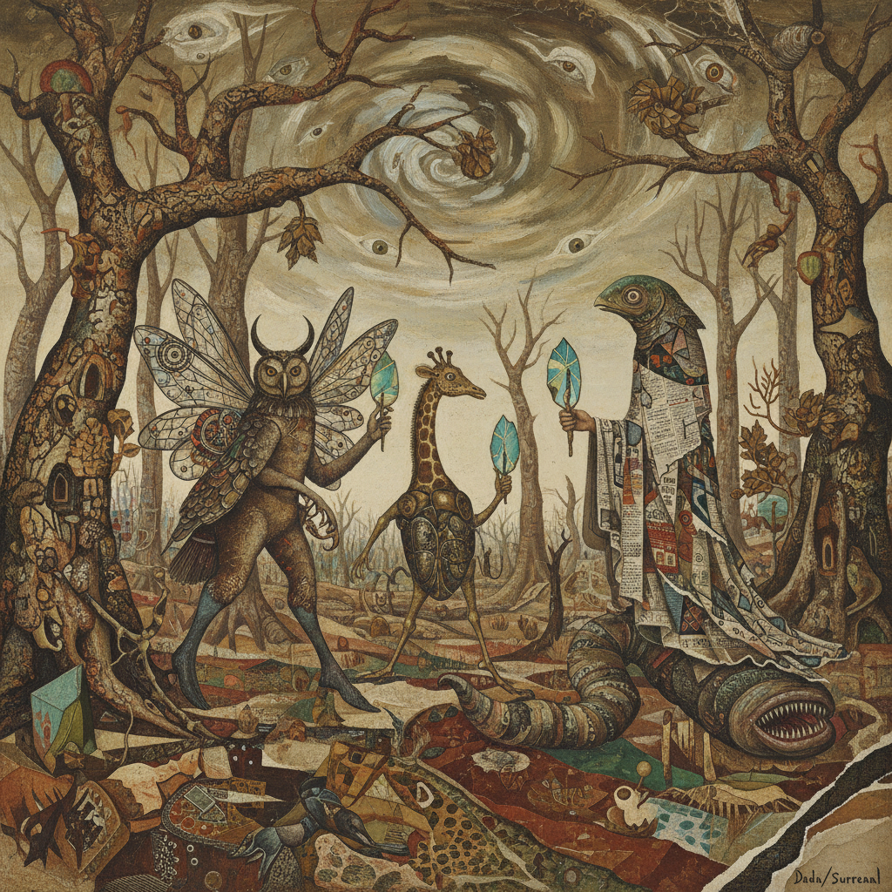

# Max Ernst 马克斯·恩斯特

> "Creativity is that marvelous capacity to grasp mutually distinct realities and draw a spark from their juxtaposition." — Max Ernst

## 概述

马克斯·恩斯特（Max Ernst，1891–1976）是德国/法国画家和雕塑家，达达主义和超现实主义的核心人物。他以发明多种自动技法闻名——拓印法（frottage）、刮擦法（grattage）和滴彩法（decalcomania），用偶然性和潜意识创造出充满奇异生物、原始森林和梦境风景的幻想世界。

## 核心特征

| 特征 | 描述 |
|------|------|
| 自动技法 | frottage、grattage的发明 |
| 奇异生物 | 鸟人Loplop等幻想角色 |
| 原始森林 | 密不透风的丛林幻象 |
| 拼贴小说 | 维多利亚版画的超现实重组 |
| 偶然性 | 让材料自己说话 |
| 变形 | 人与动物的混合体 |

## 代表作品

| 作品 | 年代 | 意义 |
|------|------|------|
| *The Elephant Celebes* | 1921 | 达达的荒诞杰作 |
| *Two Children Are Threatened by a Nightingale* | 1924 | 超现实拼贴的经典 |
| *Europe After the Rain II* | 1940–42 | 战争废墟的幻象 |
| *Une Semaine de Bonté* | 1934 | 拼贴小说的巅峰 |

## AI生成概念图

## 与其他风格的关系

- **Dada** → 科隆达达的核心人物
- **Surrealism** → 超现实主义的技法革新者
- **Abstract Expressionism** → 影响了美国抽象表现主义
- **Collage** → 拼贴艺术的大师
