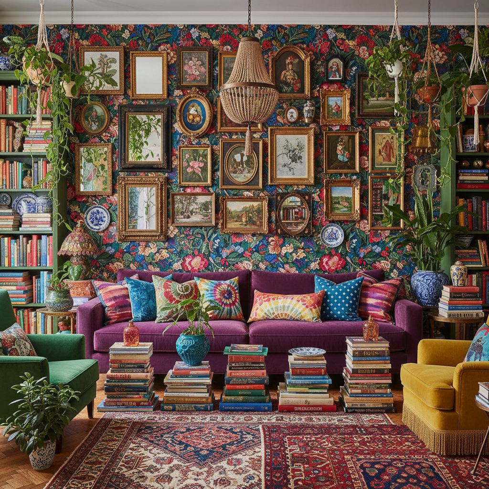

# Cluttercore Maximalism 极繁主义



> **"更多就是更多——当极简主义让你窒息，就用色彩和图案把房间填满。"**

## 概述

| 维度 | 描述 |
|------|------|
| 时期 | 2019–至今（作为对极简主义的反动） |
| 别名 | Maximalism, More-is-More, Anti-Minimalism |
| 核心色彩 | 所有颜色——越多越好 |
| 关键元素 | 图案混搭、色彩碰撞、收藏品堆叠、装饰过度 |
| 代表人物 | Iris Apfel、Alessandro Michele (Gucci)、Betsey Johnson |
| 关联风格 | Cluttercore, Dopamine Dressing, Kidcore, Grandmacore |

---

## 历史脉络

### 极简主义的反面

Maximalism 不是一个新概念，但作为**有意识的美学运动**在 2019 年后爆发：

| 时代 | 极繁主义表现 |
|------|-------------|
| 维多利亚时代 | 原始极繁——每个表面都要装饰 |
| 1960s–70s | 嬉皮/波西米亚的色彩爆炸 |
| 1980s | 后现代主义的"更多就是更多" |
| 2015–2018 | Alessandro Michele 的 Gucci 复兴 |
| 2019–至今 | TikTok 上的 Maximalism/Cluttercore |

### 为什么现在？

| 原因 | 解释 |
|------|------|
| 极简疲劳 | 10年的"断舍离"让人厌倦 |
| 疫情 | 居家期间重新审视自己的空间 |
| 心理健康 | 被物品包围 = 安全感 |
| 反消费悖论 | 极简主义变成了"买更贵的少量物品" |
| 个性表达 | 在算法时代，混乱 = 独特 |

### 核心哲学

Maximalism 的精神是**"你的空间应该讲述你的故事"**：
- 每个物品都有记忆和意义
- 完美是无聊的
- 混乱中有秩序（你的秩序）
- 生活不是展厅，是博物馆

---

## 视觉语法

### 色彩系统

```
规则：没有规则

原则：
  - 互补色碰撞（红+绿、蓝+橙）
  - 饱和度拉满
  - 图案叠图案
  - 金色/铜色作为连接色
  - 黑色作为"呼吸"色（可选）

质感：
  天鹅绒 — 沙发、窗帘
  丝绸 — 靠垫、围巾
  陶瓷 — 收藏品
  木材 — 各种木色混搭
  金属 — 金、铜、银混用
  纸张 — 书籍、杂志、明信片
```

### 标志性元素

| 类别 | 元素 |
|------|------|
| 墙面 | 画廊墙（密集挂画）、壁纸、挂毯 |
| 家具 | 不同风格混搭、vintage + 现代 |
| 收藏 | 书籍堆叠、陶瓷、旅行纪念品 |
| 纺织 | 多层地毯、混搭靠垫、流苏 |
| 植物 | 大量绿植、悬挂植物 |
| 照明 | 多光源、彩色灯、蜡烛群 |

---

## 与千禧怀旧的关系

### 对"千禧极简"的反叛
- 2010s 的 Instagram 美学 = 白墙+绿植+极简
- Maximalism 是对这种"假完美"的反叛
- "我的房间不需要看起来像 Airbnb"

### 与 Cluttercore 的关系
- Cluttercore = Maximalism 的 Gen Z 版本
- 更强调"混乱的舒适感"
- 更少"策展"，更多"真实生活"

### 与 Grandmacore 的交叉
- 奶奶的房子 = 原始 Maximalism
- 几十年的收藏品、照片、手工艺品
- Grandmacore 是 Maximalism 的"温暖版"

---

## 中国语境

- "极繁风"/"堆叠美学"
- 与中国传统审美的共鸣（雕梁画栋、满工雕刻）
- 小红书上的"收藏癖"/"杂货铺风格"
- 与"断舍离"文化的对抗
- 老北京四合院的装饰密度

---

## 设计应用

| 场景 | 应用方式 |
|------|----------|
| 品牌 | 多色+多图案+密集排版+装饰字体 |
| 空间 | 画廊墙+混搭家具+多层纺织+收藏品 |
| 包装 | 满版图案+多色+装饰边框+细节 |
| 数字 | 密集布局+动效+多色+装饰元素 |

---

## 相关风格

← [Cluttercore 杂物核](cluttercore.md) | [Dopamine Dressing 多巴胺穿搭](dopamine-dressing.md) →

↑ [返回千禧怀旧目录](README.md) | [返回总目录](../README.md)
