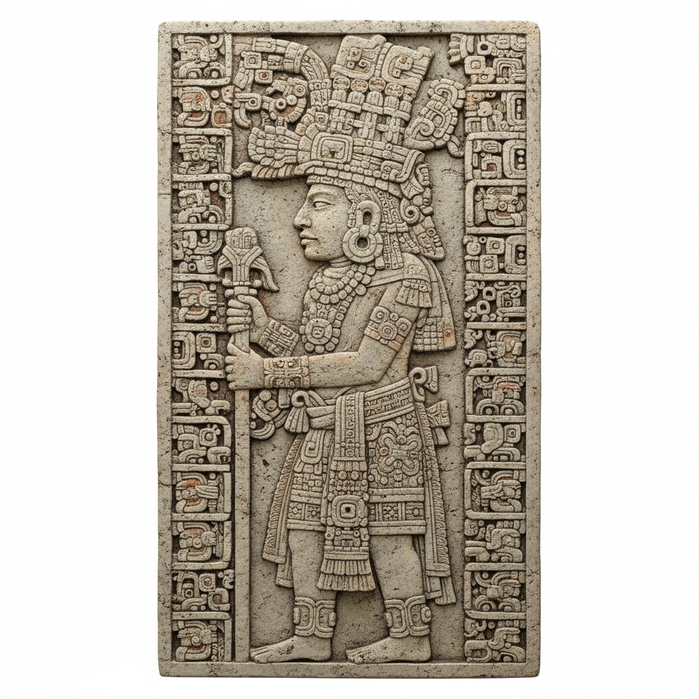

# 玛雅艺术 · Mayan Art

> "我们在石头上书写时间，在陶器上描绘诸神的故事。" —— 玛雅铭文

## 概述

玛雅艺术（Mayan Art）是公元前2000年至16世纪中美洲玛雅文明发展出的高度复杂的视觉艺术体系。玛雅艺术以精密的象形文字书写系统、叙事性壁画、精美的彩绘陶器和宏伟的建筑浮雕为特征，是美洲古代文明中艺术成就最高的传统之一。与阿兹特克艺术的纪念碑性不同，玛雅艺术更注重叙事性和书写性，其线描技法和构图复杂度堪比旧大陆的古典文明。

## 核心特征

| 特征 | 描述 |
|------|------|
| 时期 | 约公元前2000年–16世纪 |
| 地域 | 墨西哥尤卡坦、危地马拉、伯利兹、洪都拉斯 |
| 媒介 | 石灰岩浮雕、壁画、彩绘陶器、玉石、灰泥 |
| 核心理念 | 以视觉叙事记录王朝历史与宇宙神话 |
| 色彩 | 玛雅蓝、朱红、黑色、白色、黄色 |

## 视觉特征

- **线描叙事**：精密流畅的线条描绘复杂的宫廷和神话场景
- **象形文字整合**：文字与图像紧密结合，互为补充
- **人物比例写实**：相比其他美洲文明，玛雅人物更接近自然比例
- **层次丰富的构图**：多人物、多层次的复杂叙事场景
- **玛雅蓝**：独特的靛蓝色颜料，千年不褪

## 代表作品

| 作品 | 地点 | 年代 | 类型 |
|------|------|------|------|
| 博南帕克壁画 | 墨西哥恰帕斯 | 约790 | 壁画 |
| 帕伦克浮雕板 | 墨西哥恰帕斯 | 7世纪 | 石灰岩浮雕 |
| 科潘石碑群 | 洪都拉斯 | 8世纪 | 立体石雕 |
| 彩绘陶瓶（宫廷场景） | 危地马拉佩滕 | 8世纪 | 彩绘陶器 |
| 德累斯顿抄本 | 玛雅地区 | 13-14世纪 | 树皮纸抄本 |

## 发展时间线

| 时期 | 事件 |
|------|------|
| 前2000-前250 | 前古典期，早期玛雅艺术萌芽 |
| 前250-900 | 古典期，玛雅艺术黄金时代 |
| 600-900 | 晚古典期，壁画和陶器艺术巅峰 |
| 约790 | 博南帕克壁画绘制 |
| 900-1200 | 古典期崩溃，南部城市衰落 |
| 1200-1521 | 后古典期，尤卡坦北部延续 |
| 1562 | 兰达主教焚毁大量玛雅抄本 |
| 当代 | 玛雅艺术遗产的考古发现与文化复兴 |

## 中国语境

玛雅艺术与中国古代艺术的比较研究是跨文化艺术史的热门议题。两者都独立发展出了复杂的书写系统和以书写为核心的视觉文化；玛雅象形文字与中国甲骨文在"图文一体"的特征上有结构性相似。玛雅玉石崇拜与中国玉文化的平行性也引人注目。当代中国考古学界与中美洲考古的合作日益增多。

## AI 概念图

*AI 生成概念图：玛雅艺术风格*

## 关联词条

- [[aztec-art]] - 阿兹特克艺术
- [[inca-art]] - 印加艺术
- [[aboriginal-art]] - 澳大利亚原住民艺术

---

*浮光艺志 · Chronicle of Artistry*
