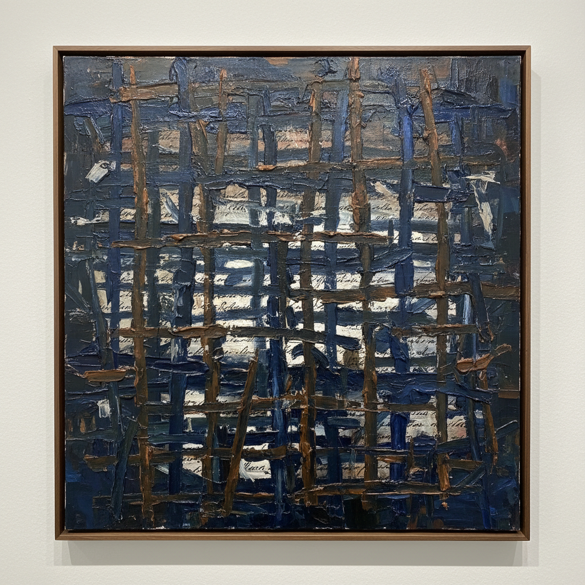

# McArthur Binion 麦克阿瑟·比尼恩

> **时期：** 1946–至今  
> **关键词：** 自传抽象、网格与档案、油棒绘画、非裔美国极简

## 概述

McArthur Binion 是美国抽象画家，以将个人档案文件（出生证明、电话簿页面、母亲的照片）嵌入密集的油棒网格之下的独特方法闻名。他的作品在极简主义的网格结构中编码了个人历史和种族记忆，使抽象绘画成为一种自传行为。

## 风格特征

- **油棒网格**：以油画棒在画面上绘制密集的交叉网格线
- **档案底层**：个人文件（出生证、地址簿、照片）被复印并贴于画布底层
- **半透明遮蔽**：网格线部分遮蔽底层文件，观者需要靠近才能辨认
- **深色调**：以深蓝、深棕和黑色为主，偶尔出现金色或红色
- **重复劳动**：密集的手工网格线体现了时间和身体劳动的积累

## 代表作品

- *DNA: Study*（2014–ongoing，系列）
- *Modern:Ancient:Brown*（2021）
- *Hand:Work*（2018，系列）
- *Mississipi*（2016）

## 历史意义

Binion 证明了极简主义和抽象绘画不必是"无内容"的——通过将个人档案编码进网格，他使每一幅抽象画都成为一份加密的自传。他在70多岁时的迟来成功也是对非裔美国抽象艺术家长期边缘化的修正。

## 概念图

