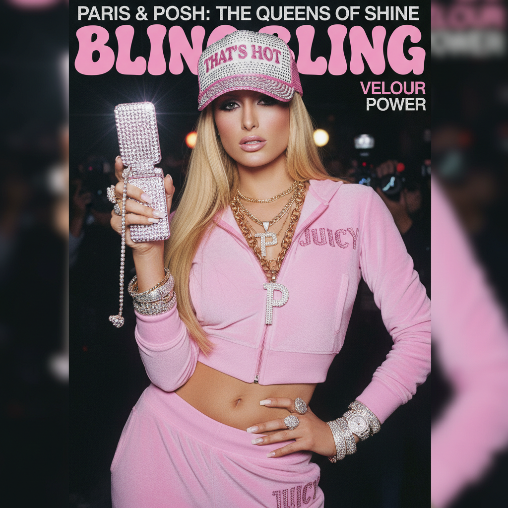

# McBling | 千禧闪耀美学

> "Bling Bling" — 当奢华变成一种青少年态度。



## 概述

McBling（又称 Trashy Y2K / Bubblegum Bling）是一种流行于 **2003–2008 年**的消费主义美学风格，与 Y2K Futurism、UrBling 和 Scene 文化有交叠。它以"闪光"为核心关键词，将嘻哈文化中的炫富符号与少女甜美元素混搭，形成了千禧年代最具辨识度的流行视觉之一。

该术语由 Y2K Aesthetics Institute 的 Evan Collins 于 2016 年通过 Facebook 页面正式命名。

## 历史背景

- **2003 年前后**：全球经济稳步增长，"及时行乐"成为主流态度
- **嘻哈文化黄金期**：Bling Bling 从说唱 MV 走向大众时尚
- **真人秀与名媛文化**：Paris Hilton、Nicole Richie 的《The Simple Life》将奢靡日常化
- **MySpace / Blingee 时代**：社交平台上的闪光 GIF、亮片贴纸成为视觉语言

## 视觉特征

| 维度 | 典型元素 |
|------|----------|
| 色彩 | 高饱和粉色（Hot Pink）、金色、银色、豹纹色 |
| 材质 | 天鹅绒、亮片、水钻、PVC、金属反光面料 |
| 图案 | 豹纹、斑马纹、Logo 满印、皇冠、心形 |
| 字体 | Candice 体、圆润衬线体、闪光描边 |
| 配饰 | 大号耳环、层叠手镯、翻盖手机、Juicy Couture 手袋 |
| 妆容 | 亮片眼影、闪光唇彩、浓密睫毛、古铜色肌肤 |

## 代表人物与品牌

### 人物
- **Paris Hilton** — McBling 的终极 Icon，粉色天鹅绒运动套装代言人
- **Britney Spears** — 低腰牛仔裤 + 水钻腰带的标志组合
- **Beyoncé** — 舞台上的 Bling 女王
- **Lindsay Lohan** — 千禧名媛的另一面

### 品牌
- **Juicy Couture** — 天鹅绒运动套装，McBling 的制服
- **Baby Phat** — 嘻哈与女性化的交汇
- **Ed Hardy** — 纹身印花 + 水钻的极致
- **Von Dutch** — 卡车司机帽的始作俑者
- **Playboy** — 兔女郎 Logo 作为时尚符号

## 影视与媒体

- 《Mean Girls》(2004) — 校园 McBling 的教科书
- 《Legally Blonde》(2001) — 粉色即力量
- 《Confessions of a Shopaholic》(2009)
- 《Bratz》系列 — 动画中的 McBling 美学
- 《Gossip Girl》— 后期 McBling 向 Preppy 过渡
- 《歌舞青春 High School Musical》

## 与其他风格的关系

```
Y2K Futurism (1997-2004)
    ↓ 科技乐观消退，消费主义接棒
McBling (2003-2008)
    ↓ 经济衰退 + 反消费主义
Indie Sleaze (2006-2014)
```

- **vs Y2K**：McBling 缺少科技感/未来感，更日常、更"闪"
- **vs Frutiger Aero**：时代重叠但审美对立——McBling 是极繁主义，Frutiger Aero 是清透自然
- **vs Scene**：共享 MySpace 平台和青少年受众，但 Scene 偏朋克/另类

## 当代复兴

2020s 年代，McBling 在 TikTok 和 Instagram 上强势回归：
- Taylor Swift Eras Tour 中的闪光元素
- Blumarine、Versace 等品牌重新拥抱水钻与粉色
- K-Pop 女团（aespa、BLACKPINK）频繁引用 McBling 视觉
- 新版《Mean Girls》(2024) 再次点燃怀旧

## 图库

> 🖼️ 待补充图片

**推荐图片来源（需手动下载）：**
- Pinterest 搜索 "McBling aesthetic moodboard"
- https://mc-bling.com/ — McBling 专题网站
- https://cari.institute/aesthetics/mcbling — CARI 研究所收录
- https://aesthetics.fandom.com/wiki/McBling — Aesthetics Wiki

## 参考链接

- [Vogue: What Is McBling?](https://www.vogue.com/article/what-is-mcbling)
- [CARI Institute: McBling](https://cari.institute/aesthetics/mcbling)
- [2000 Aesthetics Wiki: McBling](https://2000-aesthetics.fandom.com/wiki/McBling)
- [Coreification: McBling Style Guide](https://www.coreification.com/core/mcbling)

---

[← 酸性设计 Acid Graphics](acid-graphics.md) | [→ Indie Sleaze](indie-sleaze.md) | [↑ 返回目录](README.md)
