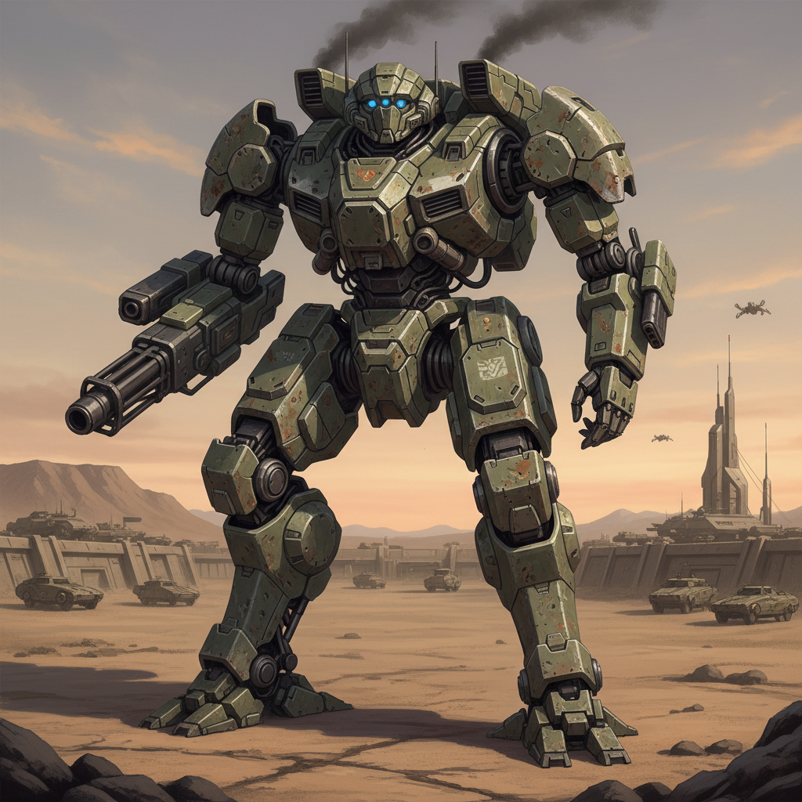

# Mecha Design 机甲设计

> **时期：** 1970年代–至今  
> **关键词：** 巨型机器人、工业设计、科幻美学、可变形结构、军事写实

## 概述

Mecha Design（机甲设计）是日本动画和模型文化中发展出的独特设计艺术，从永井豪的《魔神Z》到大河原邦男的《高达》，机甲设计从超级系的夸张造型逐渐演化为真实系的军事工业美学。它融合了工业设计、人体工学和科幻想象，创造出一种兼具功能逻辑和视觉冲击力的机械美学。

## 风格特征

- **人形机械**：以人体为基础的机械结构设计
- **可变形**：多形态变换的复杂机构
- **军事写实**：涂装、编号、损伤等真实感细节
- **关节设计**：兼顾美观与可动性的结构
- **比例美学**：从SD（超变形）到1:1的多种比例

## 代表人物与作品

- 大河原邦男《机动战士高达》
- 河森正治《超时空要塞》
- 永野护《五星物语》
- 出的�的幸彦《装甲骑兵》

## 概念图

