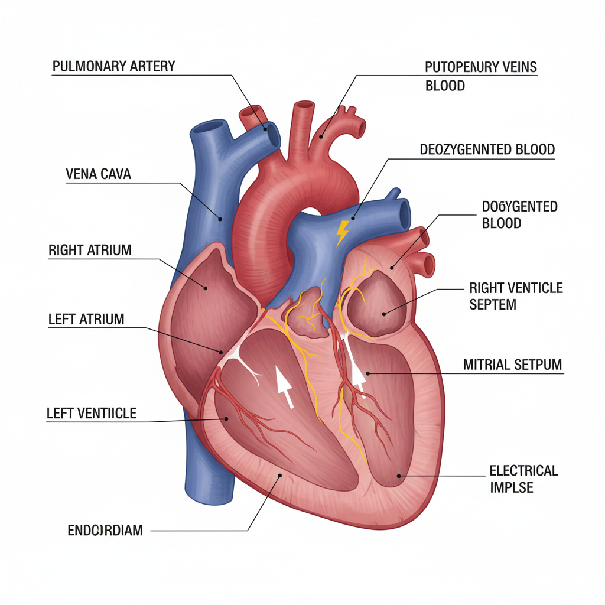

# Medical Illustration 医学插画

> **时期：** 15世纪–至今  
> **关键词：** 解剖精确、手术图解、病理可视化、教育传播、数字3D

## 概述

Medical Illustration（医学插画）是将复杂的人体结构、疾病过程和手术步骤转化为清晰可理解的视觉图像的专业艺术。从维萨里的《人体构造》到当代的3D医学动画，医学插画师需要同时掌握解剖学知识和艺术技巧，在科学准确性和视觉清晰度之间达到完美平衡。

## 风格特征

- **解剖精确**：基于真实人体结构的精确描绘
- **层次剥离**：从表皮到深层的逐层展示
- **色彩编码**：用颜色区分不同组织和系统
- **透视剖面**：展示内部结构的切面视图
- **标注系统**：引线、标签的信息标注

## 代表人物与作品

- 安德烈亚斯·维萨里《人体构造》(1543)
- 弗兰克·奈特《奈特人体解剖图谱》
- Max Brödel（约翰霍普金斯医学插画先驱）
- 当代3D医学可视化团队

## 概念图

