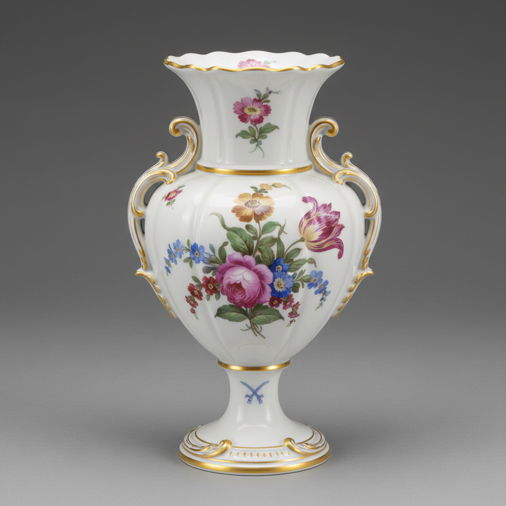

# Meissen Art 迈森瓷器艺术

> "Meissen is Europe's porcelain genesis — the first true hard-paste porcelain made outside Asia, born from Johann Friedrich Bottger's alchemical quest to make gold that instead yielded white gold, establishing a factory in 1710 whose crossed-swords mark became the continent's first trademark, where European painters learned to decorate porcelain and created a visual language that would define Western ceramic art for three centuries." — Unknown

## 概述

迈森瓷器艺术（Meissen Art）是欧洲最早的硬质瓷器制造传统，始于1710年德国萨克森选帝侯奥古斯特二世在迈森建立的皇家瓷器工厂。迈森瓷器的诞生是欧洲陶瓷史上最重要的事件——它打破了中国对硬质瓷器长达千年的垄断。迈森以其精美的彩绘装饰、优雅的造型和卓越的品质著称——其交叉双剑标志是欧洲最古老的商标之一。

迈森瓷器艺术的核心要素包括：1）欧洲首创——欧洲第一个硬质瓷器；2）交叉双剑——标志性的品牌标识；3）精美彩绘——精湛的釉上彩绘；4）人物雕塑——精美的瓷塑人物；5）洋葱图案——经典的蓝色洋葱纹；6）皇家赞助——萨克森王室的赞助；7）持续传承——300多年的不断传承。

## 核心特征

| 特征 | 描述 |
|------|------|
| 欧洲首创 | 欧洲第一个硬质瓷器 |
| 交叉双剑 | 标志性品牌标识 |
| 精美彩绘 | 精湛釉上彩绘 |
| 人物雕塑 | 精美瓷塑人物 |
| 洋葱图案 | 经典蓝色洋葱纹 |
| 皇家赞助 | 萨克森王室赞助 |

## 视觉特征

- **白瓷底色**：纯净的白色瓷胎
- **精细彩绘**：极其精细的彩绘
- **花卉装饰**：精美的花卉图案
- **人物雕塑**：生动的瓷塑人物
- **金彩边饰**：华丽的金色边饰
- **洋葱蓝白**：经典的蓝白洋葱纹

## 代表作品

| 作品 | 艺术家/文化 | 年代 | 意义 |
|------|-------------|------|------|
| *天鹅餐具* | J.J. Kaendler | 1737-1741年 | 最大的瓷器餐具套装 |
| *洋葱图案* | Meissen | 1739年起 | 经典蓝白图案 |
| *猴子乐队* | J.J. Kaendler | 1753年 | 经典瓷塑 |
| *仿中国青花* | Meissen | 1720年代 | 早期中国风 |
| *花卉彩绘* | Meissen | 18世纪 | 欧洲花卉风格 |

## 历史时间线

| 时期 | 事件 |
|------|------|
| 1708年 | Bottger成功烧制硬质瓷器 |
| 1710年 | 迈森皇家瓷器工厂建立 |
| 1720年代 | 彩绘装饰的发展 |
| 1730-1750年 | Kaendler时代的辉煌 |
| 当代 | 迈森瓷器的持续生产 |

## 中国语境

迈森瓷器的诞生直接源于欧洲对中国瓷器的渴望。萨克森选帝侯奥古斯特二世是一位狂热的中国瓷器收藏家——他曾用一队骑兵换取普鲁士国王的一批中国花瓶。正是这种对瓷器的痴迷促使他资助Bottger的实验——最终在1708年成功烧制出欧洲第一件硬质瓷器。迈森早期大量模仿中国瓷器的风格——包括青花、粉彩和中国风（Chinoiserie）图案。但迈森很快发展出了自己的欧洲风格——特别是Kaendler的瓷塑和欧洲花卉彩绘，标志着欧洲瓷器从模仿中国走向了独立创造。迈森的成功打破了中国对瓷器的千年垄断——此后欧洲各国纷纷建立自己的瓷器工厂，中国瓷器在欧洲市场的主导地位逐渐被取代。迈森至今仍在生产——是世界上持续运营时间最长的瓷器工厂之一。

## AI生成概念图

## 与其他风格的关系

- **Chinese Porcelain** → 中国瓷器
- **Sevres** → 塞夫勒
- **Wedgwood** → 韦奇伍德
- **Kakiemon** → 柿右卫门
- **Chinoiserie** → 中国风
- **European Porcelain** → 欧洲瓷器

---

*浮光艺志 | Chronicle of Artistry*
