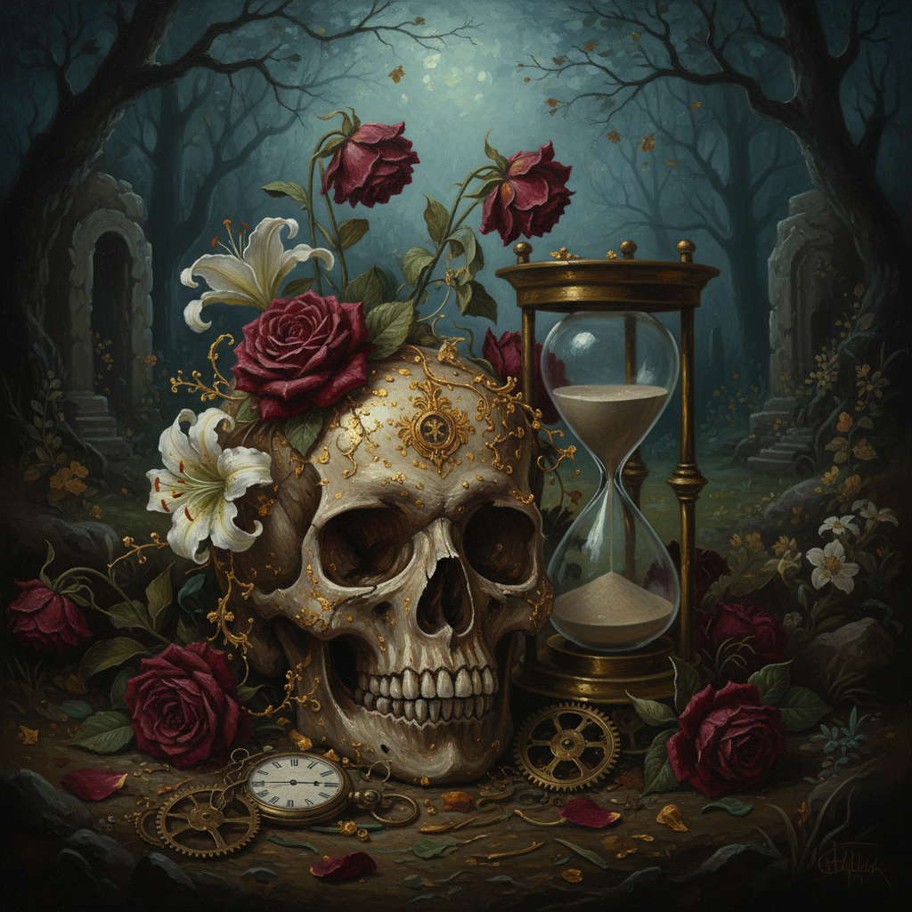

# Memento Mori Art 死亡警示艺术

> **时期：** 古罗马–至今  
> **关键词：** 骷髅、死亡象征、生命有限、哲学冥想、跨文化

## 概述

Memento Mori（拉丁语"记住你终将死去"）是贯穿西方艺术史的永恒主题，从古罗马马赛克中的骷髅到中世纪的死亡之舞，从巴洛克珠宝中的微型棺材到当代艺术家的骨骼装置——它不是恐惧的表达，而是对生命有限性的哲学冥想，提醒人们珍惜当下。

## 风格特征

- **骷髅母题**：头骨是最核心的视觉符号
- **跨媒介**：绘画、雕塑、珠宝、建筑
- **对比手法**：青春与衰老、繁华与荒芜
- **隐藏符号**：变形骷髅（如霍尔拜因）
- **哲学深度**：超越恐惧的存在主义思考

## 代表人物与作品

- 小汉斯·霍尔拜因《大使们》（变形骷髅）
- 中世纪"死亡之舞"壁画
- 墨西哥亡灵节艺术传统
- 当代：Gabriel Orozco《黑色风筝》

## 概念图

