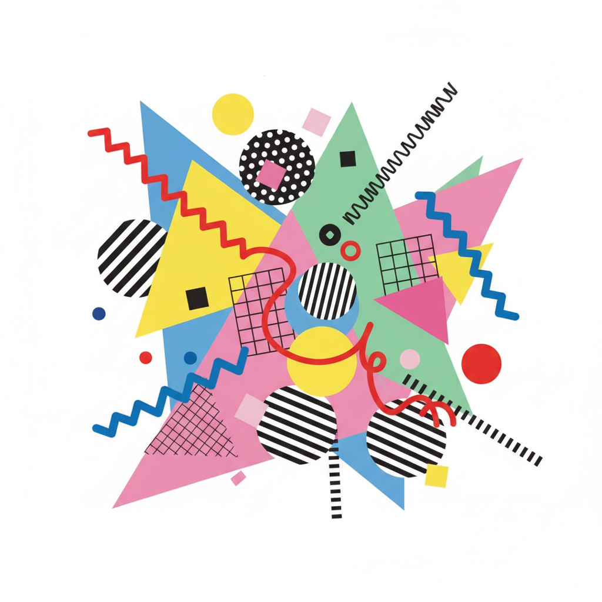

# Memphis Design 孟菲斯设计



> **"几何碰撞、色彩爆炸、反对'好品味'——1980年代最叛逆的设计运动。"**

## 概述

| 维度 | 描述 |
|------|------|
| 时期 | 1981–1988 原始 / 2010s 复兴 |
| 别名 | Memphis Design, Memphis Milano, Postmodern Design |
| 核心色彩 | 粉色、黄色、天蓝、黑色、薄荷绿（高饱和） |
| 关键元素 | 几何图形混搭、不对称、波点、锯齿线、大理石纹 |
| 代表人物 | Ettore Sottsass、Michele De Lucchi、Nathalie Du Pasquier |
| 关联风格 | Corporate Memphis, Acid Graphics, Dopamine Dressing, Kidcore |

---

## 历史脉络

### 1981：米兰的反叛

| 年份 | 事件 |
|------|------|
| 1981 | Ettore Sottsass 在米兰成立 Memphis Group |
| 1981 | 首次展览震惊设计界 |
| 1982–86 | 全球影响力扩张 |
| 1988 | Memphis Group 解散 |
| 2010s | 复兴浪潮（Instagram、时尚、室内） |

### 它反对什么？

| 主流设计 (1970s) | Memphis 的回应 |
|-----------------|---------------|
| 功能至上 | 形式可以纯粹为了好玩 |
| 中性色 | 越亮越好 |
| 对称 | 故意不对称 |
| "好品味" | "好品味"是无聊的 |
| 极简 | 极繁 |
| 昂贵材料 | 塑料层压板也是材料 |

### 核心哲学

Memphis 的精神是**"设计应该让人微笑"**：
- 反对"形式追随功能"的教条
- 装饰不是罪过
- 颜色不需要"和谐"
- 家具可以像玩具
- 设计是文化表达，不只是解决问题

---

## 视觉语法

### 色彩系统

```
主色：
  粉色 (#FF69B4) — 标志性
  黄色 (#FFD700) — 活力
  天蓝 (#87CEEB) — 清新
  黑色 (#000000) — 对比
  薄荷绿 (#98FB98) — 清凉

辅色：
  红色 (#FF0000) — 冲击
  紫色 (#800080) — 戏剧
  橙色 (#FF8C00) — 温暖

规则：
  - 高饱和度
  - 互补色碰撞
  - 不追求"和谐"
  - 黑色作为图形元素（不是背景）

图案：
  波点 — 大小不一
  锯齿线 — 闪电形
  条纹 — 粗细不均
  大理石纹 — 塑料层压板
  网格 — 不规则
```

### 标志性元素

| 类别 | 元素 |
|------|------|
| 几何 | 三角形、圆形、方形混搭 |
| 线条 | 锯齿、波浪、不规则 |
| 图案 | 波点、条纹、大理石纹、网格 |
| 材质 | 塑料层压板、霓虹灯管、玻璃 |
| 家具 | 不对称书架、彩色椅子、几何灯 |
| 排版 | 混合字体、不对齐、大小对比 |

---

## 与千禧怀旧的关系

### 2010s 的 Memphis 复兴
- Instagram 上的 Memphis 图案壁纸
- 时尚品牌的 Memphis 印花
- 与 Dopamine Dressing 的精神共鸣
- "Corporate Memphis" 的命名就来自这里

### 与 Kidcore 的交叉
- 两者都热爱鲜艳色彩和几何图形
- Memphis = 成人版的"玩具美学"
- Kidcore = 童年版的 Memphis

---

## 中国语境

- "孟菲斯风格"在国内设计圈的流行（2016–2019）
- 电商促销海报的常用风格
- 与"波普"/"后现代"标签的交叉
- 奶茶店/潮牌店的装修风格
- 小红书上的"几何撞色"标签

---

## 设计应用

| 场景 | 应用方式 |
|------|----------|
| 品牌 | 几何图形+高饱和色+不对称排版 |
| 空间 | 彩色家具+几何图案+不对称布局 |
| 包装 | 波点+锯齿线+撞色+大胆字体 |
| 数字 | 几何动效+撞色+不规则布局 |

---

## 相关风格

← [Acid Graphics 酸性设计](acid-graphics.md) | [Kidcore 童核](kidcore.md) →

↑ [返回千禧怀旧目录](README.md) | [返回总目录](../README.md)
