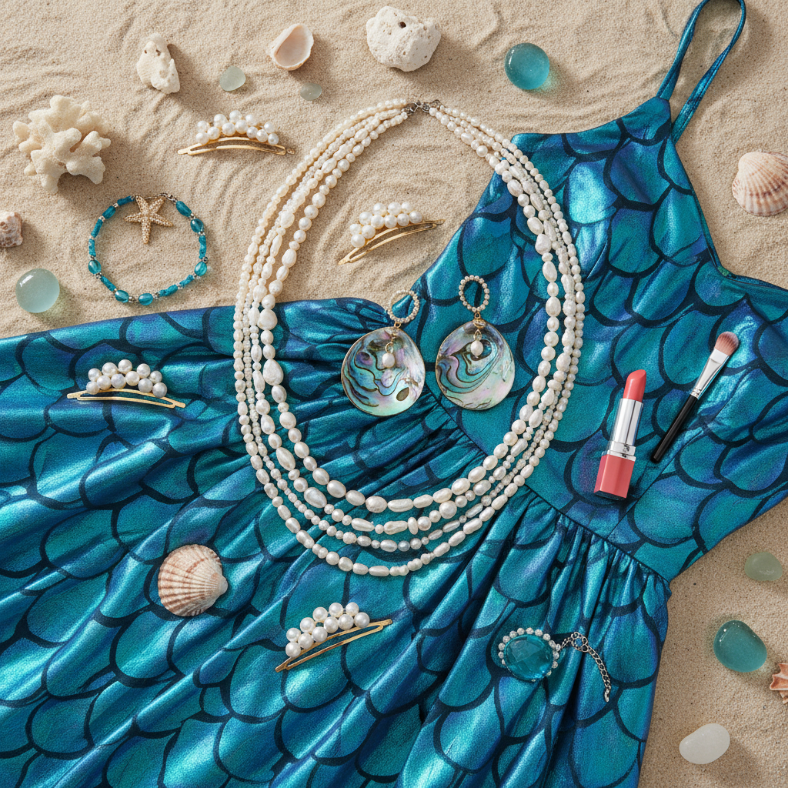

# Mermaidcore 美人鱼核




> **"鳞片闪光、珍珠发饰、海浪色渐变——每个女孩心里都住着一条美人鱼。"**

## 概述

| 维度 | 描述 |
|------|------|
| 时期 | 2012–至今（2023 爆发） |
| 别名 | Mermaidcore, Siren Aesthetic, Ocean Royalty |
| 核心色彩 | 海蓝、珊瑚粉、珍珠白、海藻绿、贝壳金 |
| 关键元素 | 鳞片、贝壳、珍珠、海浪、珊瑚 |
| 代表人物 | 《小美人鱼》(2023)、Halle Bailey、Doja Cat |
| 关联风格 | Seapunk, Fairycore, Y2K, Coquette |

---

## 历史脉络

### 2012–2015：Tumblr 的美人鱼热

美人鱼美学在 Tumblr 时代就已经流行：
- 美人鱼尾巴毯子
- 鳞片质感的手机壳
- 珍珠和贝壳配饰
- 与 Seapunk 的交叉

### 2023：《小美人鱼》真人版的爆发

迪士尼《小美人鱼》真人版 (2023) 将 Mermaidcore 推向主流：
- Halle Bailey 的美人鱼造型
- 时尚界的"美人鱼色"趋势
- 贝壳、珍珠、鳞片元素的全面回潮
- 从亚文化标签变成主流时尚趋势

### 文化基因

| 来源 | 贡献 |
|------|------|
| 迪士尼《小美人鱼》(1989) | 红发+贝壳胸衣的经典形象 |
| 希腊神话塞壬 | 危险而美丽的海洋女性 |
| 安徒生童话 | 为爱牺牲的悲剧美人鱼 |
| Seapunk (2011) | 海洋+赛博的视觉混合 |
| 珍珠/贝壳时尚 | 2020s 的配饰趋势 |

### 核心哲学

Mermaidcore 的吸引力在于美人鱼是**自由和美丽的终极象征**：
- 美人鱼 = 不受陆地规则约束
- 海洋 = 无限的自由和神秘
- 鳞片 = 闪耀但不脆弱
- 一种"既美丽又强大"的女性想象

---

## 视觉语法

### 色彩系统

```
主色：
  海蓝 (#006994) — 深海
  珊瑚粉 (#FF7F50) — 珊瑚礁
  珍珠白 (#F0EAD6) — 珍珠、泡沫
  海藻绿 (#2E8B57) — 海草、鳞片
  贝壳金 (#FFD700 低饱和) — 贝壳内壁

辅色：
  紫色 (#800080) — 深海生物
  银色 (#C0C0C0) — 鳞片反光
  沙色 (#F4A460) — 沙滩

质感：
  鳞片/全息 — 美人鱼尾巴
  珍珠光泽 — 配饰、妆容
  透明/水感 — 水滴、海浪
  贝壳 — 自然纹理
  丝绸/流动 — 水中飘动的织物
```

### 标志性元素

| 类别 | 元素 |
|------|------|
| 海洋 | 贝壳、珊瑚、海星、海马、水母 |
| 珠宝 | 珍珠项链、贝壳耳环、海玻璃 |
| 服装 | 鳞片裙、贝壳胸衣、流动长裙 |
| 妆容 | 珍珠高光、蓝绿眼影、贝壳唇色 |
| 发型 | 海浪卷发、贝壳发夹、珍珠发饰 |
| 空间 | 水族馆、海滩、珊瑚礁、水下洞穴 |

---

## 与千禧怀旧的关系

### 90s/2000s 的美人鱼记忆
- 迪士尼《小美人鱼》(1989) 是很多人的童年
- 2000s 的美人鱼芭比娃娃
- H2O: Just Add Water (2006–2010) 电视剧
- 美人鱼尾巴游泳课的流行

### 与 Y2K 的交叉
- Y2K 的全息/闪光质感 ≈ 美人鱼鳞片
- 2000s 的贝壳项链和海洋主题配饰
- 两者共享"闪亮"和"梦幻"的视觉语言

---

## 中国语境

- "美人鱼妆"/"人鱼色"在小红书的流行
- 珍珠配饰的全面回潮
- 三亚/海岛旅拍的美人鱼主题
- 与"仙女风"的交叉
- 国产美人鱼题材影视

---

## 设计应用

| 场景 | 应用方式 |
|------|----------|
| 品牌 | 海蓝渐变+珍珠质感+贝壳图案 |
| 包装 | 全息材质+珍珠色+流动形态 |
| 空间 | 蓝绿色调+贝壳装饰+水波纹 |
| 数字 | 水波动效+珍珠光泽+渐变色 |

---

## 相关风格

← [Seapunk 海朋克](seapunk.md) | [Fairycore 仙女核](fairycore.md) →

↑ [返回千禧怀旧目录](README.md) | [返回总目录](../README.md)
