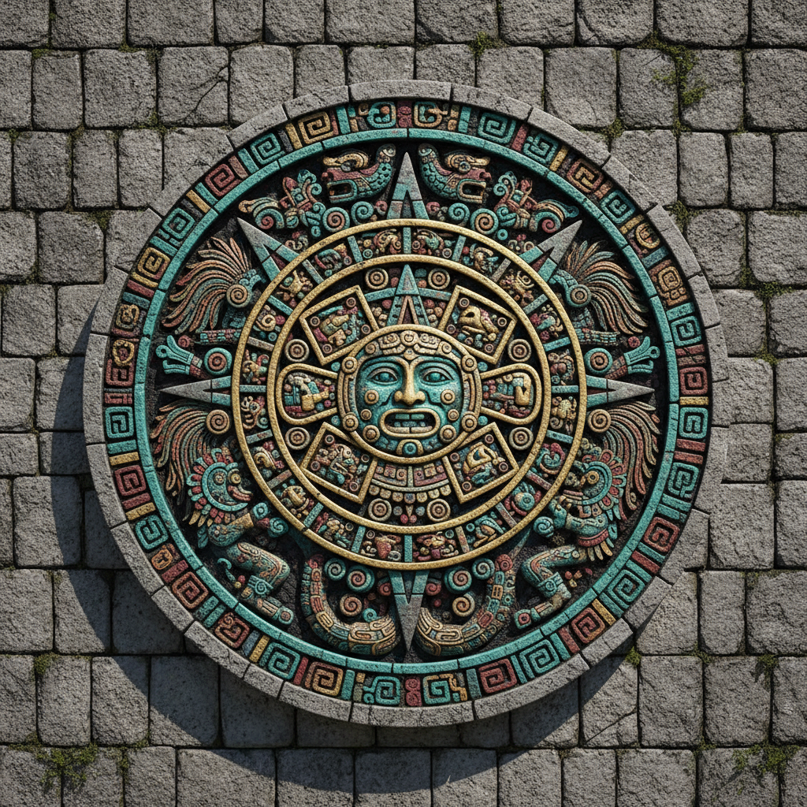

# Mesoamerican Art 中美洲古文明艺术

> **"石头上的宇宙——玛雅历法、阿兹特克太阳石与羽蛇神的永恒凝视。"**

## 概述

中美洲艺术（Arte Mesoamericano / Mesoamerican Art）涵盖了公元前1500年至1521年西班牙征服之间，在今墨西哥中南部和中美洲地区繁荣发展的多个伟大文明的视觉艺术传统——奥尔梅克、玛雅、特奥蒂瓦坎、萨波特克、米斯特克、托尔特克和阿兹特克。这些文明创造了精美的石雕、壁画、陶器、金属工艺和羽毛镶嵌艺术，以复杂的图像学体系记录宇宙观、历史和宗教信仰。

## 主要文明

| 文明 | 时期 | 代表艺术 |
|------|------|----------|
| 奥尔梅克 Olmec | 1500–400 BCE | 巨石头像、玉器 |
| 玛雅 Maya | 250–900 CE | 石碑浮雕、壁画、陶器 |
| 特奥蒂瓦坎 | 100–650 CE | 巨型金字塔、壁画 |
| 萨波特克 Zapotec | 500 BCE–900 CE | 陶制骨灰瓮 |
| 托尔特克 Toltec | 900–1168 CE | 武士柱、查克莫尔 |
| 米斯特克 Mixtec | 1000–1521 CE | 手抄本、金属工艺 |
| 阿兹特克 Aztec | 1325–1521 CE | 太阳石、骷髅架、羽蛇 |

## 核心特征

- **宇宙观**：艺术服务于记录和维持宇宙秩序
- **历法系统**：复杂的时间计算融入视觉设计
- **人祭主题**：血液献祭维持太阳运行的信仰
- **羽蛇神 Quetzalcoatl**：贯穿多个文明的核心神祇
- **象形文字**：玛雅文字系统与图像紧密结合
- **材料**：玉石（比黄金更珍贵）、黑曜石、羽毛、金

## 视觉特征

- 密集的浮雕装饰覆盖整个表面
- 正面性与侧面性的程式化人物
- 蛇、美洲豹、鹰等动物的神话化表现
- 几何与有机形式的复杂交织
- 鲜艳的矿物颜料（红、蓝、绿、黄）
- 对称构图与中轴线设计

## 与其他风格的关系

| 风格 | 关系 |
|------|------|
| 埃及艺术 | 共享金字塔建筑和程式化人物 |
| 印度教寺庙雕刻 | 共享密集浮雕装饰 |
| 墨西哥壁画运动 | 直接继承中美洲视觉遗产 |
| 当代拉丁美洲艺术 | 前哥伦布元素的持续影响 |
| Chicano Art | 阿兹特克符号作为文化身份 |

## 概念图

---

*浮光艺志 | Chronicle of Artistry*
