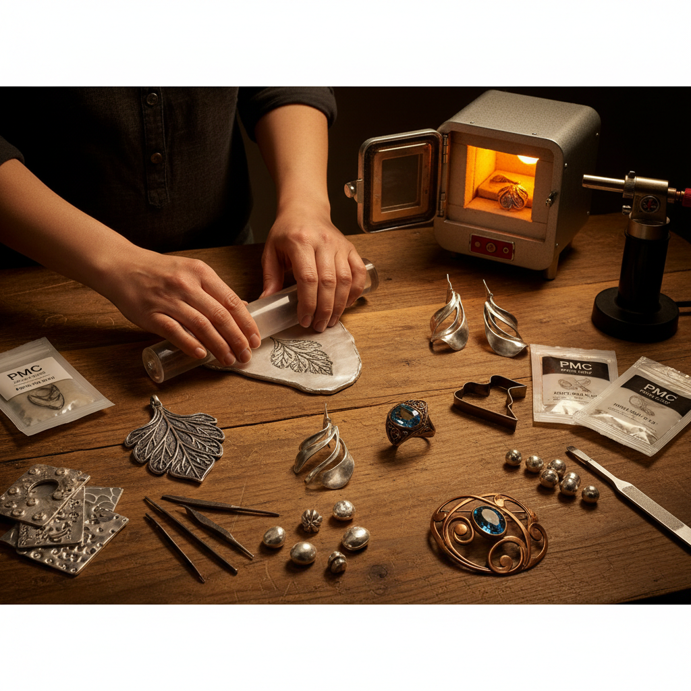

# Metal Clay 金属粘土

> "Metal clay is alchemy reversed — what begins as soft, sculptable paste transforms in the kiln into solid precious metal, granting jewelers the freedom of a sculptor and the precision of a goldsmith." — Unknown

## 概述

金属粘土（Metal Clay）是一种由微细金属粉末（银、金、铜、青铜等）、有机粘合剂和水混合而成的可塑性材料。它可以像普通粘土一样被揉捏、塑形、压模、雕刻和干燥。当金属粘土在窑炉中烧结（sintering）时，有机粘合剂燃烧殆尽，金属颗粒融合在一起，形成纯度极高的固体金属（如纯银99.9%）。

金属粘土彻底改变了金属首饰制作的门槛——传统的金属加工需要大量的工具、技能和经验（锯、锉、焊接、锻造），而金属粘土让任何人都可以用手指和简单工具创造出精美的金属首饰和小型雕塑。最著名的品牌包括Art Clay Silver和PMC（Precious Metal Clay）。

## 核心特征

| 特征 | 描述 |
|------|------|
| 可塑 | 像粘土一样可塑 |
| 烧结 | 窑烧后变为纯金属 |
| 低门槛 | 降低金属加工门槛 |
| 精细 | 可实现精细细节 |
| 多金属 | 银、金、铜、青铜 |
| 首饰 | 主要用于首饰制作 |

## 视觉特征

- **金属**：烧结后的金属光泽
- **有机**：有机的形态
- **精细**：精细的细节和纹理
- **质感**：丰富的表面质感
- **小型**：通常为小型作品
- **宝石**：可镶嵌宝石

## 代表作品

| 作品 | 艺术家 | 年代 | 意义 |
|------|--------|------|------|
| *PMC jewelry* | Various | 1990s起 | PMC首饰 |
| *Art Clay Silver works* | Various | 1990s起 | 银粘土作品 |
| *Metal clay sculptures* | Various | 当代 | 金属粘土雕塑 |
| *Mixed media jewelry* | Various | 当代 | 混合媒材首饰 |
| *Bronze clay vessels* | Various | 当代 | 青铜粘土器皿 |

## 历史时间线

| 时期 | 事件 |
|------|------|
| 1990 | 日本三菱材料公司发明PMC |
| 1991 | PMC商业化 |
| 1994 | Art Clay Silver的推出 |
| 2000s | 铜粘土和青铜粘土的开发 |
| 2010s | 金属粘土的全球普及 |
| 当代 | 新配方和新金属的持续开发 |

## 中国语境

金属粘土在中国的首饰制作爱好者中有一定的知名度。中国的一些手工工作坊和首饰学校教授银粘土课程——银粘土体验课是热门的手工体验项目。中国的电商平台上可以购买到Art Clay Silver和PMC等品牌的金属粘土。一些中国的首饰设计师将金属粘土作为创作媒介之一。中国的手工社区中有活跃的金属粘土爱好者群体。

## AI生成概念图

## 与其他风格的关系

- **Precious Metal Clay** → 贵金属粘土
- **Silversmithing** → 银器制作
- **Jewelry Making** → 首饰制作
- **Ceramics** → 陶瓷
- **Lost Wax Casting** → 失蜡铸造
- **Sculpture** → 雕塑

---

*浮光艺志 | Chronicle of Artistry*
