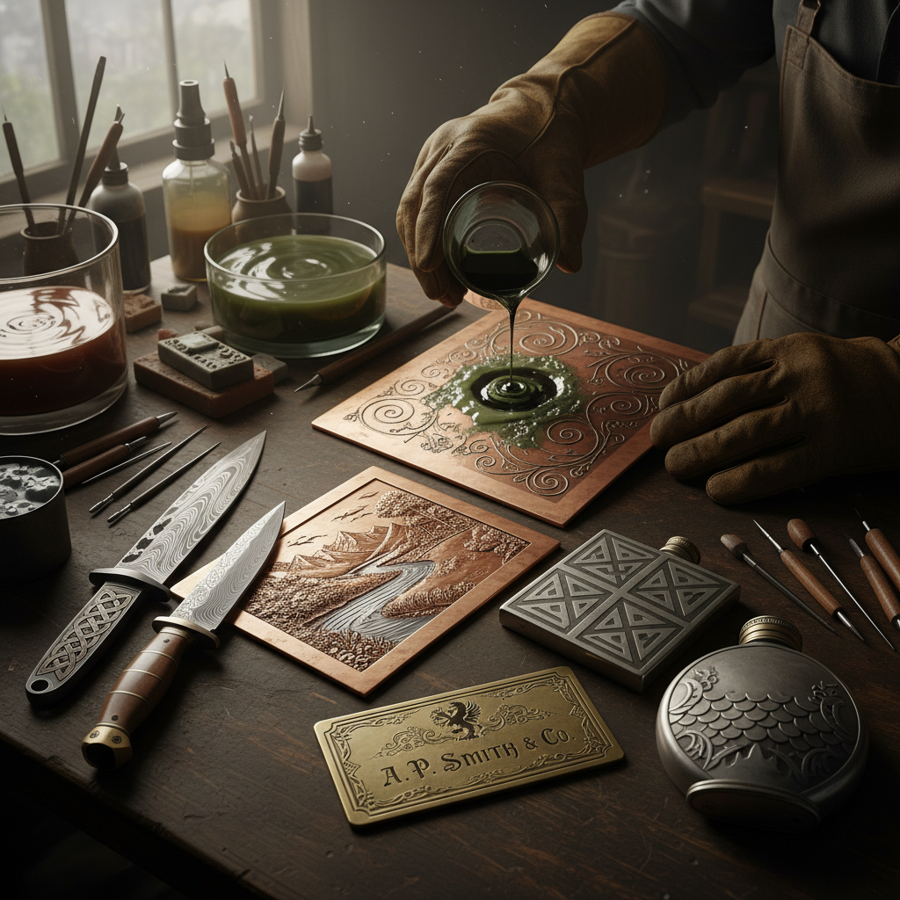

# Metal Etching 金属蚀刻

> "Metal etching is drawing with acid — the artist's line protected by wax or resist, the unprotected metal dissolved away, leaving an image bitten into the surface with a precision no hand tool can match." — Unknown

## 概述

金属蚀刻（Metal Etching）是使用化学腐蚀剂（酸或盐溶液）在金属表面创造图案的工艺。基本原理是：在金属表面涂覆一层耐酸的保护层（resist，如蜡、沥青或光敏胶），然后在保护层上刻画或曝光图案，露出下方的金属。将金属浸入腐蚀液中，露出的区域被腐蚀形成凹陷，而被保护的区域保持原高度。

金属蚀刻的应用极其广泛：从版画（etching作为凹版印刷技法）、装饰性金属制品（刀剑、盔甲、首饰的装饰）、到现代的电路板制造和工业零件标记。作为艺术形式，金属蚀刻可以在铜、锌、钢、铝等各种金属上创造精细的图案和文字。

## 核心特征

| 特征 | 描述 |
|------|------|
| 化学 | 化学腐蚀成像 |
| 保护层 | 耐酸保护层 |
| 精细 | 可实现极精细图案 |
| 凹陷 | 腐蚀形成凹陷 |
| 多金属 | 适用于多种金属 |
| 可重复 | 可用于版画印刷 |

## 视觉特征

- **精细**：极其精细的线条
- **深浅**：腐蚀深浅的变化
- **对比**：凹凸的对比
- **金属**：金属的质感
- **图案**：复杂的图案
- **文字**：精细的文字

## 代表作品

| 作品 | 艺术家 | 年代 | 意义 |
|------|--------|------|------|
| *Etched armor* | 匿名 | 15-16世纪 | 蚀刻盔甲装饰 |
| *Etched swords* | 匿名 | 传统 | 蚀刻刀剑 |
| *Printmaking etchings* | Rembrandt等 | 17世纪 | 蚀刻版画 |
| *Industrial etching* | Various | 现代 | 工业蚀刻 |
| *Contemporary metal etching* | Various | 当代 | 当代金属蚀刻艺术 |

## 历史时间线

| 时期 | 事件 |
|------|------|
| 15世纪 | 盔甲蚀刻装饰的出现 |
| 16世纪 | 蚀刻版画技法的发展 |
| 17世纪 | 伦勃朗等大师的蚀刻版画 |
| 19世纪 | 工业蚀刻的应用 |
| 20世纪 | 电路板蚀刻技术 |
| 当代 | 当代金属蚀刻艺术 |

## 中国语境

金属蚀刻在中国有着独特的应用——中国传统的金属装饰中虽然以錾刻（chasing）和镶嵌为主，但化学蚀刻也有使用。当代中国的金属蚀刻主要应用于：工业标牌和铭牌制作、电路板制造、以及装饰性金属制品。一些中国的当代金属艺术家使用蚀刻技法创作装饰性作品。中国的刀剑爱好者群体中，蚀刻是常见的刀剑装饰技法。中国的版画教育中也教授蚀刻版画技法。

## AI生成概念图

## 与其他风格的关系

- **Etching (Printmaking)** → 蚀刻版画
- **Engraving** → 雕刻
- **Niello** → 黑金镶嵌
- **Damascening** → 大马士革镶嵌
- **Metalwork** → 金属工艺
- **Chemical Milling** → 化学铣削

---

*浮光艺志 | Chronicle of Artistry*
