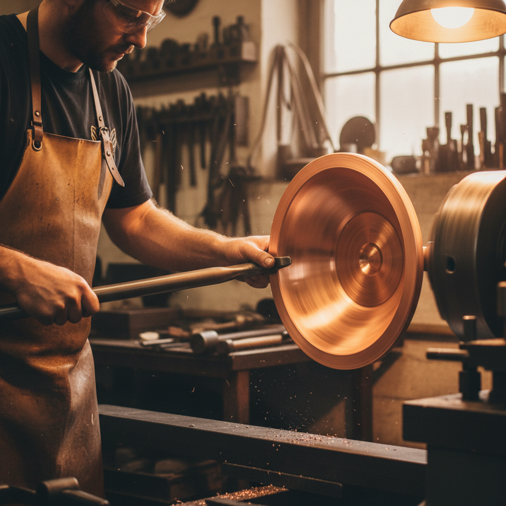

# Metal Spinning Art 金属旋压艺术

> "Metal spinning is the potter's wheel applied to metal — a flat disc of copper, brass, aluminum, or silver is clamped to a lathe and, as it spins, the craftsman presses it over a form with hand tools, gradually coaxing the flat sheet into a seamless hollow shape. No seams, no welds, no joints: just pure metal flowing under pressure into bowls, vases, lampshades, and vessels of perfect rotational symmetry. It is metalwork at its most fluid and immediate." — Unknown

## 概述

金属旋压艺术（Metal Spinning Art）是一种在车床上将平面金属圆片旋转成型为中空回转体的传统金属成型工艺——通过手工工具在旋转中将金属片逐渐压向模具，形成无缝的碗、花瓶、灯罩和各种容器。金属旋压是最古老的金属成型技法之一，以其无缝、流畅和即时的特点著称。

金属旋压艺术的实践包括：1）手工旋压——使用手工工具在车床上成型；2）剪切旋压——通过减薄金属来成型；3）多道次旋压——分多次逐渐成型复杂形状；4）热旋压——加热金属后进行旋压；5）装饰旋压——在旋压过程中创造装饰纹理；6）当代金属旋压——将传统技法与现代设计结合的创作。

## 核心特征

| 特征 | 描述 |
|------|------|
| 无缝 | 完全无缝的成型 |
| 旋转 | 回转对称的形态 |
| 流畅 | 金属的流畅变形 |
| 即时 | 相对快速的成型 |
| 古老 | 最古老的成型技法 |
| 手工 | 手工控制的精确 |

## 视觉特征

- **光滑**：无缝光滑的表面
- **对称**：完美的旋转对称
- **曲线**：流畅的曲线轮廓
- **光泽**：金属的光泽反射
- **薄壁**：轻薄的壁厚
- **优雅**：优雅简洁的形态

## 代表作品

| 作品 | 艺术家/文化 | 年代 | 意义 |
|------|-------------|------|------|
| *Ancient bronze vessels* | 多文化 | 古代 | 古代青铜器 |
| *Pewter hollowware* | 欧洲 | 中世纪至今 | 锡器 |
| *Copper cookware* | 法国 | 18世纪至今 | 铜制厨具 |
| *David Mellor designs* | 英国 | 20世纪 | 现代设计 |
| *Contemporary spun metal* | 当代 | 当代 | 当代旋压金属 |

## 历史时间线

| 时期 | 事件 |
|------|------|
| 古代 | 金属旋压的起源 |
| 中世纪 | 欧洲锡器和铜器的旋压 |
| 工业革命 | 旋压技术的机械化 |
| 20世纪 | 现代设计中的应用 |
| 当代 | 手工旋压的艺术化复兴 |

## 中国语境

金属旋压艺术在中国有悠久的传统和广泛的应用。中国传统的铜器和锡器制作中有旋压成型的技法——特别是在制作碗、盘和容器时。中国的传统金属工艺中，"打铜"和"旋铜"是重要的技法——在广东、云南等地有悠久的传统。中国当代的金属工艺教育中，旋压作为基本的金属成型技法被教授——是金属工艺专业的必修课程。中国的工业设计中，旋压被广泛应用于灯具、厨具和装饰品的生产——将传统技法与现代设计结合。中国的一些独立金属工艺师专注于手工旋压——创造精美的金属器物作品。

## AI生成概念图

## 与其他风格的关系

- **Metalwork** → 金属工艺
- **Silversmithing** → 银器制作
- **Industrial Design** → 工业设计
- **Pottery** → 陶艺
- **Sculpture** → 雕塑
- **Minimalism** → 极简主义

---

*浮光艺志 | Chronicle of Artistry*
