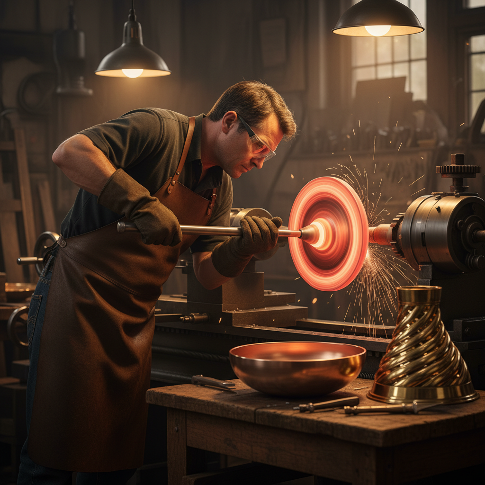

# Metal Spinning 金属旋压

> "Metal spinning is the lathe's poetry — a flat disc transformed into a vessel by the steady pressure of a tool against spinning metal." — Unknown

## 概述

金属旋压（Metal Spinning）是将平坦的金属圆盘固定在旋转的车床上，通过工具的压力将其逐渐塑造成轴对称的中空形态的成形工艺。从灯罩到火箭鼻锥，从铜锅到乐器喇叭口，金属旋压可以将一片平板变成任何旋转体形状。这种技法不需要昂贵的模具（只需一个芯模），不浪费材料（不切削），而且可以加工从铝到不锈钢的各种金属。

金属旋压的魅力在于：旋转中的变形——看着一片平板在高速旋转中逐渐"长出"深度和曲线，如同魔法。

## 核心特征

| 特征 | 描述 |
|------|------|
| 旋转 | 金属在车床上旋转 |
| 压力 | 工具施加压力成形 |
| 轴对称 | 只能制作旋转体 |
| 无损 | 不切削不浪费材料 |
| 薄壁 | 可制作薄壁容器 |
| 高效 | 比冲压更灵活 |

## 视觉特征

- **光滑**：旋压后的光滑表面
- **对称**：完美的轴对称形态
- **曲线**：优美的旋转曲线
- **薄壁**：轻薄的金属壁
- **旋痕**：细微的旋转痕迹
- **光泽**：金属的抛光光泽

## 代表作品

| 作品 | 艺术家 | 年代 | 意义 |
|------|--------|------|------|
| *Copper cookware* | 匿名 | 传统 | 传统铜器旋压 |
| *Brass instruments* | Various | 19世纪+ | 乐器喇叭口 |
| *Lamp shades* | Various | 20世纪 | 金属灯罩 |
| *Rocket nose cones* | Various | 1950s+ | 航天器部件 |
| *Contemporary vessels* | Various | 当代 | 当代金属器物 |

## 历史时间线

| 时期 | 事件 |
|------|------|
| 古埃及 | 早期的金属旋压 |
| 中世纪 | 欧洲的铜器旋压 |
| 工业革命 | 机械化旋压的发展 |
| 20世纪 | 航空航天的应用 |
| 当代 | CNC旋压和艺术旋压 |

## 中国语境

中国的金属旋压工艺在传统铜器和锡器制作中有应用。当代中国是全球重要的金属旋压加工基地，从日用品到航天器部件都有广泛应用。中国传统的铜火锅、铜壶等器物中有部分使用旋压技法。当代中国的金属工艺师也在探索旋压在艺术创作中的可能性。

## AI生成概念图

## 与其他风格的关系

- **Metalwork** → 金属成形工艺
- **Raising** → 手工起形的机械化版本
- **Industrial Design** → 工业制造
- **Coppersmithing** → 铜器制作
- **Pottery** → 类似陶轮的金属版本
- **Lathe Work** → 车床工艺

---

*浮光艺志 | Chronicle of Artistry*
