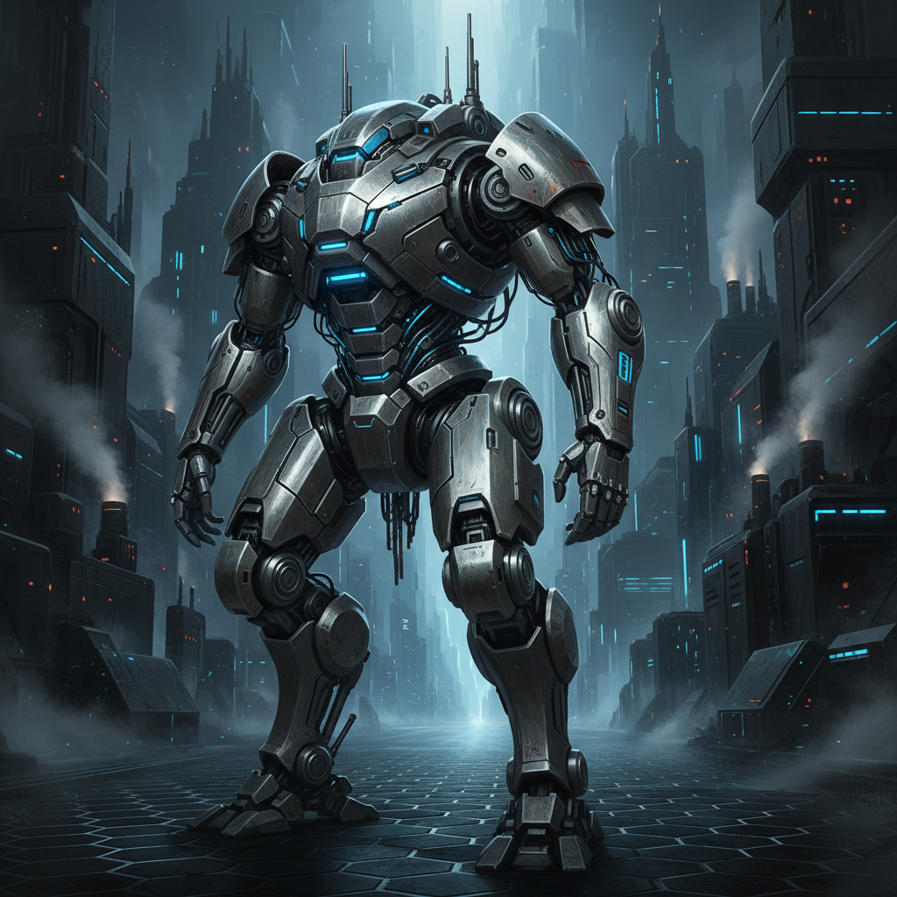
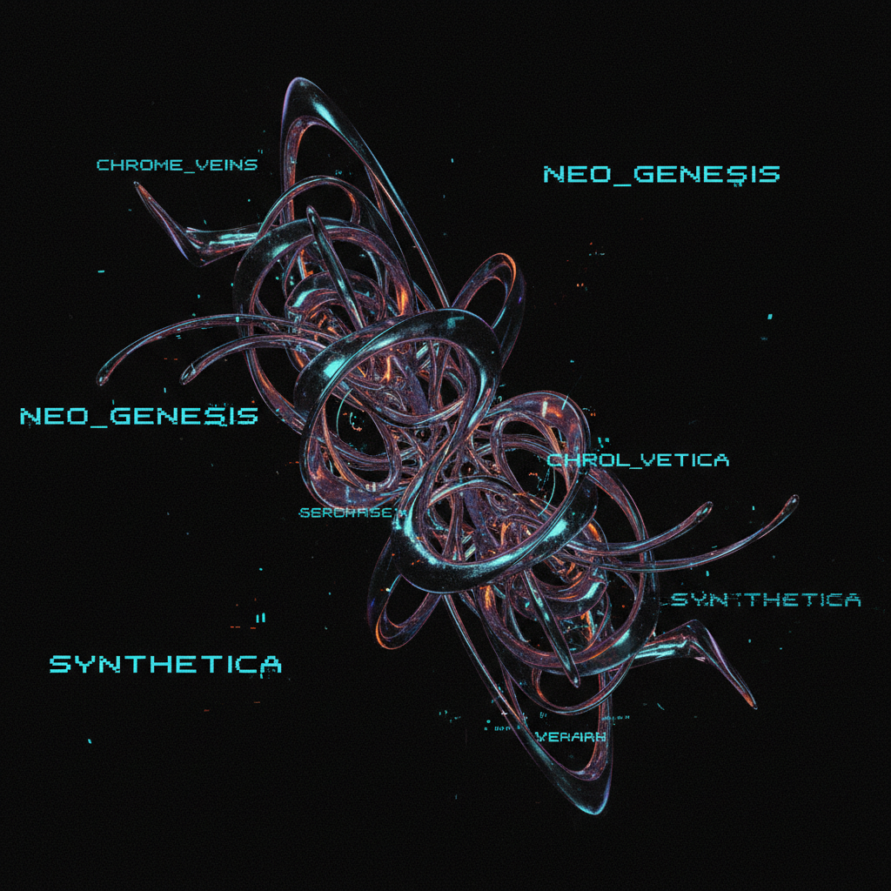

# Metalheart | 金属心美学

> 模糊背景上的扭曲金属形态——互联网设计师的第一次集体狂欢。



## 概述

Metalheart（又称 **Depthcore** / **Trendwhore**）是一种流行于 **1998–2004 年**的未来主义数字艺术美学，承袭 90 年代中期的 Cyberdelia（赛博迷幻）风格。它以**模糊背景上的变形抽象金属造型、未来主义 UI 界面和像素字体**为标志。

该名称来自 Andreas Lindholm 于 2001 年出版的同名设计书《Metalheart》。

## 历史背景

- **1998–2000**：Photoshop 5/6 普及，滤镜和图层混合模式成为设计师的新玩具
- **2000–2002**：DeviantArt、Depthcore 等在线设计社区兴起
- **2001**：《Metalheart》书籍出版，为风格命名
- **2002–2004**：风格达到巅峰，大量出现在 Flash 网站和设计论坛
- **2004 后**：被 Web 2.0 的圆角渐变（Frutiger Aero）取代

## 视觉特征

| 维度 | 典型元素 |
|------|----------|
| 形态 | 扭曲的抽象金属/有机形状、分形图案、流体造型 |
| 背景 | 模糊的深色渐变、爆炸效果、光线散射 |
| 色彩 | 深蓝、深紫、银灰、偶尔的高饱和点缀色 |
| 字体 | 像素字体（如 04b）、未来主义细体、微型文字排列 |
| 界面 | 模拟未来 UI/HUD、进度条、数据可视化装饰 |
| 技法 | 大量 Photoshop 滤镜、图层混合、3D 渲染碎片 |

## 代表平台与社区

- **Depthcore** — 最具代表性的 Metalheart 艺术家集体
- **DeviantArt** — 早期数字艺术社区
- **Plazm Magazine** — 实验性设计杂志
- **各类 Flash 网站** — 2000 年代初的互动设计前沿

## 与其他风格的关系

```
Cyberdelia / Early Cyber (mid-1990s)
    ↓ Photoshop 普及 + 互联网设计社区
Metalheart (1998-2004)
    ↓ Web 2.0 革命
Frutiger Aero (2004-2013) ← 从暗黑抽象到明亮拟物
```

- **vs Y2K Futurism**：时代重叠，但 Metalheart 更暗、更抽象、更"设计师圈层"
- **vs Acid Graphics**：都有扭曲金属质感，但 Acid Graphics 是 2010s+ 的当代演绎
- **vs Vectorheart**：Vectorheart 更平面、更几何；Metalheart 更 3D、更有机

## Vectorheart（矢量心）

与 Metalheart 同时代的另一种图形设计风格：
- 流行于 **1990s 中后期**
- 特征：醒目的矢量形状、动态对角线、未来主义字体、高对比平面配色
- 常见于电子游戏、科技和音乐品牌
- 与 The Designers Republic 工作室紧密相关
- 代表作：Wipeout 系列游戏的视觉设计

## 图库

| | |
|:---:|:---:|
|  |  |
| *Metalheart 金属心概念* | *扭曲铬色有机形态 · Depthcore风格* |

**推荐图片来源（需手动下载）：**
- https://frutigeraeroarchive.org/wallpapers/metalheart — Metalheart 壁纸收藏
- https://www.are.na/consumer-aesthetics-research-institute/metalheart-6vzdlxemtkq
- https://cari.institute/aesthetics/metalheart
- https://www.dreadlabs.net/product/metalheart-essentials/ — 250+ 素材资源
- Web Design Museum: Metalheart in Web Design

## 参考链接

- [Aesthetics Wiki: Metalheart](https://aesthetics.fandom.com/wiki/Metalheart)
- [CARI Institute: Metalheart](https://cari.institute/aesthetics/metalheart)
- [Frutiger Aero Archive: Metalheart Wallpapers](https://frutigeraeroarchive.org/wallpapers/metalheart)
- [Dreadlabs: Metalheart Art for Beginners](https://www.dreadlabs.net/tutorials/metalheart-art-for-beginners/)

---

[← Surf Crush](surf-crush.md) | [→ Cassette Futurism](cassette-futurism.md) | [↑ 返回目录](README.md)
