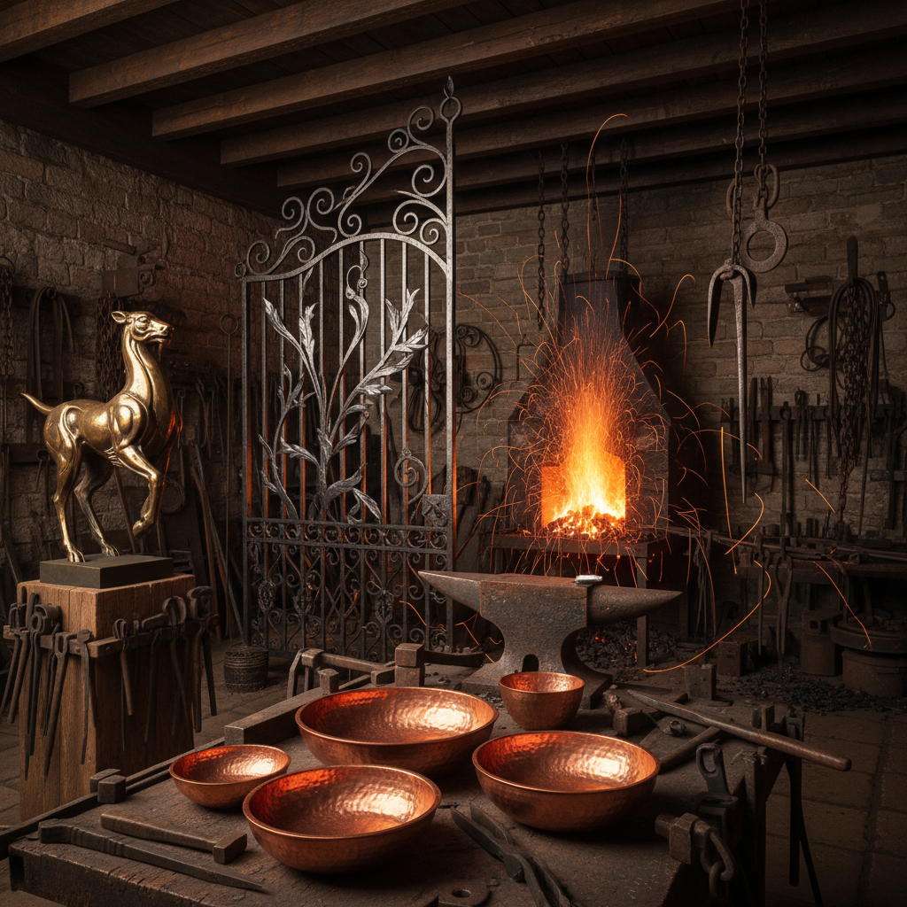

# Metalwork Art 金属工艺

> "Metal is alive — it breathes, it moves, it remembers the hammer's touch." — Alexander Calder

## 概述

金属工艺（Metalwork Art）是以金属为主要材料进行艺术创作的广泛领域——包括锻造、铸造、焊接、錾刻、镶嵌、珐琅等多种技法。从青铜时代的礼器到当代的金属雕塑，金属工艺是人类文明最重要的物质文化之一。

金属的独特性在于它的可塑性和永久性——可以被加热、锤打、熔化、浇铸成任何形状，冷却后又坚硬如石。

## 核心特征

| 特征 | 描述 |
|------|------|
| 金属媒介 | 以金、银、铜、铁、钢等为材料 |
| 多技法 | 锻造、铸造、焊接、錾刻等 |
| 耐久性 | 金属作品极其耐久 |
| 可塑性 | 加热后可以自由塑形 |
| 光泽 | 金属特有的光泽和反射 |
| 力量感 | 金属的重量和力量感 |

## 视觉特征

- **光泽**：金属的反射和光泽
- **质感**：锤痕、焊缝、抛光的不同质感
- **色彩**：金、银、铜、铁的不同色调
- **锈蚀**：铜绿、铁锈的时间痕迹
- **结构**：金属的结构性和工程性
- **重量**：视觉上的重量感

## 代表作品

| 作品/传统 | 艺术家/地区 | 年代 | 意义 |
|-----------|-------------|------|------|
| 商周青铜器 | 中国 | 前16-前3世纪 | 青铜时代的巅峰 |
| *Mobiles* | Alexander Calder | 1930s+ | 金属动态雕塑 |
| *Corten steel sculptures* | Richard Serra | 1960s+ | 大型钢铁雕塑 |
| *Spider* | Louise Bourgeois | 1990s | 青铜蜘蛛——母性的象征 |
| 大马士革钢 | 中东 | 中世纪 | 锻造工艺的极致 |
| 日本刀 | 日本 | 平安-至今 | 锻造作为艺术 |

## 历史时间线

| 时期 | 事件 |
|------|------|
| ~5000 BCE | 铜器时代开始 |
| ~3000 BCE | 青铜时代——合金技术 |
| ~1200 BCE | 铁器时代 |
| 中世纪 | 铠甲、武器、教堂金属工艺 |
| 文艺复兴 | 金匠作为艺术家——Cellini |
| 19世纪 | 工业革命——铸铁建筑 |
| 20世纪 | 焊接雕塑——Calder、Smith、Serra |
| 当代 | 金属作为当代艺术媒介 |

## 中国语境

中国的金属工艺有辉煌的历史——商周青铜器是世界青铜文明的巅峰，其造型和纹饰至今令人惊叹。中国的金银器、铜镜、铁器等都有独特的艺术成就。当代中国的金属艺术家在传统锻造和现代焊接两个方向都有探索。中国的非物质文化遗产中包含大量金属工艺项目。

## AI生成概念图

## 与其他风格的关系

- **Sculpture** → 金属雕塑是雕塑的重要分支
- **Jewelry Art** → 珠宝是金属工艺的精细形式
- **Kinetic Art** → Calder的金属动态雕塑
- **Enamel Art** → 珐琅以金属为基底
- **Industrial Design** → 工业设计大量使用金属
- **Assemblage** → 金属废料的集合艺术

---

*浮光艺志 | Chronicle of Artistry*
