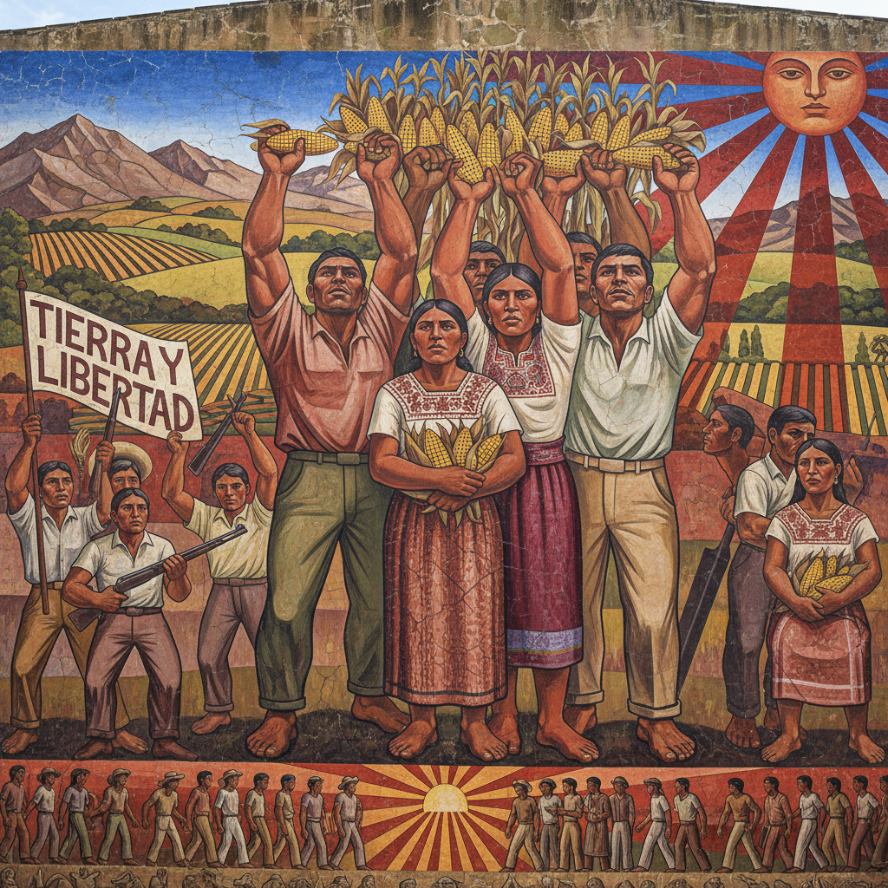

# Mexican Muralism 墨西哥壁画运动



> **"墙壁是人民的画布——让艺术走出画廊，走进街头，属于所有人。"**

## 概述

| 维度 | 描述 |
|------|------|
| 时期 | 1920s–1970s |
| 别名 | Mexican Muralism, 墨西哥壁画运动, Muralismo |
| 核心色彩 | 大地色+鲜艳原色——赭石、深红、钴蓝、金黄 |
| 关键元素 | 巨型壁画、社会叙事、民族身份、公共艺术 |
| 代表人物 | Diego Rivera, David Alfaro Siqueiros, José Clemente Orozco |
| 关联风格 | Social Realism, Art Deco, Pre-Columbian Art, Street Art |

---

## 历史脉络

| 年份 | 事件 |
|------|------|
| 1910 | 墨西哥革命——壁画运动的社会土壤 |
| 1921 | 教育部长Vasconcelos委托公共壁画 |
| 1922 | Rivera开始国家宫殿壁画 |
| 1930s | "三巨头"在美国创作壁画 |
| 1933 | Rivera洛克菲勒中心壁画被毁——政治事件 |
| 1940s | 壁画运动影响全球公共艺术 |
| 1960s | Chicano壁画运动——美国延续 |

### 核心哲学

墨西哥壁画运动的精神是**"艺术不是有钱人的玩具——是人民的武器和镜子"**：
- Rivera："我要让不识字的人也能读懂历史"
- "壁画是公共的——不需要门票——不需要画廊"
- "我们的历史在墙上——从阿兹特克到革命"
- "艺术家是工人——画笔是工具——墙壁是工厂"
- "民族身份不在博物馆里——在街头的墙上"

---

## 视觉语法

### 色彩系统

```
主色：
  赭石 (#CC7722) — 大地、前哥伦布
  深红 (#8B0000) — 革命、血
  钴蓝 (#0047AB) — 天空、精神
  金黄 (#DAA520) — 玉米、太阳

辅色：
  翠绿 (#006400) — 仙人掌、生命
  黑色 (#1A1A1A) — 力量、死亡
  白色 (#FFFFFF) — 骨骼、石灰

规则：
  - 色彩必须在远处可见
  - 大面积平涂+局部细节
  - 壁画颜料（湿壁画/丙烯）
  - 色彩叙事——不同区域不同色调
```

### 标志性元素

| 类别 | 元素 |
|------|------|
| 人物 | 工人、农民、革命者、原住民、骷髅 |
| 符号 | 玉米、仙人掌、太阳、齿轮、镰刀 |
| 构图 | 纪念碑式、多层叙事、全景 |
| 尺寸 | 巨型——整面墙壁 |
| 技法 | 湿壁画、丙烯、马赛克 |
| 态度 | 政治、民族、公共、教育 |

---

## 与千禧怀旧/当代的关系

### 对Street Art的影响
- 墨西哥壁画 → Chicano壁画 → 当代Street Art
- "每一面涂鸦墙——都欠墨西哥壁画运动一笔债"
- 公共艺术的合法性 = 壁画运动的遗产

### Frida Kahlo效应
- Frida（Rivera的妻子）= 当代流行文化偶像
- 墨西哥美学的全球化 = 壁画运动的文化遗产
- Day of the Dead美学 = 壁画运动的视觉延续

---

## 设计应用

| 场景 | 应用方式 |
|------|----------|
| 公共 | 社区壁画+城市美化 |
| 品牌 | 墨西哥美学+民族风+色彩 |
| 空间 | 大型壁画+叙事装饰 |
| 文创 | Day of the Dead+Frida+民族图案 |

---

## 相关风格

← [Social Realism 社会现实主义](social-realism.md) | [Street Art 街头艺术](street-art.md) →

↑ [返回千禧怀旧目录](README.md) | [返回总目录](../README.md)
