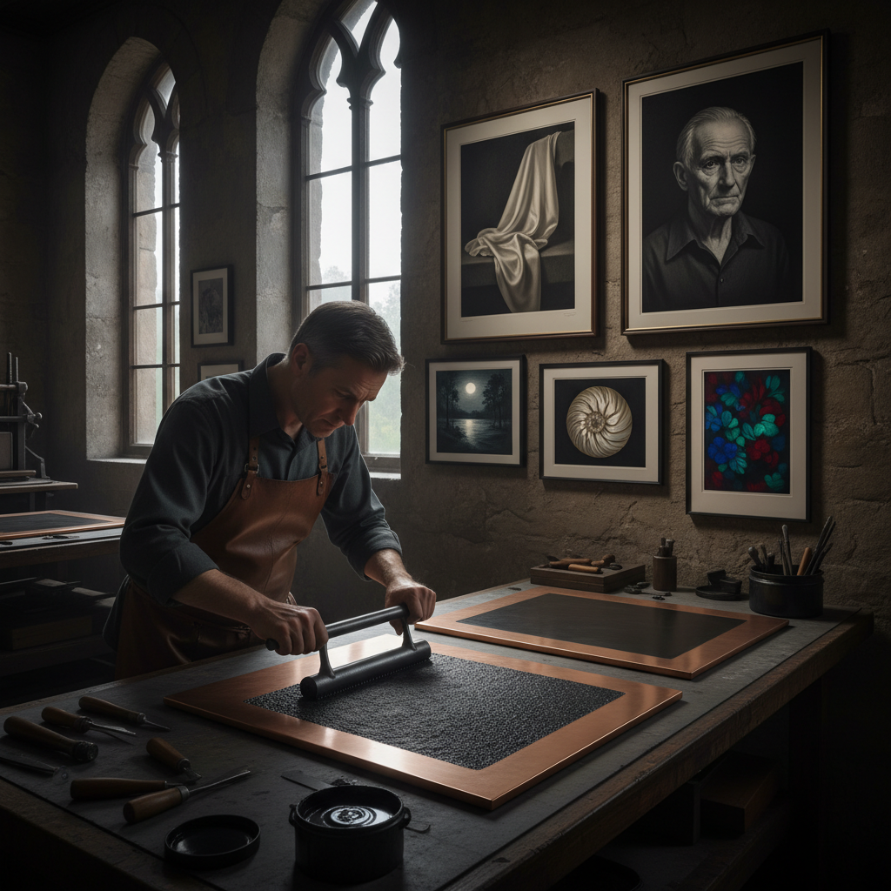

# Mezzotint Art 美柔汀

> "Mezzotint is printmaking in reverse — beginning with total darkness and working toward light, the artist smoothing a uniformly roughened copper plate to create luminous highlights that emerge from velvety black like moonlight breaking through clouds, producing tonal gradations so smooth and continuous that no other print technique can match its capacity for rendering the subtlest transitions from shadow to radiance." — Unknown

## 概述

美柔汀（Mezzotint），意大利语"mezzo"（半）+"tinto"（色调），是一种凹版印刷技法，其独特之处在于它是从黑到白的"减法"过程——先用摇点器（rocker）将整个铜板表面均匀地打出密集的毛刺（burr），使整个板面如果直接印刷会呈现纯黑色，然后艺术家使用刮刀（scraper）和磨光器（burnisher）将需要亮色的区域逐步磨平，磨得越平的区域印刷时越白。

Mezzotint由德国人Ludwig von Siegen在1642年发明，在17-18世纪的英国达到鼎盛——被称为"la manière anglaise"（英国方式）。Mezzotint最擅长表现柔和的色调过渡和天鹅绒般的黑色——特别适合复制油画肖像。Mezzotint的缺点是铜板上的毛刺在印刷过程中会逐渐磨损，因此每块板只能印刷有限的数量。

## 核心特征

| 特征 | 描述 |
|------|------|
| 减法 | 从黑到白的减法过程 |
| 摇点 | 摇点器制造毛刺 |
| 刮磨 | 刮刀和磨光器 |
| 色调 | 连续的色调过渡 |
| 天鹅绒黑 | 深邃的天鹅绒黑色 |
| 有限版 | 印刷数量有限 |

## 视觉特征

- **黑色**：深邃的天鹅绒黑色
- **柔和**：极其柔和的色调过渡
- **光感**：光从黑暗中浮现
- **连续**：连续的灰度变化
- **戏剧性**：戏剧性的明暗对比
- **细腻**：细腻的质感表现

## 代表作品

| 作品 | 艺术家 | 年代 | 意义 |
|------|--------|------|------|
| *Portrait mezzotints* | John Smith | 17-18世纪 | 英国肖像美柔汀 |
| *The Three Graces* | Valentine Green | 1781 | 经典美柔汀 |
| *Japanese contemporary mezzotint* | Hamanishi Katsunori | 当代 | 日本当代美柔汀 |
| *Color mezzotints* | Various | 当代 | 彩色美柔汀 |
| *Mezzotint landscapes* | Various | 18-19世纪 | 美柔汀风景 |

## 历史时间线

| 时期 | 事件 |
|------|------|
| 1642 | Ludwig von Siegen发明美柔汀 |
| 17-18世纪 | 英国美柔汀的鼎盛 |
| 19世纪 | 照相技术的冲击 |
| 20世纪 | 美柔汀的艺术化复兴 |
| 当代 | 日本等地的当代美柔汀 |

## 中国语境

美柔汀在中国的版画教育中有一定的地位——中国的美术院校版画专业教授美柔汀技法。中国的一些版画家在创作中使用美柔汀技法。中国的版画展览中偶尔可以看到美柔汀作品。日本的当代美柔汀艺术家（如浜西�的典）对中国的版画界有一定影响。中国的一些年轻版画家对美柔汀的深邃黑色和柔和色调特别感兴趣。

## AI生成概念图

## 与其他风格的关系

- **Copperplate Engraving** → 铜版雕刻
- **Aquatint** → 飞尘腐蚀
- **Drypoint** → 干刻
- **Intaglio** → 凹版
- **Chiaroscuro** → 明暗法
- **Printmaking** → 版画

---

*浮光艺志 | Chronicle of Artistry*
