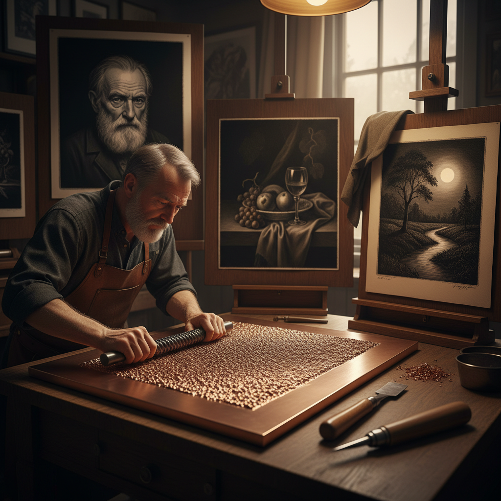

# Mezzotint 美柔汀

> "Mezzotint is darkness made luminous — the engraver begins in total black and coaxes light from the copper, tone by patient tone." — Unknown

## 概述

美柔汀（Mezzotint）是一种凹版版画技法，以其极其丰富的明暗层次和天鹅绒般的黑色著称。与其他版画技法从白纸开始添加线条不同，美柔汀从完全的黑色开始——艺术家先用摇点器（rocker）在铜版表面均匀地制造出密集的毛刺（burr），使整个版面印出纯黑色。然后用刮刀（scraper）和磨光器（burnisher）将需要亮部的区域磨平——磨得越光滑，印出的色调越浅。这种"从暗到明"的工作方式使美柔汀能够产生从纯黑到纯白之间无限细腻的灰度过渡，特别适合表现光影、肖像和夜景。

美柔汀的哲学在于：从黑暗中寻找光明——在全然的黑暗中，一点一点地磨出光亮。

## 核心特征

| 特征 | 描述 |
|------|------|
| 凹版 | 凹版印刷技法 |
| 从暗到明 | 从黑色开始减去 |
| 层次 | 极其丰富的灰度 |
| 天鹅绒 | 天鹅绒般的黑色 |
| 精细 | 极其精细的工艺 |
| 耗时 | 非常耗时的过程 |

## 视觉特征

- **黑色**：深邃的天鹅绒黑
- **层次**：无限细腻的灰度
- **光影**：戏剧性的光影
- **柔和**：柔和的过渡
- **深度**：极深的色调深度
- **精细**：精细的明暗变化

## 代表作品

| 作品 | 艺术家 | 年代 | 意义 |
|------|--------|------|------|
| *Ludwig von Siegen works* | Ludwig von Siegen | 1642 | 美柔汀的发明 |
| *John Martin mezzotints* | John Martin | 1820s | 浪漫主义美柔汀 |
| *Yozo Hamaguchi still lifes* | 浜口陽三 | 1950s+ | 现代美柔汀大师 |
| *Mario Avati works* | Mario Avati | 1960s+ | 法国美柔汀 |
| *Contemporary mezzotints* | Various | 当代 | 当代美柔汀艺术 |

## 历史时间线

| 时期 | 事件 |
|------|------|
| 1642 | Ludwig von Siegen发明美柔汀 |
| 17-18世纪 | 英国美柔汀的黄金时代 |
| 19世纪 | 照相术出现后的衰落 |
| 20世纪中 | 浜口陽三等人的复兴 |
| 1970s+ | 当代美柔汀的复兴 |
| 当代 | 全球美柔汀艺术的繁荣 |

## 中国语境

美柔汀在中国版画界是相对小众但备受尊重的技法。中国的一些版画家如杨锋等在美柔汀领域有杰出成就。中央美术学院、中国美术学院等院校的版画系开设美柔汀课程。美柔汀"从暗到明"的工作方式与中国哲学中"阴中求阳"的思想有某种呼应。当代中国的美柔汀作品在国际版画展中屡获殊荣，展现了中国艺术家对这一精细技法的深入理解。

## AI生成概念图

## 与其他风格的关系

- **Intaglio** → 凹版印刷
- **Etching** → 蚀刻版画
- **Aquatint** → 飞尘腐蚀
- **Engraving** → 雕版
- **Chiaroscuro** → 明暗法
- **Printmaking** → 版画总称

---

*浮光艺志 | Chronicle of Artistry*
