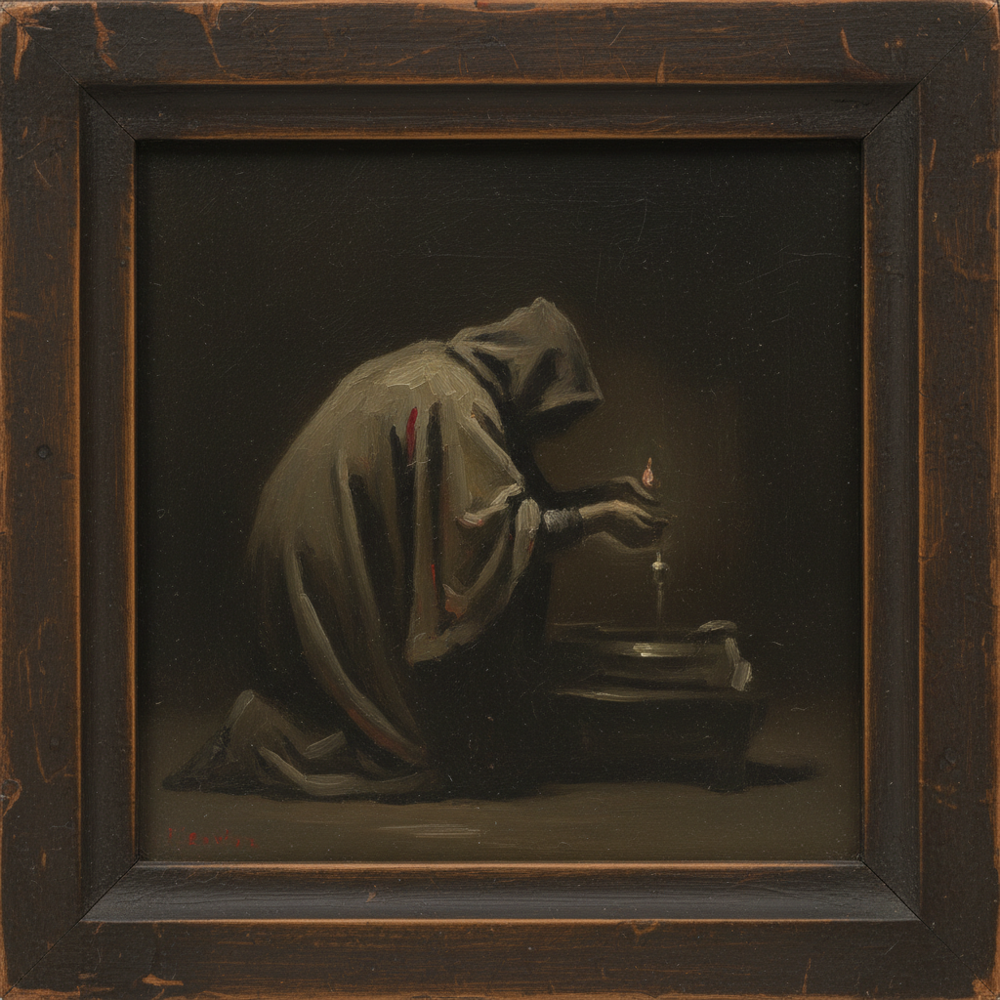

# Michaël Borremans 米夏埃尔·博雷曼斯

> **时期：** 1963–至今  
> **关键词：** 谜语绘画、古典技法、心理悬疑、比利时当代

## 概述

Michaël Borremans 是比利时当代画家和电影制作人，以技法精湛但含义晦涩的小幅油画闻名。他的作品融合了委拉斯凯兹和马奈的古典光影，却描绘无法解读的当代场景——人物执行着无意义的动作，处于无法定位的空间中。

## 风格特征

- **古典光影**：继承17世纪荷兰/西班牙大师的明暗法，色调沉稳内敛
- **小尺幅精密**：许多作品仅明信片大小，却具有纪念碑式的心理重量
- **叙事悬置**：画面呈现动作的中间状态，永远不揭示前因后果
- **灰褐色调**：以土色、灰色和暗红为主，偶尔出现刺目的红色
- **电影感构图**：画面如同电影静帧，暗示画框之外的叙事

## 代表作品

- *The Angel*（2013）
- *Fire from the Sun*（2018，系列）
- *The Feeding*（2006）
- *Black Mould*（2015）

## 历史意义

Borremans 证明了古典油画技法在当代语境中的持续生命力，他的作品拒绝被简单解读，在"可读性"泛滥的时代坚持绘画的神秘性和不可还原性。

## 概念图

