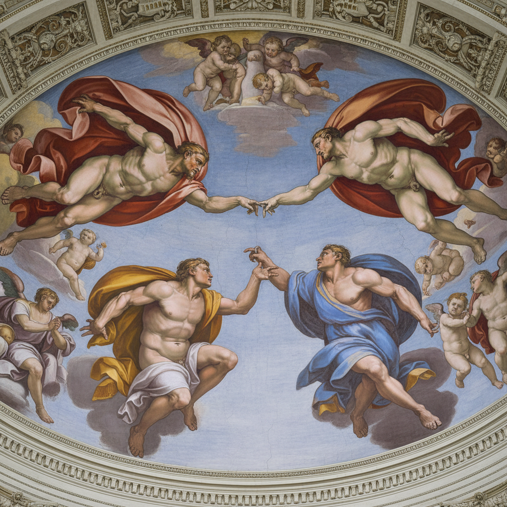

# Michelangelo 米开朗基罗

> "I saw the angel in the marble and carved until I set him free." — Michelangelo

## 概述

米开朗基罗·迪·洛多维科·布奥纳罗蒂·西莫尼（Michelangelo di Lodovico Buonarroti Simoni，1475–1564）是意大利文艺复兴最伟大的艺术家之一——雕塑家、画家、建筑师和诗人。他以超人的体力和意志力创造了西方艺术史上最宏伟的作品：大卫像、西斯廷天花板、最后的审判和圣彼得大教堂穹顶。

米开朗基罗被称为"Il Divino"（神圣者），他对人体解剖的极致掌握和对精神力量的表达达到了前所未有的高度——他笔下的人体不仅是肉体，更是灵魂的容器。

## 核心特征

| 特征 | 描述 |
|------|------|
| terribilità | "可怖的崇高"——超人的力量和精神强度 |
| 人体崇拜 | 对人体解剖的极致掌握和英雄化 |
| 雕塑性绘画 | 即使在绘画中也追求雕塑般的体积感 |
| 扭转姿态 | figura serpentinata——螺旋扭转的人体 |
| 宏大规模 | 超人尺度的宏伟构思 |
| 未完成美学 | non-finito——未完成作品的独特力量 |

## 视觉特征

- **人体**：英雄化的、肌肉发达的人体
- **姿态**：扭转的、充满张力的螺旋姿态
- **体积**：极强的三维雕塑感
- **力量**：超人的身体力量和精神强度
- **色彩**：西斯廷天花板的鲜明色彩（修复后）
- **规模**：巨大的尺度——大卫像5.17米高

## 代表作品

| 作品 | 年代 | 意义 |
|------|------|------|
| *David* | 1501-04 | 文艺复兴人文主义的象征——5.17米大理石 |
| *Sistine Chapel Ceiling* | 1508-12 | 人类艺术的巅峰——300+人物 |
| *The Last Judgment* | 1536-41 | 西斯廷祭坛墙——末日的恐怖与救赎 |
| *Pietà* | 1498-99 | 24岁的杰作——完美的悲悯 |
| *Creation of Adam* | 1512 | 世界上最著名的图像之一 |
| *St. Peter's Basilica Dome* | 1547-90 | 建筑的巅峰 |

## 真实作品（公共领域）

| 作品 | 来源 |
|------|------|
| *Creation of Adam* | [Wikimedia](https://commons.wikimedia.org/wiki/File:Michelangelo_-_Creation_of_Adam.jpg) |
| *David* | [Galleria dell'Accademia](https://www.galleriaaccademiafirenze.it/) |
| *Sistine Chapel* | [Vatican Museums](https://www.museivaticani.va/) |

> ⚠️ 本条目优先使用真实作品。

## AI生成概念图

## 与其他风格的关系

- **High Renaissance** → 盛期文艺复兴的力量极致
- **Mannerism** → 晚期作品直接启发了矫饰主义
- **Baroque** → 巴洛克的戏剧性和力量源于米开朗基罗
- **Romanticism** → 浪漫主义崇拜的"天才"原型
- **Expressionism** → 晚期未完成作品预示了表现主义

---

*浮光艺志 | Chronicle of Artistry*
