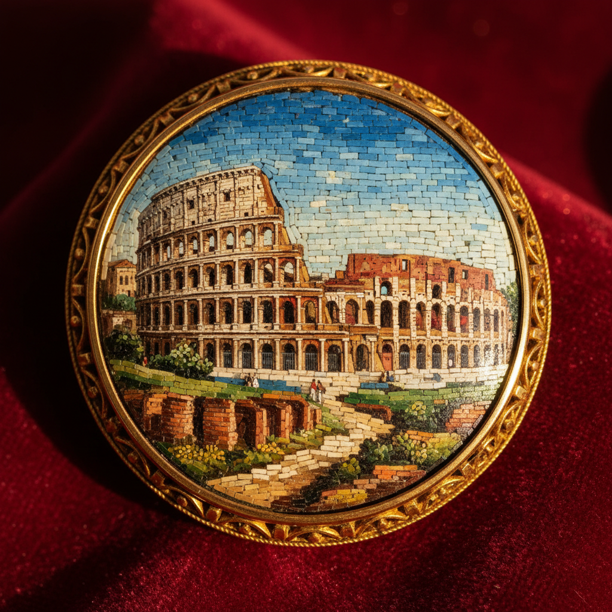

# Micro Mosaic Art 微镶嵌艺术

> "Micro mosaic is painting with glass — thousands of tiny glass rods called tesserae, each thinner than a pin, are cut and set side by side into a cement bed to create images of such fineness that they appear painted rather than assembled from discrete pieces. The best Roman micro mosaics contain over 5,000 tesserae per square inch, each one placed by hand with tweezers under magnification." — Unknown

## 概述

微镶嵌艺术（Micro Mosaic Art）是一种使用极其微小的玻璃条（tesserae）拼贴成精细图案的装饰艺术——每平方英寸可包含数千个微小的玻璃片，创造出几乎如同绘画般精细的图像。微镶嵌起源于古罗马，在18-19世纪的罗马达到巅峰，成为大旅行（Grand Tour）时代最受欢迎的纪念品之一。

微镶嵌艺术的实践包括：1）玻璃条制作——拉制极细的彩色玻璃条；2）切割——将玻璃条切成微小的片段；3）底板准备——在金属或石材底板上涂覆粘合剂；4）镶嵌——用镊子逐一放置微小玻璃片；5）填缝——填充玻璃片之间的缝隙；6）打磨——打磨表面至平滑；7）当代微镶嵌——将传统技法与现代设计结合的创作。

## 核心特征

| 特征 | 描述 |
|------|------|
| 微小 | 极其微小的玻璃片 |
| 精密 | 极高的精密度 |
| 耐久 | 玻璃的永久色彩 |
| 罗马 | 罗马的重要传统 |
| 密度 | 极高的镶嵌密度 |
| 绘画 | 如同绘画的效果 |

## 视觉特征

- **精细**：极其精细的图像
- **色彩**：玻璃的永久鲜艳色彩
- **平滑**：打磨后的平滑表面
- **细节**：惊人的细节表现
- **光泽**：玻璃的光泽效果
- **华丽**：华丽精美的整体感

## 代表作品

| 作品 | 艺术家/文化 | 年代 | 意义 |
|------|-------------|------|------|
| *Vatican micro mosaics* | 梵蒂冈 | 17世纪起 | 梵蒂冈微镶嵌 |
| *Grand Tour souvenirs* | 意大利 | 18-19世纪 | 大旅行纪念品 |
| *Castellani jewelry* | 意大利 | 19世纪 | 卡斯特拉尼珠宝 |
| *Russian micro mosaics* | 俄罗斯 | 18-19世纪 | 俄罗斯微镶嵌 |
| *Contemporary micro mosaic* | 国际 | 当代 | 当代微镶嵌 |

## 历史时间线

| 时期 | 事件 |
|------|------|
| 古罗马 | 微镶嵌的起源 |
| 17世纪 | 梵蒂冈微镶嵌工坊的建立 |
| 18-19世纪 | 大旅行时代的黄金时代 |
| 20世纪 | 微镶嵌的衰落 |
| 当代 | 微镶嵌的艺术化复兴 |

## 中国语境

微镶嵌艺术在中国有一定的认知和发展。中国传统的百宝嵌工艺与微镶嵌有相似之处——使用各种材料镶嵌成精细图案。中国的螺钿镶嵌（薄螺钿）在精细度上可与微镶嵌媲美——将极薄的贝壳片镶嵌成精美图案。中国当代的一些镶嵌艺术家开始学习西方微镶嵌技法——将其与中国传统镶嵌工艺结合。中国的珠宝设计中，微镶嵌作为一种极其精致的装饰技法——在高端定制珠宝中有所应用。中国的博物馆收藏有一些西方微镶嵌作品——作为装饰艺术的珍贵藏品。中国的工艺美术教育中，微镶嵌作为一种精密的装饰技法——在一些专业课程中有所介绍。

## AI生成概念图

## 与其他风格的关系

- **Mosaic** → 马赛克
- **Glass Art** → 玻璃艺术
- **Jewelry** → 珠宝艺术
- **Miniature Art** → 微型艺术
- **Pietra Dura** → 硬石镶嵌
- **Millefiori** → 千花玻璃

---

*浮光艺志 | Chronicle of Artistry*
