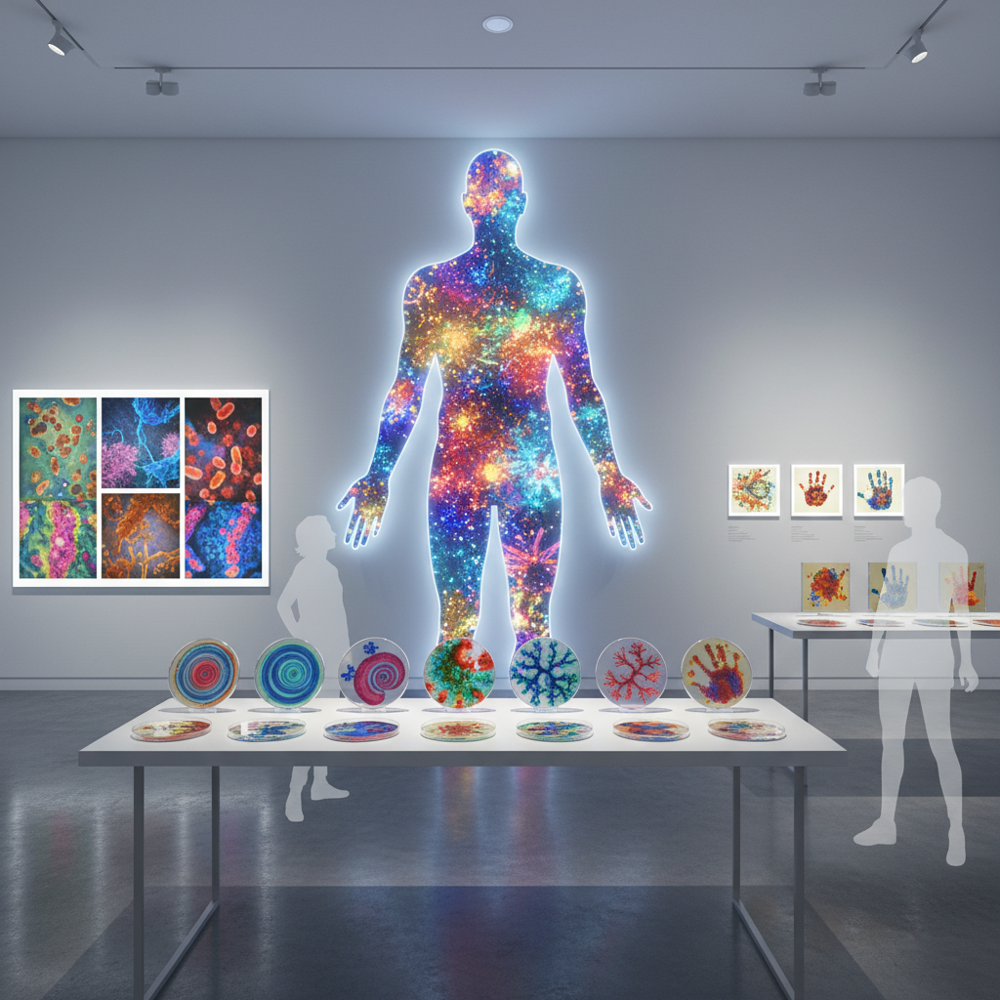

# Microbiome Art 微生物组艺术

> "Microbiome art reveals that we are never alone — that every human body is a walking ecosystem of trillions of bacteria, fungi, viruses, and archaea that outnumber our own cells, that shape our moods, our health, our very identity, and that the boundary between self and other, between human and microbe, between individual and community, was always an illusion maintained by the limitations of our senses rather than the reality of our biology." — Ed Yong

## 概述

微生物组艺术（Microbiome Art）是以微生物组（microbiome）——生活在特定环境中的微生物群落——为主题和媒介的艺术实践。人体微生物组包含约38万亿个微生物细胞，它们影响着我们的消化、免疫、情绪甚至行为。微生物组艺术将这个看不见的内在生态系统带入可见的艺术领域。

微生物组艺术的实践包括：1）微生物肖像——用个人微生物组的培养物创作独特的"微生物自画像"；2）微生物多样性的可视化——将微生物组的组成和多样性转化为视觉图案；3）微生物交换——探索人与人之间、人与环境之间的微生物交换；4）微生物美学——将微生物培养物的自然图案和色彩作为艺术形式；5）微生物身份——探索微生物组如何定义我们的生物身份。

## 核心特征

| 特征 | 描述 |
|------|------|
| 不可见 | 不可见世界的可视化 |
| 身份 | 微生物身份 |
| 多样 | 微生物多样性 |
| 共生 | 人与微生物的共生 |
| 培养 | 微生物培养 |
| 交换 | 微生物交换 |

## 视觉特征

- **培养皿**：培养皿中的菌落图案
- **色彩**：微生物产生的色彩
- **圆形**：菌落的圆形扩展
- **显微**：显微镜下的微观世界
- **数据**：微生物组数据可视化
- **身体**：人体轮廓与微生物

## 代表作品

| 作品 | 艺术家 | 年代 | 意义 |
|------|--------|------|------|
| *Microbial selfies* | Various | 2010年代 | 微生物自拍 |
| *Agar art* | Various | 2015至今 | 琼脂艺术 |
| *Body microbiome maps* | Various | 2010年代 | 身体微生物地图 |
| *Microbial exchange* | Various | 2020年代 | 微生物交换 |
| *Gut-brain art* | Various | 当代 | 肠脑轴艺术 |

## 历史时间线

| 时期 | 事件 |
|------|------|
| 2007 | 人类微生物组计划启动 |
| 2010年代 | 微生物组科学的爆发 |
| 2015 | ASM琼脂艺术竞赛 |
| 2016 | Ed Yong《I Contain Multitudes》 |
| 当代 | 微生物组艺术的成熟 |

## 中国语境

微生物组艺术在中国有独特的文化和科学背景。中国传统医学早就认识到肠道微生物的重要性——"脾胃为后天之本"的观念与现代微生物组科学有深刻的对应。中国的发酵食品文化（酱油、醋、豆腐乳、泡菜等）本质上就是与微生物的长期合作。中国当代的微生物组研究非常活跃——中国科学家在人体微生物组、土壤微生物组和海洋微生物组研究中做出了重要贡献。中国的一些艺术家在探索微生物组艺术：将中国人独特的微生物组（受饮食文化影响）可视化、探索中国发酵食品中的微生物美学、以及将传统中医的"内在生态"观念与当代微生物组科学结合。

## AI生成概念图

## 与其他风格的关系

- **Bio Art** → 生物艺术
- **Science Art** → 科学艺术
- **Data Art** → 数据艺术
- **Body Art** → 身体艺术
- **Fermentation Art** → 发酵艺术
- **Multispecies Art** → 多物种艺术

---

*浮光艺志 | Chronicle of Artistry*
