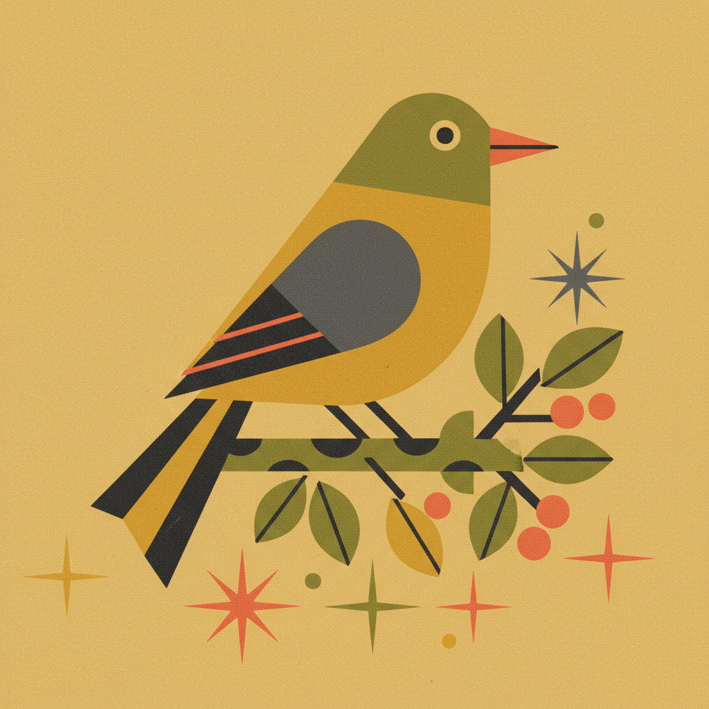

# Mid-Century Illustration 世纪中叶插画



> **"几何简化、颗粒纹理、限定色板——50年代的插画比任何时代都更'现代'。"**

## 概述

| 维度 | 描述 |
|------|------|
| 时期 | 1945–1970/影响至今 |
| 别名 | Mid-Century Modern Illustration, Atomic Age Illustration |
| 核心色彩 | 芥末黄、橄榄绿、珊瑚橙、青绿、炭灰 |
| 关键元素 | 几何简化、颗粒纹理、限定色板、风格化造型 |
| 代表人物 | Charley Harper, Mary Blair, Saul Bass, Miroslav Sasek |
| 关联风格 | Mid-Century Modern, Atomic Age, Googie, Naive Art |

---

## 历史脉络

| 年份 | 事件 |
|------|------|
| 1945 | 战后乐观主义——新的视觉语言 |
| 1950 | Mary Blair 为迪士尼设计概念艺术 |
| 1955 | Charley Harper 开始自然插画——"最少的现实主义" |
| 1958 | Saul Bass 电影海报/片头——图形革命 |
| 1959 | Miroslav Sasek "This is Paris"——旅行绘本经典 |
| 1961 | Charley Harper "Golden Book of Biology"——巅峰之作 |
| 2010s | Mid-Century 插画风格大规模复兴 |

### 核心哲学

世纪中叶插画的精神是**"用最少的元素说最多的话——每一个形状都有意义"**：
- 简化 = 智慧（"去掉一切不必要的——留下本质"）
- 几何 = 秩序（"自然可以被翻译成几何语言"）
- 限定 = 优雅（"三种颜色比三十种更有力"）
- 乐观 = 时代（"战后的世界充满可能性"）
- Charley Harper: "我不计算羽毛——我计算翅膀"

---

## 视觉语法

### 色彩系统

```
主色：
  芥末黄 (#DFAF2C) — 温暖、乐观
  橄榄绿 (#556B2F) — 自然、沉稳
  珊瑚橙 (#FF7F50) — 活力、温暖
  青绿 (#008080) — 现代、清新

辅色：
  炭灰 (#36454F) — 结构
  奶油白 (#FFFDD0) — 背景
  深红 (#8B0000) — 点缀

规则：
  - 限定色板（3-5色）
  - 平涂+颗粒纹理
  - 几何简化
  - 高对比

质感：
  颗粒 — 印刷纹理、噪点
  平涂 — 色块、无渐变
  纸张 — 复古纸感
  丝网 — 印刷层次
```

### 标志性元素

| 类别 | 元素 |
|------|------|
| 造型 | 几何简化、风格化、扁平、有机曲线 |
| 色彩 | 限定色板、复古色调、高对比 |
| 纹理 | 颗粒、丝网印刷、纸张质感 |
| 题材 | 自然、动物、旅行、日常生活、科学 |
| 构图 | 大胆裁切、负空间、图形化 |
| 态度 | 乐观、现代、简洁、智慧、优雅 |

---

## 与千禧怀旧的关系

### 永不过时的"现代"
- Mid-Century 插画 = 2010s-2020s 最流行的复古风格之一
- Charley Harper 作品在21世纪被重新发现和追捧
- "50年代的插画看起来比今天的很多设计都更现代"
- 独立品牌、咖啡馆、文具大量使用此风格

### 对当代设计的影响
- 扁平设计(Flat Design) 的精神祖先
- Google Material Design 的色彩哲学
- 独立游戏的视觉风格（如 Alto's Adventure）
- "Mid-Century 插画证明了：简单 ≠ 简陋"

---

## 中国语境

- 中国50-60年代宣传画的平行发展
- 当代中国插画师对 Mid-Century 风格的借鉴
- 中国独立品牌/咖啡馆的 Mid-Century 美学
- 与中国"扁平插画"趋势的交叉

---

## 设计应用

| 场景 | 应用方式 |
|------|----------|
| 品牌 | 限定色板+几何+复古+现代+优雅 |
| 出版 | 科普插画+旅行绘本+封面+海报 |
| 产品 | 文具+家居+纺织品+包装 |
| 数字 | 扁平图标+限定色+几何+动画 |

---

## 相关风格

← [Naive Art 稚拙艺术](naive-art.md) | [Atomic Age 原子时代](atomic-age.md) →

↑ [返回千禧怀旧目录](README.md) | [返回总目录](../README.md)
