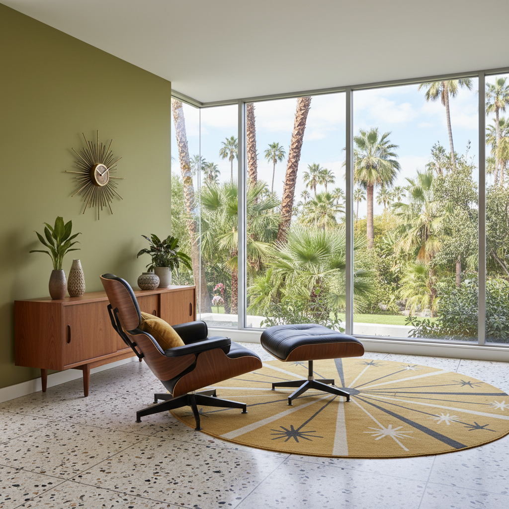

# Mid-Century Modern 中世纪现代



> **"Eames椅、原子钟、柚木边柜——1950年代相信设计可以改变生活。"**

## 概述

| 维度 | 描述 |
|------|------|
| 时期 | 1945–1969 原版 / 2010s 复兴 |
| 别名 | Mid-Century Modern, MCM, Atomic Age Design |
| 核心色彩 | 芥末黄、橄榄绿、橙色、柚木棕、白色 |
| 关键元素 | 有机曲线家具、细腿、柚木、原子图案 |
| 代表人物 | Charles & Ray Eames、Arne Jacobsen、George Nelson |
| 关联风格 | Retro Futurism, Minimalism, Bauhaus, Scandinavian |

---

## 历史脉络

### 从战后乐观到永恒经典

| 年份 | 事件 |
|------|------|
| 1945 | 二战结束——新材料（胶合板、玻璃纤维）可用 |
| 1948 | Eames Molded Plywood Chair |
| 1956 | Eames Lounge Chair |
| 1958 | Arne Jacobsen Egg Chair |
| 1960s | MCM 成为美国中产阶级标配 |
| 2000s | 复古家具市场兴起 |
| 2010s | MCM 成为室内设计主流复兴风格 |
| 2015 | 《Mad Men》推动 MCM 美学主流化 |

### 核心哲学

Mid-Century Modern 的精神是**"好设计应该人人可及——美丽与功能并存"**：
- 新材料 = 新可能
- 有机形态 = 人性化
- 功能 + 美 = 不需要二选一
- "设计是为了改善生活，不是炫耀"
- 乐观、民主、进步

---

## 视觉语法

### 色彩系统

```
主色：
  芥末黄 (#FFDB58) — 乐观、温暖
  橄榄绿 (#556B2F) — 自然、有机
  橙色 (#FF8C00) — 活力、现代
  柚木棕 (#9A7B4F) — 木材、温暖
  白色 (#FFFFFF) — 干净、现代

辅色：
  天蓝 (#87CEEB) — 乐观
  黑色 (#000000) — 铁腿、对比
  珊瑚 (#FF7F50) — 点缀

质感：
  柚木 — 温暖、有纹理
  胶合板 — 弯曲、有机
  玻璃纤维 — 光滑、现代
  皮革 — 经典、耐用
  黄铜 — 细节、温暖
```

### 标志性元素

| 类别 | 元素 |
|------|------|
| 家具 | Eames椅、蛋椅、郁金香桌、细腿边柜 |
| 灯具 | Nelson Bubble Lamp、Arco落地灯 |
| 图案 | 原子图案、星爆、几何抽象 |
| 建筑 | 落地窗、平屋顶、开放式平面 |
| 材料 | 柚木、胶合板、玻璃纤维、黄铜 |
| 特征 | 细锥形腿、有机曲线、悬臂结构 |

---

## 与千禧怀旧的关系

### 《Mad Men》效应
- 2007–2015 《Mad Men》= MCM 美学的电视广告
- 千禧一代开始收藏 MCM 家具
- IKEA 的 MCM 平替让风格民主化
- "我想住在 Don Draper 的公寓里"

### 为什么持续流行？
- 经典设计 = 永不过时
- 与当代极简主义完美兼容
- 温暖 + 现代 = 最佳平衡
- 可持续——买一把好椅子用一辈子

---

## 中国语境

- "中古风"/"MCM风"在中国的巨大市场
- 中古家具店在一二线城市遍布
- 与"北欧风"的交叉和区别
- 中国设计师对 MCM 的当代诠释

---

## 设计应用

| 场景 | 应用方式 |
|------|----------|
| 空间 | 柚木家具+细腿+有机曲线+暖色调 |
| 品牌 | 复古字体+暖色+几何图案+乐观 |
| 产品 | 有机形态+天然材质+功能美学 |
| 数字 | 暖色调+几何+复古插画风格 |

---

## 相关风格

← [Retro Futurism 复古未来主义](retro-futurism.md) | [Minimalism 极简主义](minimalism.md) →

↑ [返回千禧怀旧目录](README.md) | [返回总目录](../README.md)
