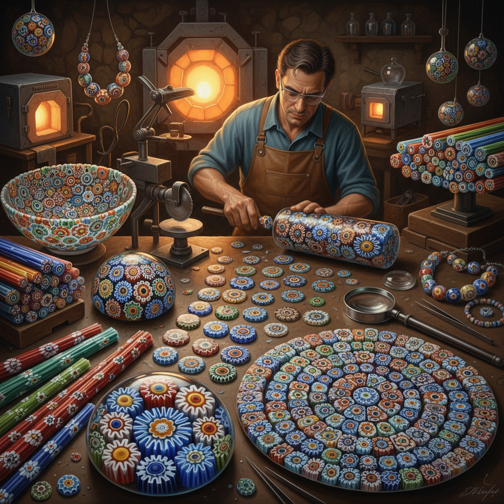

# Millefiori Art 千花玻璃艺术

> "Millefiori — a thousand flowers — is glass gardening: each cane is a stem carrying a cross-section bloom frozen in time, sliced thin as petals and arranged into fields of color that no season can wilt. The millefiori master builds flowers from the inside out, layering colored glass rods into bundles, heating and stretching them until the pattern shrinks to miniature perfection, then slicing to reveal the hidden garden within." — Unknown

## 概述

千花玻璃艺术（Millefiori Art）是一种将多根不同颜色的玻璃棒组合成图案束，加热拉伸后切片，再将切片排列组合成装饰图案的玻璃工艺——每个切片的横截面呈现出花朵或几何图案，大量切片排列在一起形成"千花"效果。这是一种极其古老且精美的玻璃装饰技法。

千花玻璃艺术的实践包括：1）花棒制作——组合不同颜色玻璃棒形成图案；2）拉伸——加热花棒并拉伸缩小图案；3）切片——将花棒切成薄片；4）排列——将切片排列成装饰图案；5）熔融——将排列好的切片熔融成整体；6）镇纸——经典的千花玻璃镇纸；7）当代千花——将传统技法与现代设计结合的创作。

## 核心特征

| 特征 | 描述 |
|------|------|
| 花纹 | 花朵般的横截面图案 |
| 重复 | 图案的精确重复 |
| 微缩 | 拉伸后的微缩效果 |
| 色彩 | 丰富的色彩组合 |
| 精密 | 极其精密的组合工艺 |
| 古老 | 两千多年的历史 |

## 视觉特征

- **花朵**：花朵般的圆形图案
- **重复**：规律重复的图案
- **色彩**：鲜艳的多色组合
- **微缩**：精细的微缩细节
- **透明**：玻璃的透明质感
- **密集**：密集排列的视觉效果

## 代表作品

| 作品 | 艺术家/文化 | 年代 | 意义 |
|------|-------------|------|------|
| *Murano millefiori* | 威尼斯穆拉诺 | 15世纪至今 | 威尼斯千花玻璃 |
| *Roman millefiori bowls* | 古罗马 | 公元前1世纪 | 古罗马千花 |
| *Clichy paperweights* | 法国克利希 | 19世纪 | 法国千花镇纸 |
| *Egyptian mosaic glass* | 古埃及 | 公元前1400年 | 最早的千花技法 |
| *Contemporary millefiori* | Various | 当代 | 当代千花创作 |

## 历史时间线

| 时期 | 事件 |
|------|------|
| 公元前1400年 | 古埃及最早的千花技法 |
| 古罗马 | 罗马千花玻璃的繁荣 |
| 中世纪 | 技术在威尼斯传承 |
| 19世纪 | 法国千花镇纸的黄金时代 |
| 当代 | 千花技法的全球复兴 |

## 中国语境

千花玻璃艺术在中国有独特的对应传统和当代发展。中国古代的琉璃珠制作中有类似千花的技法——战国时期的蜻蜓眼琉璃珠就是将不同颜色的玻璃组合成眼状图案的早期千花技法。中国的料器（北京料器）传统中也有类似的玻璃棒组合技法——用于制作花卉和装饰品。中国当代的玻璃艺术家开始系统学习和实践千花技法——一些工作室专门从事千花玻璃的创作和教学。中国的珠宝市场中，千花玻璃珠（特别是威尼斯风格的）受到收藏者的喜爱。中国的一些城市（如上海、深圳）有提供千花玻璃体验课程的工作室——让公众了解这种古老的玻璃工艺。中国的博物馆中收藏有古代的千花玻璃制品——展示了丝绸之路上的玻璃文化交流。

## AI生成概念图

## 与其他风格的关系

- **Murano Glass** → 穆拉诺玻璃
- **Fused Glass** → 熔融玻璃
- **Lampwork** → 灯工玻璃
- **Mosaic** → 马赛克
- **Paperweight Art** → 镇纸艺术
- **Bead Art** → 珠饰艺术

---

*浮光艺志 | Chronicle of Artistry*
