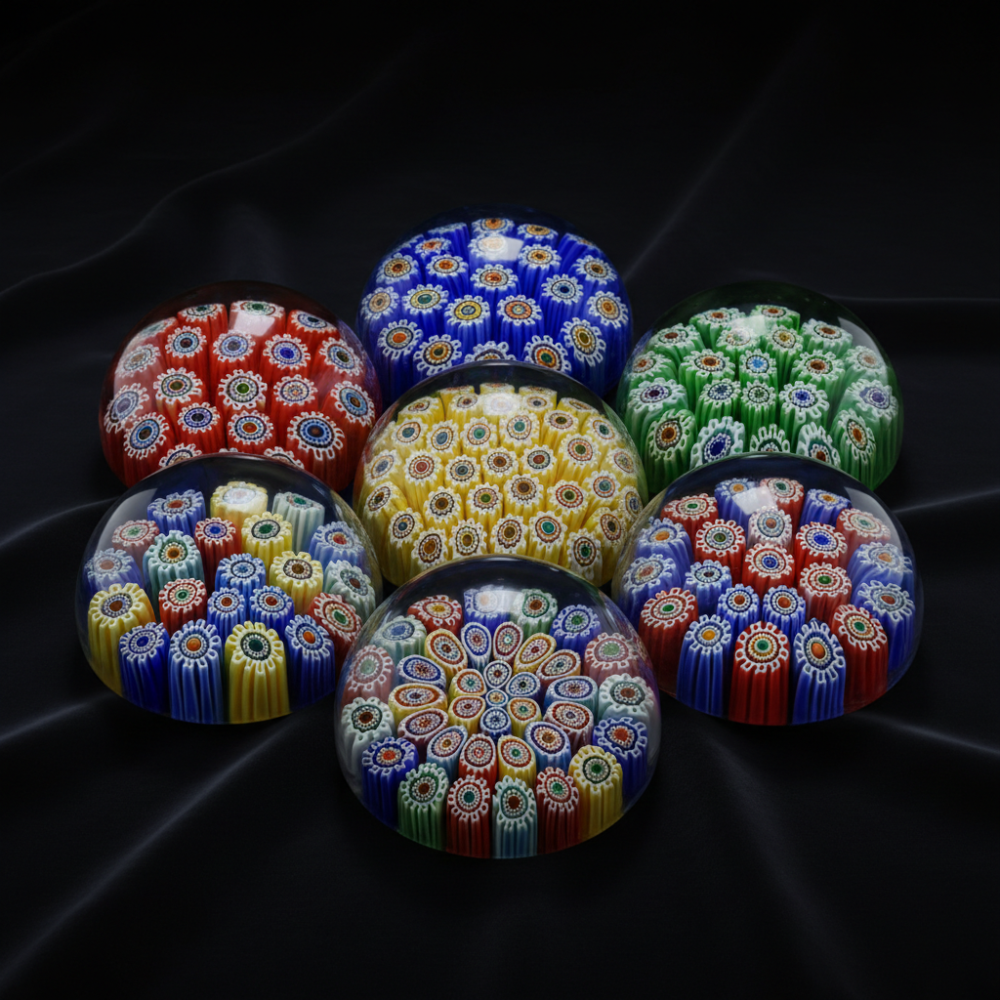

# Millefiori 千花玻璃

> "A thousand flowers frozen in glass — each slice a garden in miniature." — Unknown

## 概述

千花玻璃（Millefiori，意大利语"一千朵花"）是一种将多色玻璃棒切片排列并熔融的玻璃装饰技法。工匠先制作出截面为花朵、星形或几何图案的细长玻璃棒（murrine），然后将其切成薄片，排列组合后再次加热熔融成一体。每一个切面都是一朵微型的"花"——当数百个切片组合在一起时，就形成了一片绚烂的玻璃花园。这种技法可追溯到古埃及和罗马时期，在威尼斯穆拉诺岛达到巅峰。

千花玻璃的魅力在于：无限的重复与变化——同一根玻璃棒可以切出无数相同的"花朵"，但每一次排列组合都是独一无二的。

## 核心特征

| 特征 | 描述 |
|------|------|
| 切片 | 玻璃棒的横截面切片 |
| 花纹 | 每片呈花朵或几何图案 |
| 组合 | 多片排列组合 |
| 熔融 | 加热熔融为一体 |
| 色彩 | 丰富的多色组合 |
| 重复 | 图案的重复与变化 |

## 视觉特征

- **花朵**：密集的花朵状图案
- **色彩**：鲜艳的多色组合
- **重复**：规律的图案重复
- **细节**：微小的精细细节
- **透明**：玻璃的透明质感
- **密集**：密集排列的视觉效果

## 代表作品

| 作品 | 艺术家 | 年代 | 意义 |
|------|--------|------|------|
| *Roman millefiori bowls* | 匿名 | 公元前1世纪 | 古罗马千花玻璃 |
| *Murano paperweights* | 匿名 | 19世纪 | 威尼斯千花镇纸 |
| *French paperweights* | Baccarat/Saint-Louis | 1845-60 | 法国千花镇纸巅峰 |
| *Contemporary murrine* | Various | 当代 | 当代千花玻璃艺术 |
| *Loren Stump murrine* | Loren Stump | 2000s+ | 超写实千花玻璃 |

## 历史时间线

| 时期 | 事件 |
|------|------|
| 公元前15世纪 | 古埃及的早期千花玻璃 |
| 罗马时期 | 罗马千花玻璃碗 |
| 中世纪 | 技法在欧洲几乎失传 |
| 15世纪 | 威尼斯穆拉诺岛复兴 |
| 19世纪 | 法国镇纸的黄金时代 |
| 当代 | 千花玻璃的当代艺术应用 |

## 中国语境

千花玻璃技法在中国的直接传统较少，但中国的琉璃工艺中有类似的多色组合技法。当代中国的玻璃艺术家也在探索千花玻璃技法。中国传统的"套料"玻璃（多层不同颜色的玻璃）在概念上与千花玻璃有相似之处——都是通过多色玻璃的组合创造装饰效果。博山琉璃中的"鸡油黄"等多色技法也体现了类似的美学追求。

## AI生成概念图

## 与其他风格的关系

- **Glass Blowing** → 玻璃吹制中使用千花技法
- **Murano Glass** → 威尼斯玻璃传统
- **Mosaic** → 马赛克的玻璃版本
- **Pattern Design** → 重复图案设计
- **Canework** → 玻璃棒工艺
- **Paperweight Art** → 镇纸艺术

---

*浮光艺志 | Chronicle of Artistry*
