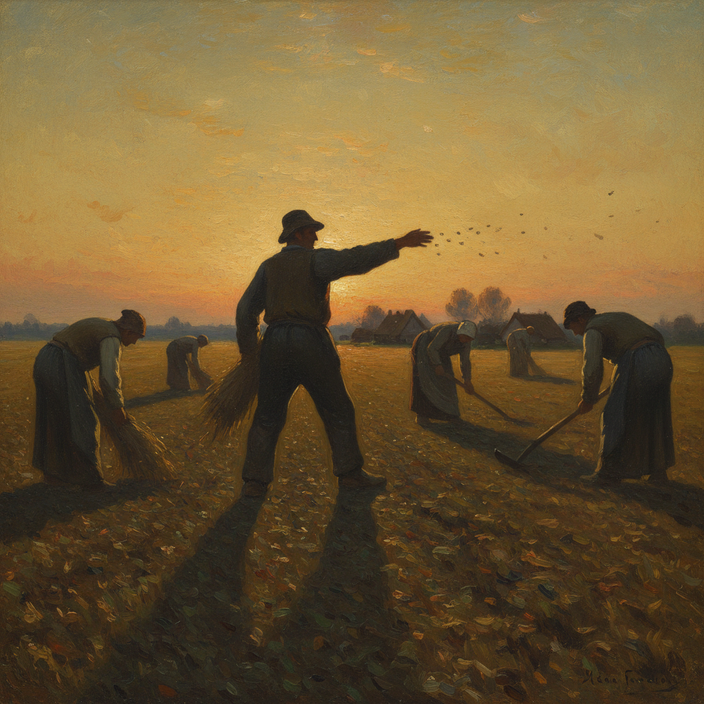

# Jean-François Millet 米勒

> "I want the people I paint to look as if they belong to their station, so that imagination cannot conceive of them as being anything else." — Jean-François Millet

## 概述

让-弗朗索瓦·米勒（Jean-François Millet，1814–1875）是法国巴比松画派的核心成员，以描绘农民劳动的史诗性场景闻名。他将普通农民的日常劳作提升为具有纪念碑式庄严感的艺术主题，深刻影响了梵高和社会现实主义。

## 核心特征

| 特征 | 描述 |
|------|------|
| 农民主题 | 播种、收割、拾穗的劳动者 |
| 纪念碑感 | 普通人物的英雄化处理 |
| 暮色光线 | 黄昏和晨曦的柔和光芒 |
| 大地色调 | 棕色、赭色、暗绿的朴素色板 |
| 宗教庄严 | 劳动如同祈祷 |
| 剪影效果 | 人物轮廓对着天空的戏剧性 |

## 代表作品

| 作品 | 年代 | 意义 |
|------|------|------|
| *The Gleaners* | 1857 | 三个拾穗者——劳动的尊严 |
| *The Angelus* | 1857–59 | 暮色中祈祷的农民夫妇 |
| *The Sower* | 1850 | 播种者的英雄姿态 |
| *Man with a Hoe* | 1860–62 | 劳动的重压 |

## AI生成概念图

## 与其他风格的关系

- **Barbizon School** → 巴比松画派的核心成员
- **Van Gogh** → 梵高反复临摹米勒作品
- **Social Realism** → 社会现实主义的先驱
- **Courbet** → 同代写实主义者，但更诗意
